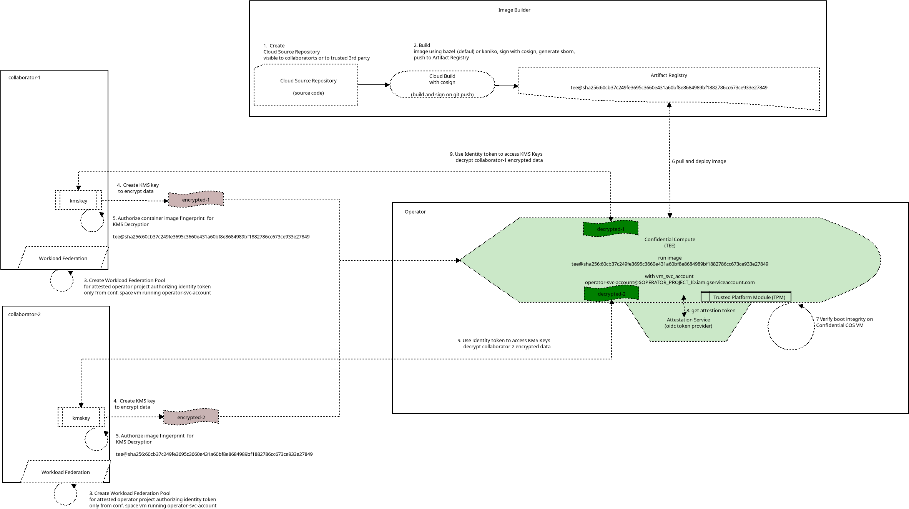
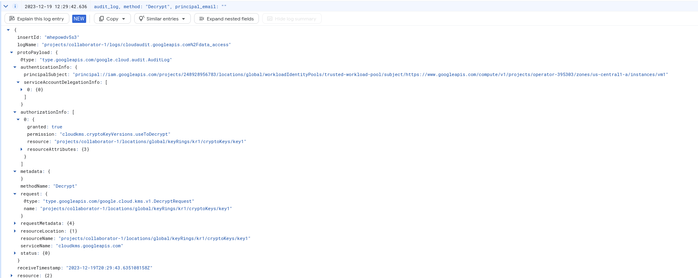

## Constructing Trusted Execution Environment (TEE) with GCP Confidential Space 

Tutorial on setting up [Google Cloud Confidential Space](https://cloud.google.com/blog/products/identity-security/announcing-confidential-space) (a `Trusted Execution Environments` (TEE)) for Untrusted Multiparty Compute (de-privileged data processing)

What this demonstrates is _one  way_ you can setup a GCP environment into which different organizations or companies can share data without worrying if the operator of that environment or any other collaborator can have direct access to the raw data.

Within the TEE, a Confidential Space VM can perform arbitrary data processing on each collaborator's data and output the appropriate result.

This specific demo accepts two collaborator's KMS encrypted data into the TEE and only within the TEE can the data get decrypted. Each collaborator is in charge of where and what security context their KMS key can be accessed and used (i.e., from only within this trusted, isolated environment).

---

Cast of characters:

* `Builder`:  
   - This project builds the trusted container image from source and optionally signs it using `cosign`.
   - Each collaborator may have access to inspect the code and build pipeline to confirm image code quality and image hash.
   - Each collaborator may build an image from source to cross check the hash value.  Images are built with `bazel` and will arrive at the same image hash no matter where it is built.

* `Operator`
  - This project runs the trusted execution environment (`TEE`) where the image the builder provides runs.
  - An administrator for the operator's project cannot access the TEE (eg ssh into or alter the TEE at runtime)
  - TEE environment will use Confidential Space attestations (an `OIDC` token) to prove a specific image is running in a specific TEE.
  - Confidential Space attestations are presented to collaborators to prove TEE's are running trusted code and only then can the TEEs gain access to collaborators KMS key for decryption of sensitive data.

* `Collaborator-1`
  - This project is a data provider that encrypted some data with a KMS key they own
  - The collaborator defines their own workload identity pools  which authorizes OIDC tokens/attestations from a specific operator in a specific project and which asserts Confidential Space claims.
  - Collaborator grants access to their KMS key to the application within the TEE once it presents an attestation token issued to the TEE and which identifies a specific image hash in a Confidential Space environment.
  - Each collaborators can optionally sign the image hash and provide the signature to the builder to attach to the registry via `cosign`.  This capability is not included in this tutorial but would potentially only allow deployment if both collaborators provided signatures.

* `Collaborator-2`
  - This project is a data provider that encrypted some data with a KMS key they own
  - The collaborator also defines their own workload identity pools  which authorizes OIDC tokens/attestations from a specific operator in a specific project and which asserts Confidential Space claims.
  - Collaborator grants access to their KMS key to the application within the TEE once it presents an attestation token issued to the TEE and which identifies a specific image hash in a Confidential Space environment.

At the end of this exercise, each collaborator will encrypt some data with their KMS key, submit that data to a pubsub topic which the TEEs subscribe to.  Once a TEE receives a message, it will use the corresponding collaborators KMS key to decrypt their data.   This sample application doesn't do anything with the decrypted data:  it just keeps a counter of how many times a unique string was sent by any collaborator (i.e., just counts words).



---

>> **Important** this sample and code is not supported by Google; use as an example for testing only.

---

* [Setup](#setup)
* [Builder](#builder)
* [Operator](#operator)
* [Collaborator 1](#collaborator-1)
* [Collaborator 2](#collaborator-2)
* [Deploy](#deploy)
* [Test](#test)
* [Appendix](#appendix)
  - [Audit Logging](#audit-logging)
  - [VPC-SC](#vpc-sc)
  - [mtls using KMS Keys](#mtls-using-kms-keys)
  - [Attestation Token and JWT Bearer token](#attestation-token-and-jwt-bearer-token)
  - [Authenticating with other Cloud Providers](#authenticating-with-other-cloud-providers)
  - [Outbound traffic via NAT](#outbound-traffic-via-nat)
  - [Running locally](#running-locally)
  - [Client-Side Encryption](#client-side-encryption)
  - [Using BigQuery](#using-bigquery)
  - [Using BigQuery ML](#using-bigquery-ml)  
  - [Using CloudSQL](#using-cloudsql)
  - [Using WebAssembly to run Sensitive Container Code](#using-webassembly-to-run-sensitive-container-code)
  - [Running Sensitive Machine Learning Code](#running-sensitive-machine-learning-code)  
  - [Using Hashicorp Vault](#using-hashicorp-vault)
  - [Check Cosign Signature and Attestation at Runtime](#check-cosign-signature-and-attestation-at-runtime)

---

### Setup

The setup here requires four GCP projects. (`YOUR_BUILDER_PROJECT_ID, YOUR_OPERATOR_PROJECT_ID, YOUR_COLLABORATOR_1_PROJECT_ID, YOUR_COLLABORATOR_2_PROJECT_ID`). They may or may not be in different organizations (in practice, these would be likely be in different organizations).

```bash
export GCLOUD_USER=`gcloud config get-value core/account`

## Configure the "Builder"
gcloud config configurations create builder
gcloud config set account builder@builder-domain.com
gcloud config set project YOUR_BUILDER_PROJECT_ID

export BUILDER_PROJECT_ID=`gcloud config get-value core/project`
export BUILDER_PROJECT_NUMBER=`gcloud projects describe $BUILDER_PROJECT_ID --format='value(projectNumber)'`

## Configure the "Operator"
gcloud config configurations create operator
gcloud config set account operatior@operator-domain.com
gcloud config set project YOUR_OPERATOR_PROJECT_ID

export OPERATOR_PROJECT_ID=`gcloud config get-value core/project`
export OPERATOR_PROJECT_NUMBER=`gcloud projects describe $OPERATOR_PROJECT_ID --format='value(projectNumber)'`

## Configure  "Collaborator-1"
gcloud config configurations create collaborator-1
gcloud config set account admin@collaborator1-domain.com
gcloud config set project YOUR_COLLABORATOR_1_PROJECT

export COLLABORATOR_1_PROJECT_ID=`gcloud config get-value core/project`
export COLLABORATOR_1_PROJECT_NUMBER=`gcloud projects describe $COLLABORATOR_1_PROJECT_ID --format='value(projectNumber)'`

## Configure  "Collaborator-2"
gcloud config configurations create collaborator-2
gcloud config set account admin@collaborator2-domain.com
gcloud config set project YOUR_COLLABORATOR_2_PROJECT

export COLLABORATOR_2_PROJECT_ID=`gcloud config get-value core/project`
export COLLABORATOR_2_PROJECT_NUMBER=`gcloud projects describe $COLLABORATOR_2_PROJECT_ID --format='value(projectNumber)'`

echo $BUILDER_PROJECT_ID
echo $OPERATOR_PROJECT_ID
echo $COLLABORATOR_1_PROJECT_ID
echo $COLLABORATOR_2_PROJECT_ID
```

### Builder

It is critical that each collaborator trusts the code that is built does what it's intended to do:  just process the data as it's intended to do; does not exfiltrate data; does not write unencrypted raw data to disk or serialize it externally...the list goes on.

One option to do this is if each collaborator can view the code that will ultimately get deployed into the TEE.  The code and container there adheres to specific constraints to _not_do the bad stuff cited above.  What each code does to meet those standards is out of the scope for this article.  What we will show here is how a given code will create the same container hash value (i.,e you know the code you trust is running in a given container)

The technique used in this example uses `bazel` to create reproducible container images.  By that, I mean for the same code base, `bazel` will generate an image with _the same image hash value_ no matter where it's built.  Using this capability, a collaborator can build a given image from a specific source repo commit, then inspect the resulting image hash value.  The collaborators can then authorize that image hash access to their KMS key.

You don't _have to_ use bazel to build an image (you can just use the `Dockerfile` provided in this example).  If you don't use bazel, you'll get a different image hash though. 

In this example using bazel, the code will always produce a hash of `myimage@sha256:c693f5cf4f447b31e8c0ae7f784fc754f783f2e64f8836913c22264004204f6b`

For more info, see

- [Building deterministic Docker images with Bazel](https://blog.bazel.build/2015/07/28/docker_build.html)
- [Deterministic container hashes and container signing using Cosign, Bazel and Google Cloud Build](https://github.com/salrashid123/cosign_bazel_cloud_build)
- [Deterministic builds with go + bazel + grpc + docker](https://github.com/salrashid123/go-grpc-bazel-docker)
- [Understanding workload identity federation](https://blog.salrashid.dev/articles/2021/understanding_workload_identity_federation/)

Anyway, to setup,

```bash
gcloud config configurations activate builder
export BUILDER_PROJECT_ID=`gcloud config get-value core/project`
export BUILDER_PROJECT_NUMBER=`gcloud projects describe $BUILDER_PROJECT_ID --format='value(projectNumber)'`
export GCLOUD_USER=`gcloud config get-value core/account`

# enable some services and create the artifact registry that will hold the image and cosign signature
gcloud services enable \
    artifactregistry.googleapis.com \
    cloudbuild.googleapis.com cloudkms.googleapis.com \
    iam.googleapis.com sourcerepo.googleapis.com

gcloud artifacts repositories create repo1 --repository-format=docker --location=us-central1 

# create a service account which cloud build will run as
gcloud iam service-accounts create cosign 

# allow cloud build to write logs
gcloud projects add-iam-policy-binding $BUILDER_PROJECT_ID \
  --member=serviceAccount:cosign@$BUILDER_PROJECT_ID.iam.gserviceaccount.com  \
  --role=roles/logging.logWriter

# allow cloud build to write the image to the registry
gcloud artifacts repositories add-iam-policy-binding repo1 \
    --location=us-central1  \
    --member=serviceAccount:cosign@$BUILDER_PROJECT_ID.iam.gserviceaccount.com \
    --role=roles/artifactregistry.writer

# Allow the operator access to the image registry 
# this is necessary since the operator project will pull an image
## note, you should set the $OPERATOR_PROJECT_ID env-var first
echo $OPERATOR_PROJECT_ID
gcloud artifacts repositories add-iam-policy-binding repo1 \
    --location=us-central1  \
    --member=serviceAccount:operator-svc-account@$OPERATOR_PROJECT_ID.iam.gserviceaccount.com \
    --role=roles/artifactregistry.reader

# allow cloud build to access the public KMS keys used for signing (used for cosign)
gcloud projects add-iam-policy-binding $BUILDER_PROJECT_ID \
  --member=serviceAccount:cosign@$BUILDER_PROJECT_ID.iam.gserviceaccount.com  \
  --role=roles/cloudkms.viewer

## create the kms key which will sign the image
gcloud kms keyrings create cosignkr --location=global

gcloud kms keys create key1 --keyring=cosignkr \
 --location=global --purpose=asymmetric-signing \
 --default-algorithm=ec-sign-p256-sha256

gcloud kms keys list  --keyring=cosignkr --location=global

# allow cloud build access to use the key to sign
gcloud kms keys add-iam-policy-binding key1 \
    --keyring=cosignkr --location=global \
    --member=serviceAccount:cosign@$BUILDER_PROJECT_ID.iam.gserviceaccount.com \
    --role=roles/cloudkms.signer

# allow current gcloud user to view the public key, in this step, you can also allow each collaborator viewer access
gcloud kms keys add-iam-policy-binding key1 \
    --keyring=cosignkr --location=global \
    --member=user:$GCLOUD_USER  \
    --role=roles/cloudkms.publicKeyViewer

# create a temp bucket for cloud build and allow cloud build permissions to use it
gsutil mb gs://$BUILDER_PROJECT_ID\_cloudbuild
gsutil iam ch serviceAccount:cosign@$BUILDER_PROJECT_ID.iam.gserviceaccount.com:objectAdmin gs://$BUILDER_PROJECT_ID\_cloudbuild

# create a cloud source repo to hold the source code
gcloud source repos create app-repo

# allow cloud build access to the source
## you can allow collaborators to view the source here too as well as allow the collaborators to see the full build pipeline
gcloud projects add-iam-policy-binding $BUILDER_PROJECT_ID \
  --member=serviceAccount:cosign@$BUILDER_PROJECT_ID.iam.gserviceaccount.com \
  --role=roles/source.reader

## clone the repo and commit the code
gcloud source repos clone app-repo
cd app-repo
cp -R ../app/* .

git add -A
git commit -m "add"
git push 

# Create a manual trigger; you could have created trigger on push too
gcloud beta builds triggers create manual --region=global \
   --name=app-build-trigger --build-config=cloudbuild.yaml \
   --repo=https://source.developers.google.com/p/$BUILDER_PROJECT_ID/r/app-repo \
   --repo-type=CLOUD_SOURCE_REPOSITORIES --branch=main \
   --service-account=projects/$BUILDER_PROJECT_ID/serviceAccounts/cosign@$BUILDER_PROJECT_ID.iam.gserviceaccount.com 

# generate the cloud build
gcloud alpha builds triggers run app-build-trigger

# optionally stream the build logs
gcloud alpha builds list

## note, if you want to modify the code, use bazel to regenerate the dependencies
# to acquire bazel go dependency references
# bazel run :gazelle -- update-repos -from_file=go.mod -prune=true -to_macro=repositories.bzl%go_repositories

# to build image locally with bazel
#    repository = "us-central1-docker.pkg.dev/builder-project/repo1/myimage"
# bazel build --platforms=@io_bazel_rules_go//go/toolchain:linux_amd64 :server
# bazel run --platforms=@io_bazel_rules_go//go/toolchain:linux_amd64 :server

# or build with docker with bazel image itself (preferable since its more hermetic):
# docker run   -e USER="$(id -u)" \
#   -v `pwd`:/src/workspace   -v /tmp/build_output:/tmp/build_output  \
#    -v /var/run/docker.sock:/var/run/docker.sock   -w /src/workspace  \
#    gcr.io/cloud-builders/bazel@sha256:f00a985c3196cc58819b6f7e8e40353273bc20e8f24b54d9c92d5279bb5b3fad  \
#     --output_user_root=/tmp/build_output   run  --platforms=@io_bazel_rules_go//go/toolchain:linux_amd64 :server

### then tag and push...Note: the artifacts here will not include items generated through cosign...its just the image alone
# docker tag us-central1-docker.pkg.dev/builder-project/repo1/myimage:server us-central1-docker.pkg.dev/$BUILDER_PROJECT_ID/repo1/myimage:server
# docker push us-central1-docker.pkg.dev/$BUILDER_PROJECT_ID/repo1/myimage:server


# pull the image.  you should see the exact same image hash
docker pull us-central1-docker.pkg.dev/$BUILDER_PROJECT_ID/repo1/myimage:server
docker inspect us-central1-docker.pkg.dev/$BUILDER_PROJECT_ID/repo1/myimage:server | jq -r '.[].RepoDigests[]'
docker inspect us-central1-docker.pkg.dev/$BUILDER_PROJECT_ID/repo1/myimage@sha256:c693f5cf4f447b31e8c0ae7f784fc754f783f2e64f8836913c22264004204f6b
```

The cloud build step should give this specific hash


The cloud build steps also used a kms key to sign the images using [cosign](https://github.com/sigstore/cosign).

If you want to dig a bit more into cosign, you can verify the signatures issued by the operator's KMS key.  This is optional so if you want, just skip to the _operator_ section.

To check the cosign signatures and attestations, install cosign and then:

```bash
### verify with cosign
## first login to adc as the builder
## gcloud auth application-default login
$ cosign tree      us-central1-docker.pkg.dev/$BUILDER_PROJECT_ID/repo1/myimage@sha256:c693f5cf4f447b31e8c0ae7f784fc754f783f2e64f8836913c22264004204f6b  

📦 Supply Chain Security Related artifacts for an image: us-central1-docker.pkg.dev/mineral-minutia-820/repo1/myimage@sha256:c693f5cf4f447b31e8c0ae7f784fc754f783f2e64f8836913c22264004204f6b
└── 💾 Attestations for an image tag: us-central1-docker.pkg.dev/mineral-minutia-820/repo1/myimage:sha256-c693f5cf4f447b31e8c0ae7f784fc754f783f2e64f8836913c22264004204f6b.att
   └── 🍒 sha256:7999d5510526de794f735c6fa82b1d5dc51b18db671bd77e1b8c0d9a4774ef3f
└── 🔐 Signatures for an image tag: us-central1-docker.pkg.dev/mineral-minutia-820/repo1/myimage:sha256-c693f5cf4f447b31e8c0ae7f784fc754f783f2e64f8836913c22264004204f6b.sig
   └── 🍒 sha256:5a150ce6ecec13cb087069eb88183deaecd4dfd17107b41dd62c5c525c8de456
```

which will exist as additional artifacts in the registry


```bash
# get the public key for the cosigned image
gcloud kms keys versions get-public-key 1  \
  --key=key1 --keyring=cosignkr \
  --location=global --output-file=/tmp/kms_pub.pem

## verify 
# you can also reference the kms key via url instead of using a local one
#   for that use --key gcpkms://projects/$BUILDER_PROJECT_ID/locations/global/keyRings/cosignkr/cryptoKeys/key1/cryptoKeyVersions/1 

cosign verify --key /tmp/kms_pub.pem   \
   us-central1-docker.pkg.dev/$BUILDER_PROJECT_ID/repo1/myimage@sha256:c693f5cf4f447b31e8c0ae7f784fc754f783f2e64f8836913c22264004204f6b  | jq '.'

# the output for the verify will look like:

Verification for us-central1-docker.pkg.dev/mineral-minutia-820/repo1/myimage@sha256:c693f5cf4f447b31e8c0ae7f784fc754f783f2e64f8836913c22264004204f6b --
The following checks were performed on each of these signatures:
  - The cosign claims were validated
  - The signatures were verified against the specified public key
[
  {
    "critical": {
      "identity": {
        "docker-reference": "us-central1-docker.pkg.dev/mineral-minutia-820/repo1/myimage"
      },
      "image": {
        "docker-manifest-digest": "sha256:c693f5cf4f447b31e8c0ae7f784fc754f783f2e64f8836913c22264004204f6b"
      },
      "type": "cosign container image signature"
    },
    "optional": {
      "key1": "value1"
    }
  }
]


# now verify the attestation that is cross checked with the rego in `policy.rego`
#  (all that this rego validates is if foo=bar is present in the predicate (which we did during the cloud build steps))
cosign verify-attestation --key /tmp/kms_pub.pem --policy cosign_verify/policy.rego    \
      us-central1-docker.pkg.dev/$BUILDER_PROJECT_ID/repo1/myimage@sha256:c693f5cf4f447b31e8c0ae7f784fc754f783f2e64f8836913c22264004204f6b  | jq '.'

## this gives

Verification for us-central1-docker.pkg.dev/mineral-minutia-820/repo1/myimage@sha256:c693f5cf4f447b31e8c0ae7f784fc754f783f2e64f8836913c22264004204f6b --
The following checks were performed on each of these signatures:
  - The cosign claims were validated
  - The signatures were verified against the specified public key
{
  "payloadType": "application/vnd.in-toto+json",
  "payload": "eyJfdHlwZSI6Imh0dHBzOi8vaW4tdG90by5pby9TdGF0ZW1lbnQvdjAuMSIsInByZWRpY2F0ZVR5cGUiOiJjb3NpZ24uc2lnc3RvcmUuZGV2L2F0dGVzdGF0aW9uL3YxIiwic3ViamVjdCI6W3sibmFtZSI6InVzLWNlbnRyYWwxLWRvY2tlci5wa2cuZGV2L21pbmVyYWwtbWludXRpYS04MjAvcmVwbzEvbXlpbWFnZSIsImRpZ2VzdCI6eyJzaGEyNTYiOiJjNjkzZjVjZjRmNDQ3YjMxZThjMGFlN2Y3ODRmYzc1NGY3ODNmMmU2NGY4ODM2OTEzYzIyMjY0MDA0MjA0ZjZiIn19XSwicHJlZGljYXRlIjp7IkRhdGEiOiJ7IFwicHJvamVjdGlkXCI6IFwibWluZXJhbC1taW51dGlhLTgyMFwiLCBcImJ1aWxkaWRcIjogXCJkY2FmMTNjOS00ZDMyLTQ4MzktYjdlOS1lMDQ0OTFkMTc5NjJcIiwgXCJmb29cIjpcImJhclwiLCBcImNvbW1pdHNoYVwiOiBcIjJiZDE1YzM4MTU1YWFmNWUyNzg5NmE0NzVmYzRkNDdkMDE2ZTMwOTZcIiB9IiwiVGltZXN0YW1wIjoiMjAyMi0xMS0wNlQxMjo1Njo1MFoifX0=",
  "signatures": [
    {
      "keyid": "",
      "sig": "MEUCIG4Tzgyy51+FKH6ZeQMoAX6BwpGTcz5voxgPeL3CaSxrAiEAhO+Z7v//CgP9PvVmmNSPVLGEScDAKWeyVC55KwogAN8="
    }
  ]
}


## if you decode the payload, you'll see the predicate and image attestations (build number, commit hash, timestamp)

{
  "_type": "https://in-toto.io/Statement/v0.1",
  "predicateType": "cosign.sigstore.dev/attestation/v1",
  "subject": [
    {
      "name": "us-central1-docker.pkg.dev/mineral-minutia-820/repo1/myimage",
      "digest": {
        "sha256": "c693f5cf4f447b31e8c0ae7f784fc754f783f2e64f8836913c22264004204f6b"
      }
    }
  ],
  "predicate": {
    "Data": "{ 
      \"projectid\": \"mineral-minutia-820\", 
      \"buildid\": \"dcaf13c9-4d32-4839-b7e9-e04491d17962\", 
      \"foo\":\"bar\", 
      \"commitsha\": \"2bd15c38155aaf5e27896a475fc4d47d016e3096\" 
    }",
    "Timestamp": "2022-11-06T12:56:50Z"
  }
}
```

### Operator

Once the image is built and each collaborator is in agreement that the code contained in image `us-central1-docker.pkg.dev/$BUILDER_PROJECT_ID/repo1/myimage@sha256:c693f5cf4f447b31e8c0ae7f784fc754f783f2e64f8836913c22264004204f6b ` isn't going to do anything malicious like exfiltrate their precious data, they can authorize that container to run in `Confidential Space` managed by an Operator.

The operator in this case simply constructs and manages GCP resources such that a Confidential Space VM within their infra will run this attested container only.

The container will get authorization tokens from each collaborators's workload identity pool _after_ it proves specifics about itself like 

* "am i running in Confidential Space VM?"
* "what is the image hash i'm running as?"
* "what is the service account ID i'm running as?"
* "confirm no ssh access by anyone is possible on this container runtime"
 
and so on...basically the operator's vm will have an identity token asserting/confirming by claims set by Confidential Space.  The claims included are shown in the appendix and specify things that help answer some information about the workload.

Anyway, to get started

```bash
# switch to the operator
gcloud config configurations activate operator
export OPERATOR_PROJECT_ID=`gcloud config get-value core/project`
export OPERATOR_PROJECT_NUMBER=`gcloud projects describe $OPERATOR_PROJECT_ID --format='value(projectNumber)'`

# create a service account the confidential space VM's will run as
gcloud iam service-accounts create operator-svc-account

# allow these service accounts permission to write to logs
gcloud projects add-iam-policy-binding $OPERATOR_PROJECT_ID \
  --member=serviceAccount:operator-svc-account@$OPERATOR_PROJECT_ID.iam.gserviceaccount.com  \
  --role=roles/logging.logWriter
```

We now have to switch to the builder account because we need to authorize the operator's service account access to download the image

```bash
### switch to image builder and grant the operator access to the image
gcloud config configurations activate builder

gcloud artifacts repositories add-iam-policy-binding repo1 \
    --location=us-central1  \
    --member=serviceAccount:operator-svc-account@$OPERATOR_PROJECT_ID.iam.gserviceaccount.com \
    --role=roles/artifactregistry.reader --project $BUILDER_PROJECT_ID

# switch back to the operator
gcloud config configurations activate operator

## create a nat gateway; we're doing this because we do _not_ want an external ip address for the 
### TEE...instead, any outbound networks access would go through a NAT gateway which we can control better
gcloud compute addresses create natip --region=us-central1 --project $OPERATOR_PROJECT_ID

gcloud compute networks create teenetwork --project  $OPERATOR_PROJECT_ID

gcloud compute routers create router \
    --network teenetwork \
    --region us-central1 --project $OPERATOR_PROJECT_ID

gcloud compute routers nats create nat-all \
  --router=router --region=us-central1 \
  --nat-external-ip-pool=natip  \
  --nat-all-subnet-ip-ranges \
  --project $OPERATOR_PROJECT_ID
```    

We're done with the operator for now.

### Collaborator 1

There can be N collaborators but for each, the flow is mirrored:

They will create their own workload identity pool (WIP) specifically authorizing specifications for an id_token originating from the Operator's Confidential Space project.

They will also authorize access to their KMS key to decrypt some data to only a request from a specific container hash in that pre-authorized Operator's project

> NOTE: It's important that the collaborators retain control of this authorization at every step

```bash
# switch to collaborator-1
gcloud config configurations activate collaborator-1
export COLLABORATOR_1_PROJECT_ID=`gcloud config get-value core/project`
export COLLABORATOR_1_PROJECT_NUMBER=`gcloud projects describe $COLLABORATOR_1_PROJECT_ID --format='value(projectNumber)'`
export COLLABORATOR_1_GCLOUD_USER=`gcloud config get-value core/account`

# enable some services
gcloud services enable \
    pubsub.googleapis.com \
    cloudkms.googleapis.com \
    iam.googleapis.com

# create a pool
gcloud iam workload-identity-pools create trusted-workload-pool --location="global"

# create a pool that authorizes requests where the identity token was issued by "Confidential Space's" OIDC issuer https://confidentialcomputing.googleapis.com
##  and which asserts its running on a CONFIDENTIAL_SPACE in the operator's project using the operator's service account we setup earlier
gcloud iam workload-identity-pools providers create-oidc attestation-verifier \
    --location="global"     --workload-identity-pool="trusted-workload-pool"   \
      --issuer-uri="https://confidentialcomputing.googleapis.com/"     --allowed-audiences="https://sts.googleapis.com" \
          --attribute-mapping="google.subject=assertion.sub,attribute.image_reference=assertion.submods.container.image_reference"  \
             --attribute-condition="assertion.swname=='CONFIDENTIAL_SPACE' && int(assertion.swversion) >= 1 && assertion.submods.gce.project_id=='$OPERATOR_PROJECT_ID' && 'operator-svc-account@$OPERATOR_PROJECT_ID.iam.gserviceaccount.com' in assertion.google_service_accounts"

# create a kms key and keyring
gcloud kms keyrings create kr1 --location=global --project $COLLABORATOR_1_PROJECT_ID
gcloud kms keys create --keyring=kr1 --location=global --purpose=encryption  key1

# allow current user to encrypt so that we can test
gcloud kms keys add-iam-policy-binding key1        --keyring=kr1 --location=global --project $COLLABORATOR_1_PROJECT_ID    \
     --member="user:$COLLABORATOR_1_GCLOUD_USER"   --role=roles/cloudkms.cryptoKeyEncrypter

# authorize access to the KMS key to _only_ the specific image hash
## we've already performed corse grain authorization on the workload pool and this step
## applies fine grain control to a specific image to decrypt data
gcloud kms keys add-iam-policy-binding key1        --keyring=kr1 --location=global --project $COLLABORATOR_1_PROJECT_ID    \
     --member="principalSet://iam.googleapis.com/projects/$COLLABORATOR_1_PROJECT_NUMBER/locations/global/workloadIdentityPools/trusted-workload-pool/attribute.image_reference/us-central1-docker.pkg.dev/$BUILDER_PROJECT_ID/repo1/myimage@sha256:c693f5cf4f447b31e8c0ae7f784fc754f783f2e64f8836913c22264004204f6b"  \
     --role=roles/cloudkms.cryptoKeyDecrypter
```

Important: use `int(assertion.swversion) >= 1` for the pool definition for production  if you want to prevent the operator running the debug image family (`--image-family=confidential-space-debug`) **which allows SSH**.  The `swversion` is >=1 for non-debug (debug has `swversion: 0`)

At this point, the collaborator will only release access to a KMS key if they see a request originating from a trusted Confidential Space VM the operator runs and at that, from a specific image hash they had earlier trusted and authorized.

In other words, the use of the KMS key is now bound to the operator's project when it uses a confidential compute VM and furthermore, when the attestation token indicates the trusted image is used.  

Access is granted to an identity bound to the image:

```bash
principalSet://iam.googleapis.com/projects/$COLLABORATOR_1_PROJECT_NUMBER/locations/global/workloadIdentityPools/trusted-workload-pool/attribute.image_reference/us-central1-docker.pkg.dev/$BUILDER_PROJECT_ID/repo1/myimage@sha256:c693f5cf4f447b31e8c0ae7f784fc754f783f2e64f8836913c22264004204f6b
```

We could have configured the entire workload provider to mandate that any access to any resource must include that specific image has.  This demo, however, abstracts it to the resource (KMS key) binding.  This was done to allow more operational flexibility: if the image builder creates a new image hash, each collaborator can more easily replace the IAM binding on specific resources instead of redefining the entire providers constraints.

>> **important** Note that since this is just a demo, the pubsub message any collaborator is blindly used by application to access the KMS key.  So if  `collaborator-3` somehow could submit messages to the topic, the application would go through the process to acquire their kms key and decrypt.  In reality, what you should do is have code or configuration that stipulates only a predefined set of collaborators can participate (eg, instead of the pubsub message itself feeding in the `audience` and `kmskey`, you have that set in code, config or container start args so that collaborator 1 and 2 knows that only their data is in the sandbox).

### Collaborator 2

We will do almost the same thing with collaborator-2 except that they define _their own_ workload pool, kms key and authorization levels.

This delegates access control to each collaborator

```bash
# switch
gcloud config configurations activate collaborator-2
export COLLABORATOR_2_GCLOUD_USER=`gcloud config get-value core/account`
export COLLABORATOR_2_PROJECT_ID=`gcloud config get-value core/project`
export COLLABORATOR_2_PROJECT_NUMBER=`gcloud projects describe $COLLABORATOR_2_PROJECT_ID --format='value(projectNumber)'`

gcloud services enable \
    pubsub.googleapis.com \
    cloudkms.googleapis.com \
    iam.googleapis.com

gcloud iam workload-identity-pools create trusted-workload-pool --location="global"

gcloud iam workload-identity-pools providers create-oidc attestation-verifier \
    --location="global"     --workload-identity-pool="trusted-workload-pool"   \
      --issuer-uri="https://confidentialcomputing.googleapis.com/"     --allowed-audiences="https://sts.googleapis.com" \
          --attribute-mapping="google.subject=assertion.sub,attribute.image_reference=assertion.submods.container.image_reference"  \
             --attribute-condition="assertion.swname=='CONFIDENTIAL_SPACE' && int(assertion.swversion) >= 1 && assertion.submods.gce.project_id=='$OPERATOR_PROJECT_ID' && 'operator-svc-account@$OPERATOR_PROJECT_ID.iam.gserviceaccount.com' in assertion.google_service_accounts"

gcloud kms keyrings create kr1 --location=global --project $COLLABORATOR_2_PROJECT_ID
gcloud kms keys create --keyring=kr1 --location=global --purpose=encryption  key1

# allow current user to encrypt so that we can test
gcloud kms keys add-iam-policy-binding key1        --keyring=kr1 --location=global --project $COLLABORATOR_2_PROJECT_ID    \
     --member="user:$COLLABORATOR_2_GCLOUD_USER"   --role=roles/cloudkms.cryptoKeyEncrypter

gcloud kms keys add-iam-policy-binding key1        --keyring=kr1 --location=global --project $COLLABORATOR_2_PROJECT_ID    \
     --member="principalSet://iam.googleapis.com/projects/$COLLABORATOR_2_PROJECT_NUMBER/locations/global/workloadIdentityPools/trusted-workload-pool/attribute.image_reference/us-central1-docker.pkg.dev/$BUILDER_PROJECT_ID/repo1/myimage@sha256:c693f5cf4f447b31e8c0ae7f784fc754f783f2e64f8836913c22264004204f6b" \
     --role=roles/cloudkms.cryptoKeyDecrypter
```

### Deploy 

We're now finally ready to deploy the Confidential Space VMs running that specific container


```bash
# switch
gcloud config configurations activate operator

export GCLOUD_USER=`gcloud config get-value core/account`
export OPERATOR_PROJECT_ID=`gcloud config get-value core/project`
export OPERATOR_PROJECT_NUMBER=`gcloud projects describe $OPERATOR_PROJECT_ID --format='value(projectNumber)'`
echo $OPERATOR_PROJECT_ID
echo $BUILDER_PROJECT_ID

### create the pubsub topic each collaborator will push encrypted data to
### the vm  will create will subscribe to messages to this topic using its own svc account (not a collaborators workload token)
gcloud pubsub topics create cs-topic
gcloud pubsub subscriptions create cs-subscribe --topic=cs-topic

gcloud pubsub subscriptions add-iam-policy-binding cs-subscribe \
  --member="serviceAccount:operator-svc-account@$OPERATOR_PROJECT_ID.iam.gserviceaccount.com" \
  --role=roles/pubsub.subscriber 

# allow both collaborators to submit messages to the topic
gcloud pubsub topics add-iam-policy-binding cs-topic \
  --member="user:$COLLABORATOR_1_GCLOUD_USER" \
  --role=roles/pubsub.publisher 

gcloud pubsub topics add-iam-policy-binding cs-topic \
  --member="user:$COLLABORATOR_2_GCLOUD_USER" \
  --role=roles/pubsub.publisher 

# create the confidential space VM in our own subnet and instruct it to run the specific image hash from the builder's project 
# note, i'm using the image-family=confidential-space here which does not allow SSH...we've also specified that this vm has no external address
## note, the following does _not_ use the debug confidential image (image-family=confidential-space-debug)
gcloud compute instances create vm1 --confidential-compute \
  --shielded-secure-boot \
  --maintenance-policy=TERMINATE --scopes=cloud-platform  --zone=us-central1-a \
  --image-project=confidential-space-images \
  --image-family=confidential-space --network=teenetwork --no-address \
  --service-account=operator-svc-account@$OPERATOR_PROJECT_ID.iam.gserviceaccount.com \
  --metadata ^~^tee-image-reference=us-central1-docker.pkg.dev/$BUILDER_PROJECT_ID/repo1/myimage@sha256:c693f5cf4f447b31e8c0ae7f784fc754f783f2e64f8836913c22264004204f6b~tee-restart-policy=Never

## for ssh access if --image-family=confidential-space-debug is used and you've defined the swversion>0 claim in the pool/provider definition
# gcloud compute firewall-rules create allow-ingress-from-iap --network teenetwork --direction=INGRESS --action=allow --rules=tcp:22 --source-ranges=35.235.240.0/20
# gcloud projects add-iam-policy-binding $OPERATOR_PROJECT_ID  --member=user:$GCLOUD_USER --role=roles/iap.tunnelResourceAccessor
# gcloud projects add-iam-policy-binding $OPERATOR_PROJECT_ID --member=user:$GCLOUD_USER --role=roles/compute.instanceAdmin.v1
# gcloud compute ssh vm1 --tunnel-through-iap --zone=us-central1-a --project $OPERATOR_PROJECT_ID
```

### Test

We can now test this by submitting encrypted messages to the topic


```bash
cd pubsub_client/

## submit some data as collaborator 1
gcloud config configurations activate collaborator-1
export COLLABORATOR_1_PROJECT_ID=`gcloud config get-value core/project`
export COLLABORATOR_1_PROJECT_NUMBER=`gcloud projects describe $COLLABORATOR_1_PROJECT_ID --format='value(projectNumber)'`
# gcloud auth application-default login

go run main.go \
  --topicProject=$OPERATOR_PROJECT_ID \
  --user=alice \
  --kmsKey="projects/$COLLABORATOR_1_PROJECT_ID/locations/global/keyRings/kr1/cryptoKeys/key1" \
  --audience="//iam.googleapis.com/projects/$COLLABORATOR_1_PROJECT_NUMBER/locations/global/workloadIdentityPools/trusted-workload-pool/providers/attestation-verifier"


# submit some data as collaborator2
gcloud config configurations activate collaborator-2
export COLLABORATOR_2_PROJECT_ID=`gcloud config get-value core/project`
export COLLABORATOR_2_PROJECT_NUMBER=`gcloud projects describe $COLLABORATOR_2_PROJECT_ID --format='value(projectNumber)'`

# gcloud auth application-default login

go run main.go \
  --topicProject=$OPERATOR_PROJECT_ID \
  --user=alice \
  --kmsKey="projects/$COLLABORATOR_2_PROJECT_ID/locations/global/keyRings/kr1/cryptoKeys/key1" \
  --audience="//iam.googleapis.com/projects/$COLLABORATOR_2_PROJECT_NUMBER/locations/global/workloadIdentityPools/trusted-workload-pool/providers/attestation-verifier"
```

what you'll see is a simple counter in the operator VM logs indicating both decrypted values match.  

Since both collaborators sent in `alice`, you'll see the count to 2


---

### Appendix

#### Audit Logging

You can enable audit logs for the collaborators, operators or builders

For the collaborators, enabled logs for workload federation and the KMS key


After deployment, you should see requests from the Confidential VM

for the token exchange:


and the actual KMS access



For the operator, you can enable vm logs for GCE

>> Important: these GCE logs are *NOT* audit logs and just plain VM logs...these can be created/faked by a user with log writer access manually so do not use them for a verifiable source of truth


#### VPC-SC

You can also restrict KMS and Workload Federation (STS) API calls on each Collaborator by the collaborator:

Each collaborator can define their own [VPC-SC](https://cloud.google.com/vpc-service-controls/docs/overview) perimeter that says:

_"only allow workload federation and kms api calls to decrypt data if it originates from THIS operator projectID"_

This will prevent anyone that gets hold of the TEE's identity token _or_ access_token and accessing the KMS service from a coffee shop (which..would be bad)

For more information, see [Google Cloud VPC-SC basic ingress and egress rules](https://blog.salrashid.dev/articles/2021/vpc_sc/)

Here is a sample VPC-SC policy a collaborator and implement:

```bash
gcloud config configurations activate collaborator-1

gcloud access-context-manager perimeters describe collaborator_1_perimeter
```

```yaml
status:
  ingressPolicies:
  - ingressFrom:
      identityType: ANY_IDENTITY
      sources:
      - resource: projects/OPERATOR_PROJECT_NUMBER
    ingressTo:
      operations:
      - methodSelectors:
        - method: '*'
        serviceName: sts.googleapis.com
      - methodSelectors:
        - method: '*'
        serviceName: cloudkms.googleapis.com
      resources:
      - projects/COLLABORATOR1_PROJECT_NUMBER
  resources:
  - projects/COLLABORATOR1_PROJECT_NUMBER
  restrictedServices:
  - cloudkms.googleapis.com
  - sts.googleapis.com
  vpcAccessibleServices:
    allowedServices:
    - RESTRICTED-SERVICES
    enableRestriction: true
title: collaborator_1_perimeter
```

Note, VPC-SC "ingressPolicy->ingressFrom->identity" does not support `principal://` or `principalSet://` get so we have to enable `ANY_IDENTITY`.  Ideally, we could tune the identity to:

```bash
principalSet://iam.googleapis.com/projects/$COLLABORATOR1_PROJECT_NUMBER/locations/global/workloadIdentityPools/trusted-workload-pool/attribute.image_reference/us-central1-docker.pkg.dev/$BUILDER_PROJECT_ID/repo1/myimage@sha256:c693f5cf4f447b31e8c0ae7f784fc754f783f2e64f8836913c22264004204f6b
```

If the TEE attempts to access the STS or KMS endpoint for any collaborator who _has not_ authorized the project for ingress, they would see a VPC-SC error at the level where the API is invoked.  In the following, the even the token grant fails


#### mTLS using KMS keys

You can also establish an mTLS connection where the private key resides in your KMS system.

In this mode, you will issue a new KMS key and grant the Confidential Space VM access to that kMS key.

You can then use that access to make an outbound HTTPS call using mTLS to your server.

If you want to do this, recommend creating a new KMS key specifically for mTLS (not for accessing other GCP resources like pubsub, etc)

For more information, see 

- [mTLS with Google Cloud KMS](https://blog.salrashid.dev/articles/2022/kms_mtls/)

You certainly don't have to use KMS just for mTLS here: the secret that is sent by each collaborator can be the encrypted public cert and private key you use for mTLS anyway. 

#### Attestation Token and JWT Bearer token

For reference, here is a sample decoded attestation JWT

Do **NOT** transmit this token to any other external system.   While its true a remote system _could_ use this as a bearer token, you would potentially compromise the security of other collaborators (i.,e a remote system can just use this token to access another collaborator's KMS key).

Instead, you can generate a JWT token using another KMS key you have access to though [golang-jwt for crypto.Signer](https://github.com/salrashid123/golang-jwt-signer) or simply use a secret decrypted with an initial bootstrapped KMS key.

- `/run/container_launcher/attestation_verifier_claims_token`

```json
{
  "aud": "https://sts.googleapis.com",
  "exp": 1667743427,
  "iat": 1667739827,
  "iss": "https://confidentialcomputing.googleapis.com",
  "nbf": 1667739827,
  "sub": "https://www.googleapis.com/compute/v1/projects/vegas-codelab-5/zones/us-central1-a/instances/vm1",
  "tee": {
    "version": {
      "major": 0,
      "minor": 1
    },
    "platform": {
      "hardware_technology": "AMD_SEV"
    },
    "container": {
      "image_reference": "us-central1-docker.pkg.dev/mineral-minutia-820/repo1/myimage@sha256:c693f5cf4f447b31e8c0ae7f784fc754f783f2e64f8836913c22264004204f6b",
      "image_digest": "sha256:c693f5cf4f447b31e8c0ae7f784fc754f783f2e64f8836913c22264004204f6b",
      "restart_policy": "Never",
      "image_id": "sha256:3eee5e759e56f75f4a6fe0538a74aa1cb2dd17e5e1887c0ede63c426ad72ad37",
      "env_override": null,
      "cmd_override": null,
      "env": {
        "HOSTNAME": "vm1",
        "PATH": "/usr/local/sbin:/usr/local/bin:/usr/sbin:/usr/bin:/sbin:/bin",
        "SSL_CERT_FILE": "/etc/ssl/certs/ca-certificates.crt"
      },
      "args": [
        "/server"
      ]
    },
    "gce": {
      "zone": "us-central1-a",
      "project_id": "vegas-codelab-5",
      "project_number": "75457521745",
      "instance_name": "vm1",
      "instance_id": "3507932791508176595"
    },
    "emails": [
      "operator-svc-account@vegas-codelab-5.iam.gserviceaccount.com"
    ]
  },
  "secboot": true,
  "oemid": 11129,
  "hwmodel": "GCP_AMD_SEV",
  "swname": "CONFIDENTIAL_SPACE",
  "swversion": "1",
  "dbgstat": "disabled-since-boot",
  "google_service_accounts": [
    "operator-svc-account@vegas-codelab-5.iam.gserviceaccount.com"
  ],
  "submods": {
    "container": {
      "image_reference": "us-central1-docker.pkg.dev/mineral-minutia-820/repo1/myimage@sha256:c693f5cf4f447b31e8c0ae7f784fc754f783f2e64f8836913c22264004204f6b",
      "image_digest": "sha256:c693f5cf4f447b31e8c0ae7f784fc754f783f2e64f8836913c22264004204f6b",
      "restart_policy": "Never",
      "image_id": "sha256:3eee5e759e56f75f4a6fe0538a74aa1cb2dd17e5e1887c0ede63c426ad72ad37",
      "env_override": null,
      "cmd_override": null,
      "env": {
        "HOSTNAME": "vm1",
        "PATH": "/usr/local/sbin:/usr/local/bin:/usr/sbin:/usr/bin:/sbin:/bin",
        "SSL_CERT_FILE": "/etc/ssl/certs/ca-certificates.crt"
      },
      "args": [
        "/server"
      ]
    },
    "gce": {
      "zone": "us-central1-a",
      "project_id": "vegas-codelab-5",
      "project_number": "75457521745",
      "instance_name": "vm1",
      "instance_id": "3507932791508176595"
    }
  }
}
```

#### Authenticating with other Cloud Providers

The KMS keys the collaborators granted access to is a generic decryption key:  you can use it to unwrap any arbitrary access tokens for any other cloud provider.  

For example, the encrypted data that is returned need not be just some text as in the example here but any AWS or Azure credential set which you can use to access any other service's APIs.

Just as a side note, you can also keep access secrets still within KMS systems (vs beaming them down).  In this mode, any access to other cloud providers requires GCP KMS key access.

For example

* [KMS, TPM and HSM based Azure Certificate Credentials](https://blog.salrashid.dev/articles/2022/azsigner/)
* [Embedding AWS_SECRET_ACCESS_KEY into Trusted Platform Modules, PKCS-11 devices, Hashicorp Vault and KMS wrapped TINK Keyset](https://blog.salrashid.dev/articles/2021/aws_hmac/)
  
    Unfortunately, at the moment GCP KMS limits the keysize you can [import to  32bytes!](https://blog.salrashid.dev/articles/2021/hmac_sha_key_size/)....which is less than an AWS Secret size...meaning, you can't use this mechanism for aws


You maybe tempted to setup GCP Workload Federation with other cloud providers from the TEE as shown here

* [Federate Google Cloud OIDC tokens for Azure Access Tokens](https://blog.salrashid.dev/articles/2022/azcompat/)
* [Federate Google Cloud OIDC tokens for AWS Access Tokens](https://blog.salrashid.dev/articles/2022/awscompat/)

However, you can't use the TEE attestation oidc token (for the reason described earlier)...nor can you use the VM's [instance identity document](https://cloud.google.com/compute/docs/instances/verifying-instance-identity) since any VM (Confidential Space or otherwise) in operator's project would surface that same google OIDC token specifications.

#### Outbound traffic via NAT

The operator can also create a [NAT gateway](https://cloud.google.com/nat/docs/overview) which will give a predictable egress address for non-google api outbound traffic.

Each collaborator can use this predictable address in additional network-based ACLs on their end.

The operator can get the NAT IP address by running:

```bash
$ gcloud compute addresses describe natip --region=us-central1 --project $OPERATOR_PROJECT_ID
address: 34.66.148.162
```

#### Running locally

Testing locally isn't that easy end-to-end primarily because this demo is tuned to work in an actual deployed TEE...

If you really want to run locally, create a service account in the project where you will run the operators' pubsub topic and subscription

1. allow the svc account to read from pubsub scription
2. allow the svc account to decrypt both collaborators kms keys

```bash
# switch to the operator (in reality, it can be any project)
gcloud config configurations activate operator
export OPERATOR_PROJECT_ID=`gcloud config get-value core/project`
export OPERATOR_PROJECT_NUMBER=`gcloud projects describe $OPERATOR_PROJECT_ID --format='value(projectNumber)'`
export GCLOUD_USER=`gcloud config get-value core/account`

gcloud kms keys add-iam-policy-binding key1        --keyring=kr1 --location=global --project $COLLABORATOR_1_PROJECT_ID    \
     --member="user:$GCLOUD_USER" \
     --role=roles/cloudkms.cryptoKeyEncrypterDecrypter

gcloud kms keys add-iam-policy-binding key1        --keyring=kr1 --location=global --project $COLLABORATOR_2_PROJECT_ID    \
     --member="user:$GCLOUD_USER" \
     --role=roles/cloudkms.cryptoKeyEncrypterDecrypter

gcloud pubsub topics add-iam-policy-binding cs-topic \
  --member="user:$GCLOUD_USER" \
  --role=roles/pubsub.publisher 

gcloud pubsub subscriptions add-iam-policy-binding cs-subscribe \
  --member="user:$GCLOUD_USER" \
  --role=roles/pubsub.subscriber 
```

then edit `app/main.go` and instead of reading in the workload federation audiences in from the pubsub message,  just use ADC

i,e replace with

```golang
// kmsClient, err = kms.NewKeyManagementClient(ctx, option.WithCredentialsJSON([]byte(c1_adc)))
kmsClient, err = kms.NewKeyManagementClient(ctx)
```

also 

```golang
const (
	subscription = "cs-subscribe"
	//jwksURL      = "https://confidentialcomputing.googleapis.com/.well-known/jwks"
	jwksURL = "https://www.googleapis.com/oauth2/v3/certs"
)
```

then export any identity token signed by google 

```bash
echo -n `gcloud auth print-identity-token` > /tmp/attestation_verifier_claims_token
```

finally call your application:

```bash
go run .-config=`pwd`/config.json --attestation_token_path=/tmp/attestation_verifier_claims_token
# bazel run  --platforms=@io_bazel_rules_go//go/toolchain:linux_amd64 :main -- --config=`pwd`/config.json --attestation_token_path=/tmp/attestation_verifier_claims_token
```

#### Client-side Encryption

Its advisable to wrap (encrypt) any data that is transmitted on the wire through a cloud provider.  

For example, if you send pubsub messages, do what is described here by encrypting the data first, then transmitting it and then finally decrypting it on the TEE.

The same technique can be used for GCS data as shown here:

- [Message Payload Encryption in Google Cloud Pub/Sub](https://blog.salrashid.dev/articles/2018/pubsub_message_encryption/)
- [Google Cloud Storage client-side Stream encryption with gsutil and TINK](https://blog.salrashid.dev/articles/2022/gcs_stream_encryption/)


#### Using BigQuery

In certain cases, it maybe acceptable if a Cloud Provider's service outside the TEE decrypts and processes some data from both parties.  

In this mode, suppose collaborator-1 and -2 encrypts some sensitive data using their own AES encryption keys compatible with [BQ AEAD Functions](https://cloud.google.com/bigquery/docs/reference/standard-sql/aead_encryption_functions).  Their data is encrypted at rest and is only accessible in its raw form to BigQuery if each collaborator supplies their decryption keys within the query.

BigQuery's infrastructure will use each collaborators key to decrypt their respective data and execute the query.  The provided key paramter [will not be stored or audit logged](https://cloud.google.com/bigquery/docs/parameterized-queries)

The output maybe anonymized data seeded back to the TEE or written to another dataset. 

If this variation of Confidential Space is acceptable (i.e each collaborator trust BigQuery but not the collaborator or operator), then a sample query originating from within the TEE may look like this where `keyset1` and `keyset2` are the parts decrypted first within a TEE by the collaborator's KMS keys


Consider each collaborator has encrypted some data with their own AEAD keys:

* `collaborator-1`

```bash
$ bq  query \
  --parameter=keyset1::CNXd6toHEmQKWAowdHlwZS5nb29nbGVhcGlzLmNvbS9nb29nbGUuY3J5cHRvLnRpbmsuQWVzR2NtS2V5EiIaIDnvckhhXod0bLVuBGIrCHiCl14aUkBeN8MaBiimapLZGAEQARjV3eraByAB --use_legacy_sql=false  'SELECT
  customer_id, encrypted,  AEAD.DECRYPT_STRING(FROM_BASE64(@keyset1),
   ecd1.encrypted,
   "somedata"
 )
FROM COLLABORATOR_1_PROJECT_ID.aead.join AS ecd1;'
+-------------+------------------------------------------------------+-------+
| customer_id |                      encrypted                       |  f0_  |
+-------------+------------------------------------------------------+-------+
| alice       | AXtartUCTC8Ei2xJf4uGs8GE42PLkC+yjoGagdD46FRwCH7BQxA= | liger |
| bob         | AXtartXXTJOVqxN1zJ0zd4jaGPcJaBpTCpxwz3Ovze6b2jh+6TE= | robin |
| carol       | AXtartVWVMV8MT7Q8xOUTyzteG4AeR6L41NOjaUffDa2V70yZ0k= | panda |
+-------------+------------------------------------------------------+-------+
```


* `collabortor-2`

```bash
bq  query \
  --parameter=keyset2::CMKIrNYJEmQKWAowdHlwZS5nb29nbGVhcGlzLmNvbS9nb29nbGUuY3J5cHRvLnRpbmsuQWVzR2NtS2V5EiIaIGNoYW5nZSB0aGlzIHBhc3N3b3JkIHRvIGEgc2VjcmV0GAEQARjCiKzWCSAB --use_legacy_sql=false  'SELECT
  customer_id, encrypted,  AEAD.DECRYPT_STRING(FROM_BASE64(@keyset2),
   ecd2.encrypted,
   "somedata"
 )
FROM COLLABORATOR_2_PROJECT_ID.aead.join AS ecd2;'

+-------------+----------------------------------------------------------+---------+
| customer_id |                        encrypted                         |   f0_   |
+-------------+----------------------------------------------------------+---------+
| jeff        |     AZrLBELOisdB8axEPXQ3YXAvbzkl1egqz6nULrkDbLFTfK6Q60qm | rabbit  |
| eric        |     AZrLBELeIrrscwsCw2fqo/QDarrupvjVtI7vKX7pkOoj2awODq0= | liger   |
| victor      |     AZrLBEKfkqVMBsHDq2uMXCArOWgd6Q8KWEUDWGgOSBDrCd34ZKc= | panda   |
| karen       | AZrLBEKYIAhdSDLUF76qcyjQE9vb5mnUeRUhZCv7ONrb5rGhQAQvQA== | sparrow |
+-------------+----------------------------------------------------------+---------+
```

* `Operator`

  The TEE can use KMS to decrypt each collaborator's AEAD keys and submit a query like this which identifies which users in the respective datasets has the same encrypted data.  In this case, the pairs `(alice,eric)`, `(carol,victor)` has the same encrypted data  

```bash
bq  query \
--parameter=keyset1::CNXd6toHEmQKWAowdHlwZS5nb29nbGVhcGlzLmNvbS9nb29nbGUuY3J5cHRvLnRpbmsuQWVzR2NtS2V5EiIaIDnvckhhXod0bLVuBGIrCHiCl14aUkBeN8MaBiimapLZGAEQARjV3eraByAB \
--parameter=keyset2::CMKIrNYJEmQKWAowdHlwZS5nb29nbGVhcGlzLmNvbS9nb29nbGUuY3J5cHRvLnRpbmsuQWVzR2NtS2V5EiIaIGNoYW5nZSB0aGlzIHBhc3N3b3JkIHRvIGEgc2VjcmV0GAEQARjCiKzWCSAB \
--use_legacy_sql=false  'SELECT
  ecd1.customer_id as cid1, ecd2.customer_id as cid2
FROM COLLABORATOR_1_PROJECT_ID.aead.join AS ecd1,
     COLLABORATOR_2_PROJECT_ID.aead.join AS ecd2
WHERE AEAD.DECRYPT_STRING(FROM_BASE64(@keyset1),
  ecd1.encrypted,
  "somedata"
) = AEAD.DECRYPT_STRING(FROM_BASE64(@keyset2),
  ecd2.encrypted,
  "somedata"
);'

+-------+--------+
| cid1  |  cid2  |
+-------+--------+
| alice | eric   |
| carol | victor |
+-------+--------+
```

Just note that in this context, the service account the TEE runs as (`operator-svc-account@$OPERATOR_PROJECT_ID.iam.gserviceaccount.com`) will require access to query over the _encrypted_ datasets each provider has.  It does not have access to decrypt any of it...that part is only available with the inline keysets provided with the query as shown above.  (see [example](https://gist.github.com/salrashid123/c358b29c0d738767435c92a9291feb56))

You can read more about this here "[BigQuery Client-side Encryption using AEAD](https://blog.salrashid.dev/articles/2022/bq_client_side_aead/#untrusted-multiparty-compute)"

Some notes and extras:

* [Importing and extracting external keys for BigQuery AEAD Tink KeySets](https://blog.salrashid.dev/articles/2021/bq_aead/)
* [AEAD Encryption with BQ Remote Functions](https://blog.salrashid.dev/articles/2022/bq_aead_remote_function/)
* [Bring your own Key for BigQuery SQL column-level encryption](https://blog.salrashid.dev/articles/2022/bq_kms/)
  
  BQ Column level encryption isn't practical here since it currently relies on KMS key access (i.,e the client that issues the BQ request must have access to _both_ provider's KMS keys used to encrypt the BQ data...This breaks some of the contracts and conditions we are using here)


#### Using BigQuery ML

You can use a similar technique describe above with [Bigquery ML](https://cloud.google.com/bigquery-ml/docs/introduction).  

There are several options available in this mode:

a. `collaborator-1`, `collaborator-2` each provides sensitive _data_ which the `operator` (or even a new `collaborator-3`) who can use that to _train_ an ML Model.  The model would be owned by the project where the training occurs (eg, either the `operator` or `collaborator-3`)

b. TEE runs `ML.PREDICT()` given sensitive data that over an already trained model that not even the operator has access to. 

For a contrived end-to-end example where a BQML model is generated with this technique, see [Bigquery ML over AEAD encrypted data](https://gist.github.com/salrashid123/12243b99771d22ed4d02a6f1094f624a)


#### Using CloudSQL

While you might be tempted to use the same technique as BigQuery encryption with CloudSQL-postgres `pgcrypto` extension, the bind parameters would be logged.

Postgres has server-side settings that would allow logging of these encryption keys which is not be desireable by the client submitting the query (you don't want your keys to get logged!)

Its _possible_ to detect if server-side logging is enabled with ClouSQL if the client issues the query can first check if postgres as bind parameter logging enabled or not:

```sql
select setting from pg_settings where name = 'log_parameter_max_length';
select setting from pg_settings where name = 'log_parameter_max_length_on_error';
```

At the moment (11/16/22), GCP CloudSQL Postgres _does not allow_ you to set these values (its a pending feature)

Once it does, GCP CloudSQL [does not allow superuser](https://cloud.google.com/sql/docs/postgres/users#superuser_restrictions) logins so one the settings above are verified, the client can submit the query (**NOTE**: take that with a big grain of salt; i do not know postgres and there maybe other vectors to surface the bind parameters)

Anyway,  following the same technique as BQ, the column data for each collaborator is encrypted using their AES keys which each releases to the TEE is described at

* [Postgres Encrypted columns using pgcrypto on Google CloudSQL](https://gist.github.com/salrashid123/b8fb527c9577ceacb2c3fe5807eae98e)


#### Using WebAssembly to run Sensitive Container Code

In certain cases, the actual code that is executed inside the container maybe considered sensitive (eg, some specific formula, ML model, etc).

If this is the case, you do not want the Operator to have access to download the container image that includes this code in raw form.   

In this repo, the operator was already given access to download the image through the IAM binding we performed earlier (i.,e the operator alrady controls this service account and can unilaterally download the container image):

```bash
gcloud artifacts repositories add-iam-policy-binding repo1 \
    --location=us-central1  \
    --member=serviceAccount:operator-svc-account@$OPERATOR_PROJECT_ID.iam.gserviceaccount.com \
    --role=roles/artifactregistry.reader
```

One option to workaround this is to only have the sensitive code available inside the container only _after_ the container uses the TEE Attestation token to download and run the code.

For example, consider the following code snippet which uses [wasmer](https://github.com/wasmerio/wasmer-go) (a go runtime for webassembly)

The sensitive data would be the `add()` typescript function thats compiled into webassembly and saved as the `hello-world.wasm` file in a secure GCS bucket owned by the owners of the IP.

When the TEE image starts up, it acquires its attestation token and uses workload federation to access the wasm file from the owners of the IP (i.e replace the `ioutil.ReadFile` with [object reader](https://pkg.go.dev/google.golang.org/cloud/storage#hdr-Objects))

```golang
package main

/*
$ cat helloworld.ts 
export function add(a: i32, b: i32): i32 {
    return a + b;
}

$ npm install -g assemblyscript
$ asc helloworld.ts -o hello-world.wasm
$ go run main.go

*/

import (
	"fmt"
	"io/ioutil"

	wasmer "github.com/wasmerio/wasmer-go/wasmer"
)

func main() {
  // use TEE attestation token here to download `hello-world.wasm`
	wasmBytes, err := ioutil.ReadFile("hello-world.wasm")
	if err != nil {
		panic(err)
	}
	engine := wasmer.NewEngine()
	store := wasmer.NewStore(engine)

	// Compiles the module
	module, err := wasmer.NewModule(store, wasmBytes)
	if err != nil {
		panic(err)
	}
	// Instantiates the module
	importObject := wasmer.NewImportObject()
	instance, err := wasmer.NewInstance(module, importObject)
	if err != nil {
		panic(err)
	}
	// Gets the `add` exported function from the WebAssembly instance.
	add, err := instance.Exports.GetFunction("add")
	if err != nil {
		panic(err)
	}
	// Calls that exported function with Go standard values. The WebAssembly
	// types are inferred and values are casted automatically.
	result, err := add(1, 5)
	if err != nil {
		panic(err)
	}
	fmt.Println(result)
}
```


#### Running Sensitive Machine Learning Code

If what the container runs is actually sensitive generic python or machine learning code (eg `Tensorflow` Model) which you do not want the operator to view, a model author can save an encrypted form of the machine learning model or code and only download or decrypt it after attestation.

In this flow, suppose the following funciton `RCE()` is deemed sensitive, the author can use a library like [dill](https://dill.readthedocs.io/en/latest/) to serialize the class and then encrypt it with their KMS key.  The decryption and desrialization can occur within the TEE after attestation to the functions author which releases the KMS key


```python
#!/usr/bin/python
import dill  

# to serialize, uncomment 
# class RCE:
#     import os
#     def __init__(self, v="foo"):
#       self._v = v
#     def sq(self, n):
#         return n*n

# with open('p.bin', 'wb') as s:
#   dill.dump(RCE(), s)


# to deserialize, comment the steps above and run
with open("p.bin", mode='rb') as s:
    r = dill.load(s)
    print(repr(r))
    print(r.sq(2))
```

In a similar way, if you're dealing with an ML model you deem sensitive, you can also [export/import a tensosorflow model](https://www.tensorflow.org/tutorials/keras/save_and_load#save_the_entire_model).  For this, the entire model is saved or encrypted and only visible to the TEE after attestation (i'm not familiar with TF so i don't know if [this is how its done](https://gist.github.com/salrashid123/0e6f5a1a11bc12ab21306c1e1ce94fed)..)

#### Using Hashicorp Vault

If you have an on-prem [Hashicorp Vault](https://www.vaultproject.io/) which saves encryption keys, you can access it from within the TEE by passing through a GCP KMS encrypted `VAULT_TOKEN`, unwrapping it within the TEE.

Alternatively, you can just use Vault's [JWT Auth](https://developer.hashicorp.com/vault/docs/auth/jwt) mechansim.

In this mode, you use the TEE's attestation token and emit that to your vault server.  The vault server validates the TEE specicifcations and returns a `VAULT_TOKEN` for the TEE to use again.

>> Note: you _are_ emitting the TEE's attestation token externally here.  Earlier on in this tutorial, we mentioned that you should not emit this token in a multiparty system (eg, to prevent replay or compromise another collaborator security).  However, if you are the _only_ collaborator, you can emit the token to your own VAULT server.

Critically, also note that the TEE attestation token has a fixed audience value (`https://sts.googleapis.com`).  If you sent this TEE token to your vault server as-is, you are somewhat misusing the intent for that claim and token (i.,e its intended auidence is GCP's STS server; not your vault server). 

Once Confidential Space allows custom audiences,  you can use this VAULT auth mechansim against multiple collaborators onprem server as well as GCP APIs since you can define your own audience settings.

In short, its not recommened to use this mechanism but the following is there for completeness:

Anyway, here is a sample Vault JWT configuration that would authorize a specific image similar to the workload federation done in this tutorial.

```hcl
vault write auth/jwt/config \
    jwks_url="https://confidentialcomputing.googleapis.com/.well-known/jwks" \
    bound_issuer="https://confidentialcomputing.googleapis.com/"
```

Vault operator defines fine-grained role that enforces the image policy

```hcl
vault write auth/jwt/role/my-jwt-role -<<EOF
{
  "role_type": "jwt",
  "policies": ["token-policy","secrets-policy"],
  "token_explicit_max_ttl": 60,
  "user_claim": "sub",
  "bound_audiences": ["https://sts.googleapis.com"],
  "bound_subject": "https://www.googleapis.com/compute/v1/projects/vegas-codelab-5/zones/us-central1-a/instances/vm1",
  "claims_mappings": {
    "hwmodel": "hwmodel",
    "swname": "swname",
    "swversion": "swversion",
    "/submods/container/image_digest": "/submods/container/image_digest",
    "/submods/gce/project_id":"/submods/gce/project_id",
    "google_service_accounts":"google_service_accounts"
  },
  "bound_claims": {
    "hwmodel": "GCP_AMD_SEV",
    "swname": "CONFIDENTIAL_SPACE",
    "swversion": "1",
    "/submods/container/image_digest": ["sha256:c693f5cf4f447b31e8c0ae7f784fc754f783f2e64f8836913c22264004204f6b"],
    "/submods/gce/project_id": ["$OPERATOR_PROJECT_ID"],
    "google_service_accounts":["operator-svc-account@$OPERATOR_PROJECT_ID.iam.gserviceaccount.com"]
  }  
}
EOF
```

Exchange TEE Attestation token for an on-prem `VAULT_TOKEN`:

- [Vault auth and secrets on GCP](https://github.com/salrashid123/vault_gcp)

The equivalent usage with vault cli:

```bash
export VAULT_CACERT='/path/to/tls/ca.pem'
export VAULT_ADDR='https://your_vault_server:443'
export JWT_TOKEN=`cat /run/container_launcher/attestation_verifier_claims_token`
export VAULT_TOKEN=`vault write -field="token" auth/jwt/login role=my-jwt-role jwt="$JWT_TOKEN"`
echo $VAULT_TOKEN

# now use the vault token to access a secret or key
vault kv put kv/message foo=world
vault kv get kv/message
```

#### Check Cosign Signature and Attestation at Runtime

Confidential space does not currently verify if the image being deployed was signed by various parties with any attestations.

If you really need this now, you _can_ perform the checks for the attestation and signature when the application starts up.

In this mode, the secure image you're deploying "checks" the hash value for its own image from `/run/container_launcher/attestation_verifier_claims_token` and then use a static (or configured) set of public or KMS keys to verify signatures or attestations predicates are preset.

This is currently not included in this sample but you could modify it using examples [here](https://github.com/salrashid123/cosign_bazel_cloud_build/blob/main/client/main.go)

As mentioned above, each collaborator could also optionally provide the builder a singature for inclusion to the registry.  


For example:

* 1 collaborator-1, -2 and builder creates a image signing key

* 2 collaborator-1, -2 gives the public key for image siginig to the builder

* 3 the deployed code does the following on `func init() {}`:

  ```golang
  const (
    builder_public_key=".."
    collaborator_1_public_key=".."
    collaborator_2_public_key=".."
  )
  var (
      signatures_to_check := []string{ builder_public_key, collaborator_1_public_key, collaborator_2_public_key }
  )
  func init() {
    // verify attestation jwt and extract current image hash by decoding {submods.container.image_reference} from
    // /run/container_launcher/attestation_verifier_claims_token
    imageRef := "..."

    for __, publicKey in range signatures_to_check {
      // verify signatures using each publicKey against imageRef
      // https://github.com/salrashid123/cosign_bazel_cloud_build/blob/main/client/main.go#L127-L190
    }
  }
  ```

* 4 collaborator-1, 2 builder _offline_ sign the image using their private key:
  - [Sign without upload to registry](https://github.com/salrashid123/cosign_bazel_cloud_build/blob/main/README.md#sign-without-upload-to-registry)

* 5 builder _attaches_ all the signatures to the registry
  - [Sign offline and attach](https://github.com/salrashid123/cosign_bazel_cloud_build/blob/main/README.md#sign-offline-and-attach)

* 6 On deployment, the startup init in step 3 will ensure all parties signed image before doing anything

