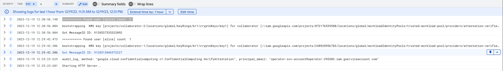
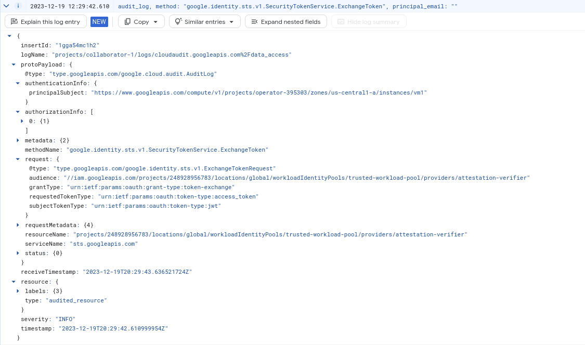

## Constructing Trusted Execution Environment (TEE) with GCP Confidential Space 

Tutorial on setting up [Google Cloud Confidential Space](https://cloud.google.com/blog/products/identity-security/announcing-confidential-space) (a `Trusted Execution Environments` (TEE)) for Untrusted Multiparty Compute (de-privileged data processing)

What this demonstrates is _one  way_ you can setup a GCP environment into which different organizations or companies can share data without worrying if the operator of that environment or any other collaborator can have direct access to the raw data.

Within the TEE, a Confidential Space VM can perform arbitrary data processing on each collaborator's data and output the appropriate result.

This specific demo accepts two collaborator's KMS encrypted data into the TEE and only within the TEE can the data get decrypted. Each collaborator is in charge of where and what security context their KMS key can be accessed and used (i.e., from only within this trusted, isolated environment).

---

Cast of characters:

* `Builder`:  
   - This project builds the trusted container image from source and optionally signs it using [cosign](https://github.com/sigstore/cosign).
   - Each collaborator may have access to inspect the code and build pipeline to confirm image code quality and image hash.
   - Each collaborator may build an image from source to cross check the hash value.  Images are built with `bazel` or `kaniko` and each will arrive at their own consistent same image hash.

* `Operator`
  - This project runs the trusted execution environment (`TEE`) where the image the builder provides runs.
  - An administrator for the operator's project cannot access the TEE (eg ssh into or alter the TEE at runtime)
  - TEE environment will use Confidential Space attestations (an `OIDC` token) to prove a specific image is running in a specific TEE.
  - Confidential Space attestations are presented to collaborators to prove TEE's are running trusted code and only then can the TEEs gain access to collaborators KMS key for decryption of sensitive data.

* `Collaborator-1`
  - This project is a data provider that encrypted some data with a KMS key they own
  - The collaborator defines their own workload identity pools  which authorizes OIDC tokens/attestations from a specific operator in a specific project and which asserts Confidential Space claims.
  - Collaborator grants access to their KMS key to the application within the TEE once it presents an attestation token issued to the TEE and which identifies a specific image hash in a Confidential Space environment.
  - Each collaborators can optionally sign the image hash and provide the signature to the builder to attach to the registry via `cosign`.  This capability is not included in this tutorial but would potentially only allow deployment if both collaborators provided signatures.

* `Collaborator-2`
  - This project is a data provider that encrypted some data with a KMS key they own
  - The collaborator also defines their own workload identity pools  which authorizes OIDC tokens/attestations from a specific operator in a specific project and which asserts Confidential Space claims.
  - Collaborator grants access to their KMS key to the application within the TEE once it presents an attestation token issued to the TEE and which identifies a specific image hash in a Confidential Space environment.

At the end of this exercise, each collaborator will encrypt some data with their KMS key, submit that data to a pubsub topic or emit to an mTLS HTTPS endpoint on the TEE.  Once a TEE receives a message, it will use the corresponding collaborators KMS key to decrypt their data.  This sample application doesn't do anything with the decrypted data:  it just keeps a counter of how many times a unique string was sent by any collaborator (i.e., just counts words).

If using HTTPS, this demo utilizes mTLS certs and authorizes the TLS connection using [Channel Binding](https://datatracker.ietf.org/doc/rfc9266/) using `Exported Keying Material (EKM)`.  Which just means Before the TEE service calls the actual endpoint on the TEE to increment the wordcount (`/increment`), the client connecting to the TEE first verifies (using `/connect` endpoint) that the TLS connection is infact associated with the TEE alone by inspecting a returned Bearer token JWT containing the unique connections EKM nonce.

Finally, this demo also creates an RSA keypair and certificate unique to each TEE and then provides "certification" that a given certificate and key was generated inside that TEE.  The TEE can then sign data inside the TEE and a remote user can verify that act by using the attestation_jwt and public key.


---

>> **Important** this sample and code is not supported by Google; use as an example for testing only.

---

* [Setup](#setup)
* [Builder](#builder)
* [Operator](#operator)
* [Collaborator 1](#collaborator-1)
* [Collaborator 2](#collaborator-2)
* [Deploy](#deploy)
* [Test](#test)
* [Appendix](#appendix)
  - [Attestation Token Custom Audience and Nonce](#attestation-token-custom-audience-and-nonce)
    - [Default Attestation Token](#default-attestation-token)
    - [Custom Attestation Token](#custom-attestation-token)
  - [Audit Logging](#audit-logging)
  - [Logging](#logging)
  - [Reproducible Builds](#reproducible-builds)
  - [Credential Injection](#credential-injection)  
  - [VPC-SC](#vpc-sc)
  - [mTLS using acquired Keys](#mtls-using-acquired-keys)
  - [Service Discovery and TEE-TEE traffic](#service-discovery-and-tee-tee-traffic)
  - [Using Exported Key Material (EKM) TLS Attestation](#using-exported-key-material-ekm-tls-attestation)
  - [Authenticating with other Cloud Providers](#authenticating-with-other-cloud-providers)
      - [AWS Credentials for Confidential Space](#aws-credentials-for-confidential-space)
      - [Azure Credentials for Confidential Space](#azure-credentials-for-confidential-space) 
  - [Outbound traffic via NAT](#outbound-traffic-via-nat)
  - [Client-Side Encryption](#client-side-encryption)
  - [Using BigQuery](#using-bigquery)
  - [Using BigQuery ML](#using-bigquery-ml)
  - [Using BigQuery Differential Privacy](#using-bigquery-differential-privacy)      
  - [Using SecretManager](#using-secretmanager)
  - [Using WebAssembly to run Sensitive Container Code](#using-webassembly-to-run-sensitive-container-code)
  - [Running Sensitive Machine Learning Code](#running-sensitive-machine-learning-code)
  - [Container image signing and verification](#container-image-signing-and-verification)
  - [Terraform Template](#terraform-template)  
  - [Minimal bootstrap credentials for for GCP Confidential Space](misc/tee_bootstrap)
  - [Bazel Overrides](misc/bazel_overrides)
  - [Manual Container image signing and verification](misc/container_signing)
  - [Threshold Encryption and Signatures](misc/threshold_encryption_and_signatures)
  - [Hashicorp Vault](misc/hashicorp_vault)
  - [CNCF Confidential Containers](misc/cncf_containers)
  - [Azure Confidential Containers](misc/azure_containers)
  - [Access GCP and workspace APIs using GCP Workload Identity Federation](misc/google_workspace)
  - [Build from Kaniko and gcloud](misc/kaniko_build)
  - [Confidential Space Attestation JWT validation with Envoy](misc/envoy_cs)

---

### Setup

The setup here requires four GCP projects. (`YOUR_BUILDER_PROJECT_ID, YOUR_OPERATOR_PROJECT_ID, YOUR_COLLABORATOR_1_PROJECT_ID, YOUR_COLLABORATOR_2_PROJECT_ID`). They may or may not be in different organizations (in practice, these would be likely be in different organizations).

```bash
export GCLOUD_USER=`gcloud config get-value core/account`

## Configure the "Builder"
gcloud config configurations create builder
gcloud config set account builder@builder-domain.com
gcloud config set project YOUR_BUILDER_PROJECT_ID

gcloud config configurations activate builder
export BUILDER_PROJECT_ID=`gcloud config get-value core/project`
export BUILDER_PROJECT_NUMBER=`gcloud projects describe $BUILDER_PROJECT_ID --format='value(projectNumber)'`

## Configure the "Operator"
gcloud config configurations create operator
gcloud config set account operatior@operator-domain.com
gcloud config set project YOUR_OPERATOR_PROJECT_ID

gcloud config configurations activate operator
export OPERATOR_PROJECT_ID=`gcloud config get-value core/project`
export OPERATOR_PROJECT_NUMBER=`gcloud projects describe $OPERATOR_PROJECT_ID --format='value(projectNumber)'`

## Configure  "Collaborator-1"
gcloud config configurations create collaborator-1
gcloud config set account admin@collaborator1-domain.com
gcloud config set project YOUR_COLLABORATOR_1_PROJECT

gcloud config configurations activate collaborator-1
export COLLABORATOR_1_PROJECT_ID=`gcloud config get-value core/project`
export COLLABORATOR_1_PROJECT_NUMBER=`gcloud projects describe $COLLABORATOR_1_PROJECT_ID --format='value(projectNumber)'`

## Configure  "Collaborator-2"
gcloud config configurations create collaborator-2
gcloud config set account admin@collaborator2-domain.com
gcloud config set project YOUR_COLLABORATOR_2_PROJECT

gcloud config configurations activate collaborator-2
export COLLABORATOR_2_PROJECT_ID=`gcloud config get-value core/project`
export COLLABORATOR_2_PROJECT_NUMBER=`gcloud projects describe $COLLABORATOR_2_PROJECT_ID --format='value(projectNumber)'`

echo $BUILDER_PROJECT_ID
echo $OPERATOR_PROJECT_ID
echo $COLLABORATOR_1_PROJECT_ID
echo $COLLABORATOR_2_PROJECT_ID
```

### Builder

It is critical that each collaborator trusts the code that is built does what it's intended to do:  just process the data as it's intended to do; does not exfiltrate data; does not write unencrypted raw data to disk or serialize it externally...the list goes on.

One option to do this is if each collaborator can view the code that will ultimately get deployed into the TEE.  The code and container there adheres to specific constraints to _not_do the bad stuff cited above.  What each code does to meet those standards is out of the scope for this article.  What we will show here is how a given code will create the same container hash value (i.,e you know the code you trust is running in a given container)

The technique used in this example uses `bazel` (default) or `kaniko` to create reproducible container images.  By that, I mean for the same code base, these will generate an image with _the same image hash value_ no matter where it's built.  Using this capability, a collaborator can clone the source, generate a build and then inspect the resulting image hash value.  The collaborators can then authorize that image hash access to their KMS key.

You don't _have to_ use `bazel` or `kaniko` to build an image (you can just use the `Dockerfile` provided in this example).  However, if you don't use those, you'll get a different image hash though. 

In this example using `bazel`, the code will always produce a hash of  (see [reproducible Builds](#reproducible-builds))

* `tee@sha256:60cb37c249fe3695c3660e431a60bf8e8684989bf1882786cc673ce933e27849`

For more info, see

- [Building deterministic Docker images with Bazel](https://blog.bazel.build/2015/07/28/docker_build.html)
- [Deterministic container hashes and container signing using Cosign, Kaniko and Google Cloud Build](https://github.com/salrashid123/cosign_kaniko_cloud_build)
- [Deterministic container hashes and container signing using Cosign, Bazel and Google Cloud Build](https://github.com/salrashid123/cosign_bazel_cloud_build)
- [Deterministic builds with go + bazel + grpc + docker](https://github.com/salrashid123/go-grpc-bazel-docker)
- [Deterministic builds with nodejs + bazel + docker](https://github.com/salrashid123/nodejs-bazel-docker)
- [Deterministic container images with c++ and GCP APIs using bazel.](https://github.com/salrashid123/cpp-bazel-docker)
- [Deterministic container images with python and GCP APIs using bazel](https://github.com/salrashid123/python-bazel-docker)
- [Deterministic container images with java and GCP APIs using bazel](https://github.com/salrashid123/java-bazel-docker)
- [Understanding workload identity federation](https://blog.salrashid.dev/articles/2021/understanding_workload_identity_federation/)

Anyway, to setup,

```bash
gcloud config configurations activate builder
export BUILDER_PROJECT_ID=`gcloud config get-value core/project`
export BUILDER_PROJECT_NUMBER=`gcloud projects describe $BUILDER_PROJECT_ID --format='value(projectNumber)'`
export GCLOUD_USER=`gcloud config get-value core/account`

# enable some services and create the artifact registry that will hold the image and cosign signature
gcloud services enable \
    artifactregistry.googleapis.com \
    cloudbuild.googleapis.com cloudkms.googleapis.com \
    iam.googleapis.com sourcerepo.googleapis.com

gcloud artifacts repositories create repo1 --repository-format=docker --location=us-central1 

# create a service account which cloud build will run as
gcloud iam service-accounts create cosign 

# allow cloud build to write logs
gcloud projects add-iam-policy-binding $BUILDER_PROJECT_ID \
  --member=serviceAccount:cosign@$BUILDER_PROJECT_ID.iam.gserviceaccount.com  \
  --role=roles/logging.logWriter

# allow cloud build to write the image to the registry
gcloud artifacts repositories add-iam-policy-binding repo1 \
    --location=us-central1  \
    --member=serviceAccount:cosign@$BUILDER_PROJECT_ID.iam.gserviceaccount.com \
    --role=roles/artifactregistry.writer

# allow cloud build to access the public KMS keys used for signing (used for cosign)
gcloud projects add-iam-policy-binding $BUILDER_PROJECT_ID \
  --member=serviceAccount:cosign@$BUILDER_PROJECT_ID.iam.gserviceaccount.com  \
  --role=roles/cloudkms.viewer

## create the kms key which will sign the image
gcloud kms keyrings create cosignkr --location=global

gcloud kms keys create key1 --keyring=cosignkr \
 --location=global --purpose=asymmetric-signing \
 --default-algorithm=ec-sign-p256-sha256

gcloud kms keys list  --keyring=cosignkr --location=global

# allow cloud build access to use the key to sign
gcloud kms keys add-iam-policy-binding key1 \
    --keyring=cosignkr --location=global \
    --member=serviceAccount:cosign@$BUILDER_PROJECT_ID.iam.gserviceaccount.com \
    --role=roles/cloudkms.signer

# allow current gcloud and cloud build to view the public key, in this step, you can also allow each collaborator viewer access
gcloud kms keys add-iam-policy-binding key1 \
    --keyring=cosignkr --location=global \
    --member=user:$GCLOUD_USER  \
    --role=roles/cloudkms.publicKeyViewer

gcloud kms keys add-iam-policy-binding key1 \
    --keyring=cosignkr --location=global \
    --member=serviceAccount:cosign@$BUILDER_PROJECT_ID.iam.gserviceaccount.com \
    --role=roles/cloudkms.publicKeyViewer  

# create a temp bucket for cloud build and allow cloud build permissions to use it
gsutil mb gs://$BUILDER_PROJECT_ID\_cloudbuild
gsutil iam ch \
  serviceAccount:cosign@$BUILDER_PROJECT_ID.iam.gserviceaccount.com:objectAdmin \
  gs://$BUILDER_PROJECT_ID\_cloudbuild


### for Bazel
# gcloud builds submit --config=cloudbuild_bazel.yaml

## for local Bazel
### generate bazel dependencies
# docker run   -e USER="$(id -u)" \
#    -v `pwd`:/src/workspace   -v /tmp/build_output:/tmp/build_output \
#     -v /var/run/docker.sock:/var/run/docker.sock   -w /src/workspace  \
#     gcr.io/cloud-builders/bazel@sha256:604cf4bc0d197a2bec4b1d4f92d1010d93298168b7f27d7e7edaad8259e18a3a \
#      --output_user_root=/tmp/build_output   run :gazelle -- update-repos -from_file=go.mod -prune=true -to_macro=repositories.bzl%go_repositories

# # build
# docker run   -e USER="$(id -u)" \
#    -v `pwd`:/src/workspace   -v /tmp/build_output:/tmp/build_output \
#     -v /var/run/docker.sock:/var/run/docker.sock   -w /src/workspace  \
#     gcr.io/cloud-builders/bazel@sha256:604cf4bc0d197a2bec4b1d4f92d1010d93298168b7f27d7e7edaad8259e18a3a \
#      --output_user_root=/tmp/build_output   run  --platforms=@io_bazel_rules_go//go/toolchain:linux_amd64 :server

# skopeo inspect --format "{{.Name}}@{{.Digest}}"  docker-daemon:us-central1-docker.pkg.dev/builder-project/repo1/tee:server

### for Kaniko

# with local docker
# see appendix to setup credentials for artifact registry
# cd /app
# docker run    -v `pwd`:/workspace   -v $HOME/.docker/config_kaniko.json:/kaniko/.docker/config.json:ro  \
#              gcr.io/kaniko-project/executor@sha256:034f15e6fe235490e64a4173d02d0a41f61382450c314fffed9b8ca96dff66b2    \
#               --dockerfile=Dockerfile --reproducible \
#               --destination "us-central1-docker.pkg.dev/$BUILDER_PROJECT_ID/repo1/tee:server"     --context dir:///workspace/

## for cloud build
# cd /app
# gcloud beta builds submit --config=cloudbuild_kaniko.yaml

# to build via commit
gcloud source repos create cosign-repo

gcloud projects add-iam-policy-binding $BUILDER_PROJECT_ID \
  --member=serviceAccount:cosign@$BUILDER_PROJECT_ID.iam.gserviceaccount.com \
  --role=roles/source.reader

gcloud source repos clone cosign-repo
cd cosign-repo
cp -R ../app/* .

git add -A
git commit -m "add"
git push  -o nokeycheck

# create a manual trigger using bazel or kaniko build yaml (default bazel)
gcloud builds triggers create manual --region=global \
   --name=cosign-trigger --build-config=cloudbuild_bazel.yaml \
   --repo=https://source.developers.google.com/p/$BUILDER_PROJECT_ID/r/cosign-repo \
   --repo-type=CLOUD_SOURCE_REPOSITORIES --branch=main \
   --service-account=projects/$BUILDER_PROJECT_ID/serviceAccounts/cosign@$BUILDER_PROJECT_ID.iam.gserviceaccount.com 

# now trigger
gcloud builds triggers run cosign-trigger --branch=main

# skopeo inspect --format "{{.Name}}@{{.Digest}}"  docker://us-central1-docker.pkg.dev/$BUILDER_PROJECT_ID/repo1/tee:server

# pull the image.  you should see the exact same image hash

docker pull us-central1-docker.pkg.dev/$BUILDER_PROJECT_ID/repo1/tee:server
export IMAGE_HASH=`docker inspect us-central1-docker.pkg.dev/$BUILDER_PROJECT_ID/repo1/tee:server | jq -r '.[].RepoDigests[]'`
docker inspect $IMAGE_HASH
echo $IMAGE_HASH

# crane copy --all-tags us-central1-docker.pkg.dev/$BUILDER_PROJECT_ID/repo1/tee docker.io/salrashid123/tee
# docker pull docker.io/salrashid123/tee:server
# docker inspect docker.io/salrashid123/tee:server
```

The cloud build steps also used a kms key to sign the images using [cosign](https://github.com/sigstore/cosign).

Using `cosign` is a completely optional step used to add verification signatures and claims to the image.  See appendix for more information.


### Operator

Once the image is built and each collaborator is in agreement that the code contained in image 

- `us-central1-docker.pkg.dev/$BUILDER_PROJECT_ID/repo1/tee@sha256:60cb37c249fe3695c3660e431a60bf8e8684989bf1882786cc673ce933e27849` 

Note, the image cited is the index 

```bash
$ crane manifest us-central1-docker.pkg.dev/$BUILDER_PROJECT_ID/repo1/tee@sha256:60cb37c249fe3695c3660e431a60bf8e8684989bf1882786cc673ce933e27849

{
  "schemaVersion": 2,
  "mediaType": "application/vnd.oci.image.index.v1+json",
  "manifests": [
    {
      "mediaType": "application/vnd.oci.image.manifest.v1+json",
      "size": 2586,
      "digest": "sha256:8e74897e8c7fcc126e8fa9ec474f03941c0a66d6bdacceb58f691af01838a6cc",
      "platform": {
        "os": "linux",
        "architecture": "amd64"
      }
    }
  ]
}

## get the actual image manifest
# crane manifest us-central1-docker.pkg.dev/$BUILDER_PROJECT_ID/repo1/tee@sha256:8e74897e8c7fcc126e8fa9ec474f03941c0a66d6bdacceb58f691af01838a6cc | jq '.'
```

isn't going to do anything malicious like exfiltrate their precious data, they can authorize that container to run in `Confidential Space` managed by an Operator.

The operator in this case simply constructs and manages GCP resources such that a Confidential Space VM within their infra will run this attested container only.

The container will get authorization tokens from each collaborators's workload identity pool _after_ it proves specifics about itself like 

* "am i running in Confidential Space VM?"
* "what is the image hash i'm running as?"
* "what is the service account ID i'm running as?"
* "confirm no ssh access by anyone is possible on this container runtime"
 
and so on...basically the operator's vm will have an identity token asserting/confirming by claims set by Confidential Space.  The claims included are shown in the appendix and specify things that help answer some information about the workload.

Anyway, to get started

```bash
# switch to the operator
gcloud config configurations activate operator
export OPERATOR_PROJECT_ID=`gcloud config get-value core/project`
export OPERATOR_PROJECT_NUMBER=`gcloud projects describe $OPERATOR_PROJECT_ID --format='value(projectNumber)'`

# enable some services and create the artifact registry that will hold the image and cosign signature
gcloud services enable \
    compute.googleapis.com confidentialcomputing.googleapis.com pubsub.googleapis.com cloudkms.googleapis.com

# create a service account the confidential space VM's will run as
gcloud iam service-accounts create operator-svc-account

# allow these service accounts permission to write to logs
gcloud projects add-iam-policy-binding $OPERATOR_PROJECT_ID \
  --member=serviceAccount:operator-svc-account@$OPERATOR_PROJECT_ID.iam.gserviceaccount.com  \
  --role=roles/logging.logWriter
```

We now have to switch to the builder account because we need to authorize the operator's service account access to download the image

```bash
### switch to image builder and grant the operator access to the image
gcloud config configurations activate builder

gcloud artifacts repositories add-iam-policy-binding repo1 \
    --location=us-central1  \
    --member=serviceAccount:operator-svc-account@$OPERATOR_PROJECT_ID.iam.gserviceaccount.com \
    --role=roles/artifactregistry.reader --project $BUILDER_PROJECT_ID

# switch back to the operator
gcloud config configurations activate operator

## create a nat gateway; we're doing this because we do _not_ want an external ip address for the 
### TEE...instead, any outbound networks access would go through a NAT gateway which we can control better
gcloud compute addresses create natip --region=us-central1 --project $OPERATOR_PROJECT_ID

gcloud compute networks create teenetwork --project  $OPERATOR_PROJECT_ID

gcloud compute routers create router \
    --network teenetwork \
    --region us-central1 --project $OPERATOR_PROJECT_ID

gcloud compute routers nats create nat-all \
  --router=router --region=us-central1 \
  --nat-external-ip-pool=natip  \
  --nat-all-subnet-ip-ranges \
  --project $OPERATOR_PROJECT_ID
```    

We're done with the operator for now.

### Collaborator 1

There can be N collaborators but for each, the flow is mirrored:

They will create their own workload identity pool (WIP) specifically authorizing specifications for an id_token originating from the Operator's Confidential Space project.

They will also authorize access to their KMS key to decrypt some data to only a request from a specific container hash in that pre-authorized Operator's project

> NOTE: It's important that the collaborators retain control of this authorization at every step

```bash
# switch to collaborator-1
gcloud config configurations activate collaborator-1
export COLLABORATOR_1_PROJECT_ID=`gcloud config get-value core/project`
export COLLABORATOR_1_PROJECT_NUMBER=`gcloud projects describe $COLLABORATOR_1_PROJECT_ID --format='value(projectNumber)'`
export COLLABORATOR_1_GCLOUD_USER=`gcloud config get-value core/account`

# enable some services
gcloud services enable \
    pubsub.googleapis.com \
    cloudkms.googleapis.com \
    iam.googleapis.com pubsub.googleapis.com

# create a pool
gcloud iam workload-identity-pools create trusted-workload-pool --location="global"

# create a pool that authorizes requests where the identity token was issued by "Confidential Space's" OIDC issuer https://confidentialcomputing.googleapis.com
##  and which asserts its running on a CONFIDENTIAL_SPACE in the operator's project using the operator's service account we setup earlier
# note the following allows the **production** conf-space image:   "STABLE" in assertion.submods.confidential_space.support_attributes 
#   also see https://cloud.google.com/compute/confidential-vm/docs/reference/cs-attestation-policies
gcloud iam workload-identity-pools providers create-oidc attestation-verifier \
    --location="global"     --workload-identity-pool="trusted-workload-pool"   \
      --issuer-uri="https://confidentialcomputing.googleapis.com/"     --allowed-audiences="https://sts.googleapis.com" \
          --attribute-mapping="google.subject=assertion.sub,attribute.image_reference=assertion.submods.container.image_reference"  \
             --attribute-condition="assertion.swname=='CONFIDENTIAL_SPACE' && \"STABLE\" in assertion.submods.confidential_space.support_attributes && assertion.submods.gce.project_id=='$OPERATOR_PROJECT_ID' && 'operator-svc-account@$OPERATOR_PROJECT_ID.iam.gserviceaccount.com' in assertion.google_service_accounts"

# create a kms key and keyring
gcloud kms keyrings create kr1 --location=global --project $COLLABORATOR_1_PROJECT_ID
gcloud kms keys create --keyring=kr1 --location=global --purpose=encryption  key1

# allow current user to encrypt so that we can test
gcloud kms keys add-iam-policy-binding key1        --keyring=kr1 --location=global --project $COLLABORATOR_1_PROJECT_ID    \
     --member="user:$COLLABORATOR_1_GCLOUD_USER"   --role=roles/cloudkms.cryptoKeyEncrypter

# authorize access to the KMS key to _only_ the specific image hash
## we've already performed corse grain authorization on the workload pool and this step
## applies fine grain control to a specific image to decrypt data
gcloud kms keys add-iam-policy-binding key1        --keyring=kr1 --location=global --project $COLLABORATOR_1_PROJECT_ID    \
     --member="principalSet://iam.googleapis.com/projects/$COLLABORATOR_1_PROJECT_NUMBER/locations/global/workloadIdentityPools/trusted-workload-pool/attribute.image_reference/$IMAGE_HASH"  \
     --role=roles/cloudkms.cryptoKeyDecrypter
```

**Important**: use `"STABLE" in assertion.submods.confidential_space.support_attributes` for the pool definition for production  if you want to prevent the operator running the debug image family (`--image-family=confidential-space-debug`) **which allows SSH**.

At this point, the collaborator will only release access to a KMS key if they see a request originating from a trusted Confidential Space VM the operator runs and at that, from a specific image hash they had earlier trusted and authorized.

In other words, the use of the KMS key is now bound to the operator's project when it uses a confidential compute VM and furthermore, when the attestation token indicates the trusted image is used.  

Access is granted to an identity bound to the image:

```bash
principalSet://iam.googleapis.com/projects/$COLLABORATOR_1_PROJECT_NUMBER/locations/global/workloadIdentityPools/trusted-workload-pool/attribute.image_reference/$IMAGE_HASH
```

We could have configured the entire workload provider to mandate that any access to any resource must include that specific image has.  This demo, however, abstracts it to the resource (KMS key) binding.  This was done to allow more operational flexibility: if the image builder creates a new image hash, each collaborator can more easily replace the IAM binding on specific resources instead of redefining the entire providers constraints.

Alternatively, if you wanted the top-level IAM binding to include the `image_hash` alone, the command would be something like

```bash
# gcloud iam workload-identity-pools providers create-oidc attestation-verifier \
#     --location="global"     --workload-identity-pool="trusted-workload-pool"   \
#       --issuer-uri="https://confidentialcomputing.googleapis.com/"     --allowed-audiences="https://sts.googleapis.com" \
#           --attribute-mapping="google.subject=assertion.sub,attribute.image_reference=assertion.submods.container.image_reference"  \
#              --attribute-condition="assertion.swname=='CONFIDENTIAL_SPACE' && \"STABLE\" in assertion.submods.confidential_space.support_attributes && assertion.submods.gce.project_id=='$OPERATOR_PROJECT_ID' && 'operator-svc-account@$OPERATOR_PROJECT_ID.iam.gserviceaccount.com' in assertion.google_service_accounts && 'assertion.submods.container.image_reference==$IMAGE_HASH'"

# this will allow all identities in the provider access to the key.
#  since the provider includes the image_hash and project, its bound to the operator's environment
# gcloud kms keys add-iam-policy-binding key1        --keyring=kr1 --location=global --project $COLLABORATOR_1_PROJECT_ID    \
#      --member="principalSet://iam.googleapis.com/projects/$COLLABORATOR_1_PROJECT_NUMBER/locations/global/workloadIdentityPools/trusted-workload-pool/*"  \
#      --role=roles/cloudkms.cryptoKeyDecrypter
```

>> **important** Note that since this is just a demo, the HTTP or pubsub message any collaborator sends is blindly used by application to access the KMS key.  So if  `collaborator-3` somehow could submit messages to the topic or post data over mTLS using certs, the application would go through the process to acquire their kms key and decrypt.  In reality, what you should do is have code or configuration that stipulates only a predefined set of collaborators can participate (eg, instead of the pubsub message itself feeding in the `audience` and `kmskey`, you have that set in code, config or container start args so that collaborator 1 and 2 knows that only their data is in the sandbox).

### Collaborator 2

We will do almost the same thing with collaborator-2 except that they define _their own_ workload pool, kms key and authorization levels.

This delegates access control to each collaborator

```bash
# switch
gcloud config configurations activate collaborator-2
export COLLABORATOR_2_GCLOUD_USER=`gcloud config get-value core/account`
export COLLABORATOR_2_PROJECT_ID=`gcloud config get-value core/project`
export COLLABORATOR_2_PROJECT_NUMBER=`gcloud projects describe $COLLABORATOR_2_PROJECT_ID --format='value(projectNumber)'`

gcloud services enable \
    pubsub.googleapis.com \
    cloudkms.googleapis.com \
    iam.googleapis.com pubsub.googleapis.com

gcloud iam workload-identity-pools create trusted-workload-pool --location="global"

# note the following allows the **production** conf-space image;  to allow the debug,
gcloud iam workload-identity-pools providers create-oidc attestation-verifier \
    --location="global"     --workload-identity-pool="trusted-workload-pool"   \
      --issuer-uri="https://confidentialcomputing.googleapis.com/"     --allowed-audiences="https://sts.googleapis.com" \
          --attribute-mapping="google.subject=assertion.sub,attribute.image_reference=assertion.submods.container.image_reference"  \
             --attribute-condition="assertion.swname=='CONFIDENTIAL_SPACE' && \"STABLE\" in assertion.submods.confidential_space.support_attributes && assertion.submods.gce.project_id=='$OPERATOR_PROJECT_ID' && 'operator-svc-account@$OPERATOR_PROJECT_ID.iam.gserviceaccount.com' in assertion.google_service_accounts"

gcloud kms keyrings create kr1 --location=global --project $COLLABORATOR_2_PROJECT_ID
gcloud kms keys create --keyring=kr1 --location=global --purpose=encryption  key1

# allow current user to encrypt so that we can test
gcloud kms keys add-iam-policy-binding key1        --keyring=kr1 --location=global --project $COLLABORATOR_2_PROJECT_ID    \
     --member="user:$COLLABORATOR_2_GCLOUD_USER"   --role=roles/cloudkms.cryptoKeyEncrypter

gcloud kms keys add-iam-policy-binding key1        --keyring=kr1 --location=global --project $COLLABORATOR_2_PROJECT_ID    \
     --member="principalSet://iam.googleapis.com/projects/$COLLABORATOR_2_PROJECT_NUMBER/locations/global/workloadIdentityPools/trusted-workload-pool/attribute.image_reference/$IMAGE_HASH"  \
     --role=roles/cloudkms.cryptoKeyDecrypter
```

### Deploy 

We're now finally ready to deploy the Confidential Space VMs running that specific container


```bash
# switch
gcloud config configurations activate operator
export GCLOUD_USER=`gcloud config get-value core/account`
export OPERATOR_PROJECT_ID=`gcloud config get-value core/project`
export OPERATOR_PROJECT_NUMBER=`gcloud projects describe $OPERATOR_PROJECT_ID --format='value(projectNumber)'`
echo $OPERATOR_PROJECT_ID
echo $BUILDER_PROJECT_ID

### create the pubsub topic each collaborator will push encrypted data to
### the vm  will create will subscribe to messages to this topic using its own svc account (not a collaborators workload token)
gcloud pubsub topics create cs-topic
gcloud pubsub subscriptions create cs-subscribe --topic=cs-topic

gcloud pubsub subscriptions add-iam-policy-binding cs-subscribe \
  --member="serviceAccount:operator-svc-account@$OPERATOR_PROJECT_ID.iam.gserviceaccount.com" \
  --role=roles/pubsub.subscriber 

# allow both collaborators to submit messages to the topic
gcloud pubsub topics add-iam-policy-binding cs-topic \
  --member="user:$COLLABORATOR_1_GCLOUD_USER" \
  --role=roles/pubsub.publisher 

gcloud pubsub topics add-iam-policy-binding cs-topic \
  --member="user:$COLLABORATOR_2_GCLOUD_USER" \
  --role=roles/pubsub.publisher 

## allow the vm itself that has that service account permissions access to the attestation service
### note, we're applying this to all VM's in the project that use this specific service account
gcloud projects add-iam-policy-binding $OPERATOR_PROJECT_ID \
      --member="serviceAccount:operator-svc-account@$OPERATOR_PROJECT_ID.iam.gserviceaccount.com" \
      --role=roles/confidentialcomputing.workloadUser

# create the confidential space VM in our own subnet and instruct it to run the specific image hash from the builder's project 
# we are using the image-family=confidential-space here which does **NOT** allow SSH...we've also specified that this vm 
### https://cloud.google.com/compute/confidential-vm/docs/reference/cs-options

## you can also list the images (as of now they are)
$ gcloud compute images list --project confidential-space-images --no-standard-images

## There are two options, pick one: 
### A) start a VM with no external IP where collaborators use pubsub to send data
### B) start VM with external IP where collaborators use mTLS Certs and Pubsub to send data

### A) Using pubsub and no external IP
# gcloud compute instances create vm1 --confidential-compute \
#   --shielded-secure-boot --tags=tee-vm --project $OPERATOR_PROJECT_ID \
#   --maintenance-policy=TERMINATE --scopes=cloud-platform  --zone=us-central1-a \
#   --image-project=confidential-space-images \
#   --image=confidential-space-231201 --network=teenetwork --no-address \
#   --service-account=operator-svc-account@$OPERATOR_PROJECT_ID.iam.gserviceaccount.com \
#   --metadata ^~^tee-image-reference=$IMAGE_HASH~tee-restart-policy=Never~tee-container-log-redirect=true

### B) Using mTLS with external IP
#### first allow your (or in this case all), IP's to connect
gcloud compute firewall-rules create allow-tee-inbound --project $OPERATOR_PROJECT_ID \
 --network teenetwork --action allow --direction INGRESS    --source-ranges 0.0.0.0/0     --target-tags tee-vm    --rules tcp:8081

gcloud compute instances create vm1 --confidential-compute \
 --shielded-secure-boot --tags=tee-vm --project $OPERATOR_PROJECT_ID \
 --maintenance-policy=TERMINATE --scopes=cloud-platform  --zone=us-central1-a \
 --image-project=confidential-space-images \
 --image=confidential-space-231201 --network=teenetwork \
 --service-account=operator-svc-account@$OPERATOR_PROJECT_ID.iam.gserviceaccount.com \
 --metadata ^~^tee-image-reference=$IMAGE_HASH~tee-restart-policy=Never~tee-container-log-redirect=true~tee-signed-image-repos=us-central1-docker.pkg.dev/$BUILDER_PROJECT_ID/repo1/tee

export EXTERNAL_IP=`gcloud compute instances describe vm1 --project $OPERATOR_PROJECT_ID --zone=us-central1-a  --format='get(networkInterfaces[0].accessConfigs.natIP)'`
echo $EXTERNAL_IP

## for ssh access, set --image-project=confidential-space-debug --image=confidential-space-debug-231200 and omit the `"STABLE" in assertion.submods.confidential_space.support_attributes`  in each collaborator pool/provider definition
# gcloud compute firewall-rules create allow-ingress-from-iap --network teenetwork --direction=INGRESS --action=allow --rules=tcp:22 --source-ranges=35.235.240.0/20
# gcloud projects add-iam-policy-binding $OPERATOR_PROJECT_ID  --member=user:$GCLOUD_USER --role=roles/iap.tunnelResourceAccessor
# gcloud projects add-iam-policy-binding $OPERATOR_PROJECT_ID --member=user:$GCLOUD_USER --role=roles/compute.instanceAdmin.v1
# gcloud compute ssh vm1 --tunnel-through-iap --zone=us-central1-a --project $OPERATOR_PROJECT_ID
```

You should see the startup sequence and subscription ready on the operator's GCE logs:


### Test

We can now test this by submitting encrypted messages to the topic


```bash
## submit some data as collaborator 1
gcloud config configurations activate collaborator-1
export COLLABORATOR_1_PROJECT_ID=`gcloud config get-value core/project`
export COLLABORATOR_1_PROJECT_NUMBER=`gcloud projects describe $COLLABORATOR_1_PROJECT_ID --format='value(projectNumber)'`

# gcloud auth application-default login

## For pubsub
cd pubsub_client/
go run main.go \
  --topicProject=$OPERATOR_PROJECT_ID \
  --user=alice \
  --kmsKey="projects/$COLLABORATOR_1_PROJECT_ID/locations/global/keyRings/kr1/cryptoKeys/key1" \
  --audience="//iam.googleapis.com/projects/$COLLABORATOR_1_PROJECT_NUMBER/locations/global/workloadIdentityPools/trusted-workload-pool/providers/attestation-verifier"

## For HTTP
cd http_client/
go run client.go  \
   --host $EXTERNAL_IP:8081 \
   --server_name=tee.collaborator1.com \
   --audience="//iam.googleapis.com/projects/$COLLABORATOR_1_PROJECT_NUMBER/locations/global/workloadIdentityPools/trusted-workload-pool/providers/attestation-verifier" \
   --kmsKey="projects/$COLLABORATOR_1_PROJECT_ID/locations/global/keyRings/kr1/cryptoKeys/key1" \
   --user=alice \
   --expected_image_hash=$IMAGE_HASH \
   --ca_files=certs/root-ca-collaborator1.crt \
   --tls_crt=certs/client-collaborator1.crt \
   --tls_key=certs/client-collaborator1.key   

# submit some data as collaborator2
gcloud config configurations activate collaborator-2
export COLLABORATOR_2_PROJECT_ID=`gcloud config get-value core/project`
export COLLABORATOR_2_PROJECT_NUMBER=`gcloud projects describe $COLLABORATOR_2_PROJECT_ID --format='value(projectNumber)'`

# gcloud auth application-default login

## For pubsub
cd pubsub_client/
go run main.go \
  --topicProject=$OPERATOR_PROJECT_ID \
  --user=alice \
  --kmsKey="projects/$COLLABORATOR_2_PROJECT_ID/locations/global/keyRings/kr1/cryptoKeys/key1" \
  --audience="//iam.googleapis.com/projects/$COLLABORATOR_2_PROJECT_NUMBER/locations/global/workloadIdentityPools/trusted-workload-pool/providers/attestation-verifier"

## For HTTP
cd http_client/
go run client.go   \
   --host $EXTERNAL_IP:8081 \
   --server_name=tee.collaborator2.com \
   --audience="//iam.googleapis.com/projects/$COLLABORATOR_2_PROJECT_NUMBER/locations/global/workloadIdentityPools/trusted-workload-pool/providers/attestation-verifier" \
   --kmsKey="projects/$COLLABORATOR_2_PROJECT_ID/locations/global/keyRings/kr1/cryptoKeys/key1" \
   --user=alice \
   --expected_image_hash=$IMAGE_HASH \
   --ca_files=certs/root-ca-collaborator2.crt \
   --tls_crt=certs/client-collaborator2.crt \
   --tls_key=certs/client-collaborator2.key 
```

If you happened to see the pubsub messages, you'll see the message data is encrypted:


The TEE should automatically process each message so what you'll see is a simple counter in the operator VM logs indicating the counter.  

Since both collaborators sent in `alice`, you'll see the count to 2



---

### Appendix


#### Attestation Token Custom Audience and Nonce

Confidential Space offers a convenient way to authenticate the TEE to Google APIs, other cloud provider or arbitrary systems and present its runtime identity in a way which assures a trusted image is running in a trusted operator's project is making the outbound call.

This is possible because Google provides an externally verifiable signed JWT statement with claims about the runtime and the image thats running.

This JWT can *only* get created within that confidential space environment and asserts many thing such as:

* what is the current `image_hash` that is running
* what is that image's runtime arguments and environment variables
* is this running in confidential_space debug or prod runtime and what is its software version, secure boot status, etc
* what is the project, zone, unique vm `instance_id`
* what is the default service account for the 
* many more

If the application inside confidential space emits that token, a remote party can easily verify the JWT and claims.  

Signature verification is done though a JWK endpoint `jwks_uri` like any standard OIDC provider:

```json
$ curl -s https://confidentialcomputing.googleapis.com/.well-known/openid-configuration | jq '.'

{
  "issuer": "https://confidentialcomputing.googleapis.com",
  "jwks_uri": "https://www.googleapis.com/service_accounts/v1/metadata/jwk/signer@confidentialspace-sign.iam.gserviceaccount.com",
  "subject_types_supported": [
    "public"
  ],
  "response_types_supported": [
    "id_token"
  ],
  "claims_supported": [
    "sub",
    "aud",
    "exp",
    "iat",
    "iss",
    "jti",
    "nbf",
    "dbgstat",
    "eat_nonce",
    "google_service_accounts",
    "hwmodel",
    "oemid",
    "secboot",
    "submods",
    "swname",
    "swversion"
  ],
  "id_token_signing_alg_values_supported": [
    "RS256"
  ],
  "scopes_supported": [
    "openid"
  ]
}
```

There are two types of tokens the runtime has access to but are intended for different audiences and use:

* `default token`

  this is used to authenticate to GCP APIs using workload federation and the default GCP SDKs

* `custom token`

  this is a generic token used to authenticate which can be used for authentication, TLS or arbitrary application assertions

##### Default Attestation Token

The default JWT attestation token is intended for use with workload federation is available by simply reading a volume mount on visible to all runtimes at:

* `/run/container_launcher/attestation_verifier_claims_token`


The `aud:` is always has a static value `"https://sts.googleapis.com"` and as mentioned, is intended for use with GCP Workload Federation to access GCP APIs.

**do not** transmit this token to any external source other than GCP APIs as this token can be replayed directly again to GCP (assuming no VPC-SC perimeter is setup)

Anyway, the following describes enabling workload federation to access a KMS key using the default token that has the intended audience value

```bash
gcloud iam workload-identity-pools providers create-oidc attestation-verifier \
    --location="global"     --workload-identity-pool="trusted-workload-pool"   \
      --issuer-uri="https://confidentialcomputing.googleapis.com/"     --allowed-audiences="https://sts.googleapis.com" \
          --attribute-mapping="google.subject=assertion.sub,attribute.image_reference=assertion.submods.container.image_reference"  \
             --attribute-condition="assertion.swname=='CONFIDENTIAL_SPACE' && \"STABLE\" in assertion.submods.confidential_space.support_attributes && assertion.submods.gce.project_id=='$OPERATOR_PROJECT_ID' && 'operator-svc-account@$OPERATOR_PROJECT_ID.iam.gserviceaccount.com' in assertion.google_service_accounts"

gcloud kms keys add-iam-policy-binding key1        --keyring=kr1 --location=global --project $COLLABORATOR_1_PROJECT_ID    \
     --member="principalSet://iam.googleapis.com/projects/$COLLABORATOR_1_PROJECT_NUMBER/locations/global/workloadIdentityPools/trusted-workload-pool/attribute.image_reference/$IMAGE_HASH"  \
     --role=roles/cloudkms.cryptoKeyDecrypter
```

Note that each image is authorized but the provider itself has claims only allowing access to a specific  project, the service account, the audience, issuer, etc

In go, each GCP api client acquires the JWT token usign the standard library set which has the ability to read and load the token file:

```golang
	attestation_token_path := "/run/container_launcher/attestation_verifier_claims_token"
  audience :="//iam.googleapis.com/projects/$COLLABORATOR_1_PROJECT_NUMBER/locations/global/workloadIdentityPools/trusted-workload-pool/providers/attestation-verifier" 

	c1_adc := fmt.Sprintf(`{
	"type": "external_account",
	"audience": "%s",
	"subject_token_type": "urn:ietf:params:oauth:token-type:jwt",
	"token_url": "https://sts.googleapis.com/v1/token",
	"credential_source": {
	  "file": "%s"
	}
	}`, audience, *attestation_token_path)

  kmsClient, err := kms.NewKeyManagementClient(ctx, option.WithCredentialsJSON([]byte(c1_adc)))
  c1_decrypted, err := kmsClient.Decrypt(ctx, &kmspb.DecryptRequest{
		Name:       key,
		Ciphertext: []byte(data),
	})
```

##### Custom Attestation Token

Confidential space can also issue an externally verifiable OIDC token which with a custom `aud:` and nonce value (`eat_nonce` claim).

This token is identical to the default token describe earlier in which is signed by google and includes information about the runtime (image_hash, project, status of confidential_space, etc).

The critical difference is that this token allows the user to specify the audience and a custom nonce.   Having the ability to specify these values at runtime allows you to emit this token to external resoruces.

You can specify a custom audience value and use this to access other cloud providers (described in a separate section)

You can use the custom nonce value to embed data from the TLS channel which along with the token, you would achieve a form of "Channel Binding" (also described in a section below)

You can use the custom nonce and/or audience to enable a multitude of protocols (eg, you can generate an RSA key at runtime, provide the RSA public key and set the hash of the public key as the nonce into the JWT; a remote party can verify the JWT, the hash the public key, compare and confidently know a confidential space image is holding the private key)

Unlike the default token which you can "just read as a file", the custom token interface is surfaced as unix socket at

* `/run/container_launcher/teeserver.sock`

To access it, you need to transmit JSON describing the intended audience and nonce values as shown like this


```golang
// the json struct to post
const (
	TOKEN_TYPE_OIDC        string = "OIDC"
	TOKEN_TYPE_UNSPECIFIED string = "UNSPECIFIED"
)

type customToken struct {
	Audience  string   `json:"audience"`
	Nonces    []string `json:"nonces"`
	TokenType string   `json:"token_type"`
}

// with usage like
customTokenValue, err := getCustomAttestation(customToken{
	Audience: "http://audience",
	Nonces:   []string{"0000000000000000000", "0000000000000000001"},
	TokenType: TOKEN_TYPE_OIDC,  
})

// ******

func getCustomAttestation(tokenRequest customToken) (string, error) {
	httpClient := http.Client{
		Transport: &http.Transport{
			DialContext: func(_ context.Context, _, _ string) (net.Conn, error) {
				return net.Dial("unix", "/run/container_launcher/teeserver.sock")
			},
		},
	}
	customJSON, err := json.Marshal(tokenRequest)
	url := "http://localhost/v1/token"
	resp, err := httpClient.Post(url, "application/json", strings.NewReader(string(customJSON)))
	tokenbytes, err := io.ReadAll(resp.Body)
	return string(tokenbytes), nil
}
```

Just note, the `eat_nonce` value can be `string` or `[]string` in the JSON response depending if single or multple values are sent in.

#### Authenticating with other Cloud Providers

The easiest way to access resoruces in other providers is to use the custom JWT tokens and federation.  Basically, just configure the remote provider to accept the claims and OIDC token as described by the custom JWT as shown in the previous section.

...unfortunately, AWS and Azure do **NOT** allow arbitrary claim validation (meaning, you cannot setup a AWS federation claim which checks for the `image_hash` value, for example).  For AWS's limitation, see [note](https://docs.aws.amazon.com/IAM/latest/UserGuide/reference_policies_iam-condition-keys.html#cross-condition-keys-wif)

Which means for AWS and Azure, you have to use a provider like GCP KMS to return a decrypted secret or Hashicorp Vault to exchange the attestation JWT for aws secret or azure client certificates.  

Alternatively, you could run an AWS Lambda function which validates the Attestation JWT and proxies an `AWS_ACCESS_TOKEN` back to the cs instance (basically a token broker).   However, note that if you are using Lambda or a Cloud Function, you can't make use of the TLS EKM capability (since it does not terminate the TLS session)

##### AWS Credentials for Confidential Space

* `EKM golang SDK Credential and Process Credential for Confidential Space`: [misc/aws-channel-jwt-credential](misc/aws-channel-jwt-credential)

##### Azure Credentials for Confidential Space

* `EKM golang SDK Azure Credential for Confidential Space`: [misc/azure-channel-jwt-credential](misc/azure-channel-jwt-credential)

#### Audit Logging

You can enable audit logs for the collaborators, operators or builders

For the collaborators, enabled logs for workload federation and the KMS key


After deployment, you should see requests from the Confidential VM

for the token exchange:



and the actual KMS access


For the operator, you can enable vm logs for GCE

>> Important: these GCE logs are *NOT* audit logs and just plain VM logs...these can be [created/faked](https://gist.github.com/salrashid123/714a5b67f254eba6954333be8bc03c0c) by a user with log writer access manually so do not use them for a verifiable source of truth

Note that API calls you invoke to GCP services can also include arbitrary user-specified annotations.  For example, if the operator wants to call any collaborators KMS API operation, they can attach a 'request-reason' to each call which will show up in audit logs.

For more information, see

- [Request Annotation with Cloud Audit Logging and Monitoring on GCP](https://github.com/salrashid123/request_reason)

### Logging

Logging to `stdout/stderr` is disabled for confidential space VMs.  Logging to stdout/stderr is only enabled with the debug image set but thats rarely used.

This repo addresses this by writing to `Cloud Logging` via the API itself.

GCP Cloud Logging must always be associated to a container project where the logs are written to.  This repo uses the `Operator` project and is constructed with labels to  appears logs with that vm as labels.  You will see _just_ the api based `LogEntries`  with `logName=projects/$OPERATOR_PROJECT_ID/logs/cs-log`.


In addition, the logs could even get written to any collaborator's GCP project.  In this mode, the container application will use workload identify federation to authenticate to the collaborators GCP project and use its logging api.

### Reproducible Builds

Building an container image using `docker` is not deterministic and will produce different image hash values.

If the all participants in this tutorial need assurance that a specific, attested code is infact running in the workload, they all need to confirm the the code results in a specific container image hash (alternatively, they need assurance from a 3rd party a specific image hash does what its intended to do only)

In the most strict scenario, the builder of the image should devise some way to create consistent image hashes that each collaborator can independently verify.

There are several ways to do this

* `kaniko`

    This is the default mechanism shown in this repo. Images based of kaniko can be made reproducible via flag [link](https://github.com/salrashid123/cosign_kaniko_cloud_build) 

* `bazel`
   
   Bazel can build these types of images too but...see the sad state of bazel's [rules_docker](https://github.com/bazelbuild/rules_docker#status) and even then, using [rules_go](https://github.com/bazelbuild/rules_go/issues/3467) is challenging.

* `ko`

  Ko is designed for go applications and can also create reproducible images

* `buildah`

  see [https://tensor5.dev/reproducible-container-images/](https://tensor5.dev/reproducible-container-images/)


Note, i've observed a build using bazel and kaniko produces the different hashes for the same code...not sure what the case is (implementation or have some small variation i didn't account for; likely the override stated below)...eitherway, i did see builds are self-consistent and reproducible using the same tool

* Kaniko produces `tee@sha256:51af5e192f5c1f6debf16ec90764fe0dcd96e187a4fdd8d1175e3a2f483fb7a0`
* Bazel produces `tee@sha256:60cb37c249fe3695c3660e431a60bf8e8684989bf1882786cc673ce933e27849`


#### Credential Injection

The default sample here uses KMS to decrypt secrets provided by each collaborator and then surface that to the application (in this repo, the application is just a simple 'work counter').

The decrypted dtaa could be anything like credentials or TLS keys used by an arbitrary application.  For example, [mTLS using acquired Keys](#mtls-using-acquired-keys) shows how a TEE can first acquire TLS credentials for `TEE->TEE` traffic while [Service Discovery and TEE-TEE traffic](#service-discovery-and-tee-tee-traffic) shows how you can acquire a shared secret (i.e, the consul node encryption key)

The common pattern in those two refernces describes a 'bootstrap' process which exchanges confidential space tokens for the decrypted tokens or access to secret manager.  

This mechanims can to bootstrap and then launch N background custom or off-the-shelf applications (consul, postgres, spark, envoy) is generalized here though in this case generalization still requires a custom bootstrap image per background service:

*  [Minimal key injection for GCP Confidential Space](misc/tee_bootstrap)

#### VPC-SC

You can also restrict KMS and Workload Federation (STS) API calls on each Collaborator by the collaborator:

Each collaborator can define their own [VPC-SC](https://cloud.google.com/vpc-service-controls/docs/overview) perimeter that says:

_"only allow workload federation and kms api calls to decrypt data if it originates from THIS operator projectID"_

This will prevent anyone that gets hold of the TEE's identity token _or_ access_token and accessing the KMS service from a coffee shop (which..would be bad)

For more information, see [Google Cloud VPC-SC basic ingress and egress rules](https://blog.salrashid.dev/articles/2021/vpc_sc/)

Here is a sample VPC-SC policy a collaborator and implement:

```bash
gcloud config configurations activate collaborator-1

gcloud access-context-manager perimeters describe collaborator_1_perimeter
```

```yaml
status:
  ingressPolicies:
  - ingressFrom:
      identityType: ANY_IDENTITY
      sources:
      - resource: projects/OPERATOR_PROJECT_NUMBER
    ingressTo:
      operations:
      - methodSelectors:
        - method: '*'
        serviceName: sts.googleapis.com
      - methodSelectors:
        - method: '*'
        serviceName: cloudkms.googleapis.com
      resources:
      - projects/COLLABORATOR1_PROJECT_NUMBER
  resources:
  - projects/COLLABORATOR1_PROJECT_NUMBER
  restrictedServices:
  - cloudkms.googleapis.com
  - sts.googleapis.com
  vpcAccessibleServices:
    allowedServices:
    - RESTRICTED-SERVICES
    enableRestriction: true
title: collaborator_1_perimeter
```

Note, VPC-SC "ingressPolicy->ingressFrom->identity" does not support `principal://` or `principalSet://` get so we have to enable `ANY_IDENTITY`.  Ideally, we could tune the identity to:

```bash
principalSet://iam.googleapis.com/projects/$COLLABORATOR1_PROJECT_NUMBER/locations/global/workloadIdentityPools/trusted-workload-pool/attribute.image_reference/$IMAGE_HASH 
```

If the TEE attempts to access the STS or KMS endpoint for any collaborator who _has not_ authorized the project for ingress, they would see a VPC-SC error at the level where the API is invoked.  In the following, the even the token grant fails


#### mTLS using acquired Keys

The object that is decrypted within a TEE can easily be a keypair used to establish or receive an mTLS connection.  

For outbound, a collaborator may choose to send an mTLS keypair to the TEE which it then uses to make a new connection to a service which expects that that client certificate.

There are several ways to achieve this where a pregenerated collaborator provided TLS CA and key pair is surfaced through a collaborator's own `Secret Manager` or using `GCP Private CA` to sign a CSR. (i.,e, instead of making KMS API calls back to a collaborators KMS syste, each collaborator unseals their secret or issues their own x509 within the TEE)

You can find basic examples of seeding a generic key into secret manager or issuing a cert via private ca [here](https://gist.github.com/salrashid123/f06eacd80a25611a7c322d8e6f99942f).

One advantage of using PrivateCA (or any CA) is that the private key can be generated on the TEE which can use it to further create a CSR.   That CSR is what is used when calling [certificate.create{}](https://cloud.google.com/certificate-authority-service/docs/reference/rest/v1/projects.locations.caPools.certificates/create) call.

For inbound traffic to the TEE, its the same flow as above but if your application is listening for connections from multiple collaborators (as in this repo), and if you want to enforce multple CA issued TLS certs, you can use one listener port that enforces different collaborators mtls CAs.  In this mode, each collaborator seeds the TEE with its own CA for client certs and its own server certificates.

A client will connect to the common listner port and perform mTLS using a client cert issued by a specific collaborators CA.  The client can also validate the server certificate was issued by that CA.  You can find an example of that at

* [go mTLS with multiple certificate issuers and OCSP verification](https://github.com/salrashid123/go_mtls_scratchpad#tls-config-without-client-ca).

The repo here contains a basic example of this techinque:  if the server TLS certificates were materialized on startup (i.,e these keys were delivered to the TEE by each individual collaborator)

```golang
	// load the server certs issued by both ca1 and ca2, pretend these should use get loaded
	// from each collaborators's secret manager or private ca using the attestation token (similar to the KMS decryption)
	server1_cert, err := tls.LoadX509KeyPair(*collaborator1_tls_crt, *collaborator1_tls_key)

	server2_cert, err := tls.LoadX509KeyPair(*collaborator2_tls_crt, *collaborator2_tls_key)
```

Then the TEE will startup and enforce mTLS by specifing the exact client CA that should be honored based on the SNI and reject all other inbound traffic

```golang
	tlsConfig := &tls.Config{
		GetConfigForClient: func(ci *tls.ClientHelloInfo) (*tls.Config, error) {
			if ci.ServerName == "tee.collaborator1.com" {
				return &tls.Config{
					ClientAuth: tls.RequireAndVerifyClientCert,
					ClientCAs:  client1_root_pool,
					GetCertificate: func(ci *tls.ClientHelloInfo) (*tls.Certificate, error) {
						return &server1_cert, nil
					},
				}, nil
			}
			if ci.ServerName == "tee.collaborator2.com" {
				return &tls.Config{
					ClientAuth: tls.RequireAndVerifyClientCert,
					ClientCAs:  client2_root_pool,
					GetCertificate: func(ci *tls.ClientHelloInfo) (*tls.Certificate, error) {
						return &server2_cert, nil
					},
				}, nil
			}
			return nil, fmt.Errorf("SNI not recognized %s", ci.ServerName)
		},
	}
```

Essentially, the client *must* present a client certificate issued exclusively the CA and client certificates associated with their collaborator.

Altarnatively, the mtls connection can be used to in a 'multi-party' capability which different collaborators each holds their keysiare which is used together to create the TLS connection.  This idea is explored in the following repo where you could "recombine" a TLS certificate inside confidential space using all the key shares.   The idea is that you create an TLS connection to confidential space and instead of trusting the CA issuer and certificate necessarily, you trust the public key which will be the same everywhere.  Ofcourse each collaborator would need a way to the public certificate value prior to trust (which can be done during key generation and distribution which itself can be done within confidential space)

- [Multiparty Consent Based Networks (MCBN)](https://github.com/salrashid123/mcbn#deterministic-rsa-key)

You can also achive `TEE->TEE` traffic for a single trusted collaborator by using boot/init containers that acquire the mTLS certificates.  This is decribed in

* [mTLS proxy containers for GCP Confidential Compute](https://github.com/salrashid123/tee_server_proxy)


#### Service Discovery and TEE-TEE traffic

Networking between TEEs necessarily needs to be done over TLS or preferably mTLS using the one of the techniques outlined in the sections above.  

Basically, the `TEE->TEE` traffic first needs one TEE to discovery the address resolution of another TEE peer.  Once thats done, the TLS connection needs to be such that they 'trust each other' (either with mTLS and/or EKM)

There are many ways to establish service disovery of the TEE cluster/peers depending on the topoloy.  The service discovery system by itself can be hosted entirely by the operator in this case if the peer TLS is mutually trusted by bootstrapping after attestation.   In other words, even if the operator injects false TEE peer addresses, a client TEE cannot establish a TLS connection with the server since the server would not have bootstrapped mTLS credentials.

Anyway, the various service discovery mechanisms

* [DNS Based Service Directory with HTTP and TCP Internal Load Balancer](https://gist.github.com/salrashid123/93d899503d5799f10745a9fe7c89de87)

  With this, the GCP Service Directory is used to specify the address of an internal load balancer for a group of TEE backends

* [Proxyless gRPC with Google Traffic Director](https://github.com/salrashid123/grpc_xds_traffic_director)

  With this, each gRPC client acquires peer addresses from Traffic Director

* [Hashicorp Consul JWT Auth](https://github.com/salrashid123/consul_jwt_auth)

  Uses an external service where each client 'registers' itself to consul by presenting it with an OIDC attestation token

You can also ensure `TEE->TEE` traffic by running a proxy that acquires certificates first before delegating the request to the backend (see example below for envoy network proxy).  Alternatively, the target TEE would acqquire the certificates and exec the target service's native tls configuration (see example below for redis and postgres ) You can find an example of that here:

* [mTLS proxy containers for GCP Confidential Compute](https://github.com/salrashid123/tee_server_proxy)

Here is an end-to-end example with consul and envoy:

* [Service->Service mTLS using Envoy and Consul Service Discovery on GCP Confidential Space](https://github.com/salrashid123/cs_mesh)

To ensure multiple parties consent to the tee->tee traffic, thats a lot harder and experimental (see prior section)

You can also use `Exported Key Materal (EKM)` as described below but that requires an application aware handling (vs just raw TLS keys)

##### Using Exported Key Material (EKM) TLS Attestation

Its reasonable for remote clients to ask 

1. _"how do i know i'm making an outbound connection *to* a TEE i trust? (eg. trust a connection from client-->TEE)"_
2. _"how do i know i've just recieved a connection *from* a TEE i trust? (eg. trust a connection from TEE-->server)"_

Both flows are described below but focuses on using a technique involving `Exported Key Material (EKM)`.

* **client --> TEE**

This can be done a couple of ways such as having the client trust the server's TLS public certificate.  

In this mode, the client is assured that the server's certificate will only get distributed to a TEE of a defined specification.  This is described at: [mTLS proxy containers for GCP Confidential Compute](https://github.com/salrashid123/tee_server_proxy)

However, there is another mechanims which spans the TLS and application layers:  using `Exported Key Material` derived from the TLS channel to issue an Attestation JWT which is compared at the client side.   

Its easiest explained like this:

1. client attemps to call an initial auth API on TEE (e.g. `/connect`)

2. TLS session is setup between `client --> TEE`

   Both client and TEE will arrive at the _same_ EKM value unique to the TLS session

3. TEE will create a JWT Attestation Token where the `eat_nonce` claim includes the shared EKM value

4. TEE will respond back to the `/connect` with the JWT 

5. client will:

   * verify the JWT is signed by GCP Confidential Space
   * extract the `image_hash`, confirm its the version it expects
   * extract the EKM claim from the `eat_nonce` claim, confirm it matches the TLS session
   * at this point, the client knows for sure the server is the TEE since it returned the claim with the nonce

6. After the initial `/connect` step, the client has a trusted channel where they can submit additonal api calls to the TEE

The default sample in this repo demonstrates this mechanism where the EKM is verified with the initial `/connect` and from then on the `/cert` and `/increment` api calls uses the same trusted channel (connection object).

* **TEE --> Server**

In this flow, the TEE makes an _outbound_ connection to a remote server which can inspect the TLS Session (i.e. acquire the EKM directly).

The way this is done is when the TEE wants to connect outbound to a remote server, it can encode the TLS EKM into the attestation jwt and send jwt as a bearer token:

1. TEE wants to connect to a remote server (eg, `httpbin.org`)

2. TEE makes a TLS connection to the remote server and derives the EKM value

3. TEE creates an attestation token with `aud: https://httpbin.org` and `eat_nonce: ["the_ekm_value"]`

4. TEE attaches the JWT as a bearer token while making the actual API call using the same connection from step 

5. Remote server will receive the inbound connection, extract the TLS EKM value, verify the JWT claims (`image_hash`, etc), then compare the ekm value inside the `eat_nonce` with the derived TLS value

6. at this point, the remote server knows it just got a connection from a trusted TEE

The default sample in this repo domstrates this flow with httpbin.  Ofcourse httpbin cannot validate steps 5 and 6 but that is already done shown in _client --> TEE_ section.


For more details about using EKM, see

- [Keying Material Exporters for Transport Layer Security (TLS)](https://www.rfc-editor.org/rfc/rfc5705.html)
- [Exported Key Material (EKM) in golang and openssl](https://github.com/salrashid123/go_ekm_tls)

Note that you can also use the EKM to create mTLS connections:

- [mtls golang Exported Key Material](https://github.com/salrashid123/go_mtls_scratchpad/tree/main#exported-key-material)

#### Outbound traffic via NAT

The operator can also create a [NAT gateway](https://cloud.google.com/nat/docs/overview) which will give a predictable egress address for non-google api outbound traffic.

Each collaborator can use this predictable address in additional network-based ACLs on their end.

The operator can get the NAT IP address by running:

```bash
$ gcloud compute addresses describe natip --region=us-central1 --project $OPERATOR_PROJECT_ID
address: 34.66.148.162
```

#### Client-side Encryption

Its advisable to wrap (encrypt) any data that is transmitted on the wire through a cloud provider.  

For example, if you send pubsub messages, do what is described here by encrypting the data first, then transmitting it and then finally decrypting it on the TEE.

The same technique can be used for GCS data as shown here:

- [Message Payload Encryption in Google Cloud Pub/Sub](https://blog.salrashid.dev/articles/2018/pubsub_message_encryption/)
- [Google Cloud Storage client-side Stream encryption with gsutil and TINK](https://blog.salrashid.dev/articles/2022/gcs_stream_encryption/)


#### Using BigQuery

In certain cases, it maybe acceptable if a Cloud Provider's service outside the TEE decrypts and processes some data from both parties.  

In this mode, suppose collaborator-1 and -2 encrypts some sensitive data using their own AES encryption keys compatible with [BQ AEAD Functions](https://cloud.google.com/bigquery/docs/reference/standard-sql/aead_encryption_functions).  Their data is encrypted at rest and is only accessible in its raw form to BigQuery if each collaborator supplies their decryption keys within the query.

BigQuery's infrastructure will use each collaborators key to decrypt their respective data and execute the query.  The provided key paramter [will not be stored or audit logged](https://cloud.google.com/bigquery/docs/parameterized-queries)

The output maybe anonymized data seeded back to the TEE or written to another dataset. 

If this variation of Confidential Space is acceptable (i.e each collaborator trust BigQuery but not the collaborator or operator), then a sample query originating from within the TEE may look like this where `keyset1` and `keyset2` are the parts decrypted first within a TEE by the collaborator's KMS keys


Consider each collaborator has encrypted some data with their own AEAD keys:

* `collaborator-1`

```bash
$ bq  query \
  --parameter=keyset1::CNXd6toHEmQKWAowdHlwZS5nb29nbGVhcGlzLmNvbS9nb29nbGUuY3J5cHRvLnRpbmsuQWVzR2NtS2V5EiIaIDnvckhhXod0bLVuBGIrCHiCl14aUkBeN8MaBiimapLZGAEQARjV3eraByAB --use_legacy_sql=false  'SELECT
  customer_id, encrypted,  AEAD.DECRYPT_STRING(FROM_BASE64(@keyset1),
   ecd1.encrypted,
   "somedata"
 )
FROM COLLABORATOR_1_PROJECT_ID.aead.join AS ecd1;'
+-------------+------------------------------------------------------+-------+
| customer_id |                      encrypted                       |  f0_  |
+-------------+------------------------------------------------------+-------+
| alice       | AXtartUCTC8Ei2xJf4uGs8GE42PLkC+yjoGagdD46FRwCH7BQxA= | liger |
| bob         | AXtartXXTJOVqxN1zJ0zd4jaGPcJaBpTCpxwz3Ovze6b2jh+6TE= | robin |
| carol       | AXtartVWVMV8MT7Q8xOUTyzteG4AeR6L41NOjaUffDa2V70yZ0k= | panda |
+-------------+------------------------------------------------------+-------+
```


* `collabortor-2`

```bash
bq  query \
  --parameter=keyset2::CMKIrNYJEmQKWAowdHlwZS5nb29nbGVhcGlzLmNvbS9nb29nbGUuY3J5cHRvLnRpbmsuQWVzR2NtS2V5EiIaIGNoYW5nZSB0aGlzIHBhc3N3b3JkIHRvIGEgc2VjcmV0GAEQARjCiKzWCSAB --use_legacy_sql=false  'SELECT
  customer_id, encrypted,  AEAD.DECRYPT_STRING(FROM_BASE64(@keyset2),
   ecd2.encrypted,
   "somedata"
 )
FROM COLLABORATOR_2_PROJECT_ID.aead.join AS ecd2;'

+-------------+----------------------------------------------------------+---------+
| customer_id |                        encrypted                         |   f0_   |
+-------------+----------------------------------------------------------+---------+
| jeff        |     AZrLBELOisdB8axEPXQ3YXAvbzkl1egqz6nULrkDbLFTfK6Q60qm | rabbit  |
| eric        |     AZrLBELeIrrscwsCw2fqo/QDarrupvjVtI7vKX7pkOoj2awODq0= | liger   |
| victor      |     AZrLBEKfkqVMBsHDq2uMXCArOWgd6Q8KWEUDWGgOSBDrCd34ZKc= | panda   |
| karen       | AZrLBEKYIAhdSDLUF76qcyjQE9vb5mnUeRUhZCv7ONrb5rGhQAQvQA== | sparrow |
+-------------+----------------------------------------------------------+---------+
```

* `Operator`

  The TEE can use KMS to decrypt each collaborator's AEAD keys and submit a query like this which identifies which users in the respective datasets has the same encrypted data.  In this case, the pairs `(alice,eric)`, `(carol,victor)` has the same encrypted data  

```bash
bq  query \
--parameter=keyset1::CNXd6toHEmQKWAowdHlwZS5nb29nbGVhcGlzLmNvbS9nb29nbGUuY3J5cHRvLnRpbmsuQWVzR2NtS2V5EiIaIDnvckhhXod0bLVuBGIrCHiCl14aUkBeN8MaBiimapLZGAEQARjV3eraByAB \
--parameter=keyset2::CMKIrNYJEmQKWAowdHlwZS5nb29nbGVhcGlzLmNvbS9nb29nbGUuY3J5cHRvLnRpbmsuQWVzR2NtS2V5EiIaIGNoYW5nZSB0aGlzIHBhc3N3b3JkIHRvIGEgc2VjcmV0GAEQARjCiKzWCSAB \
--use_legacy_sql=false  'SELECT
  ecd1.customer_id as cid1, ecd2.customer_id as cid2
FROM COLLABORATOR_1_PROJECT_ID.aead.join AS ecd1,
     COLLABORATOR_2_PROJECT_ID.aead.join AS ecd2
WHERE AEAD.DECRYPT_STRING(FROM_BASE64(@keyset1),
  ecd1.encrypted,
  "somedata"
) = AEAD.DECRYPT_STRING(FROM_BASE64(@keyset2),
  ecd2.encrypted,
  "somedata"
);'

+-------+--------+
| cid1  |  cid2  |
+-------+--------+
| alice | eric   |
| carol | victor |
+-------+--------+
```

Just note that in this context, the service account the TEE runs as (`operator-svc-account@$OPERATOR_PROJECT_ID.iam.gserviceaccount.com`) will require access to query over the _encrypted_ datasets each provider has.  It does not have access to decrypt any of it...that part is only available with the inline keysets provided with the query as shown above.  (see [example](https://gist.github.com/salrashid123/c358b29c0d738767435c92a9291feb56))

You can read more about this here "[BigQuery Client-side Encryption using AEAD](https://blog.salrashid.dev/articles/2022/bq_client_side_aead/#untrusted-multiparty-compute)"

Some notes and extras:

* [Importing and extracting external keys for BigQuery AEAD Tink KeySets](https://blog.salrashid.dev/articles/2021/bq_aead/)
* [AEAD Encryption with BQ Remote Functions](https://blog.salrashid.dev/articles/2022/bq_aead_remote_function/)
* [Bring your own Key for BigQuery SQL column-level encryption](https://blog.salrashid.dev/articles/2022/bq_kms/)
  
  BQ Column level encryption isn't practical here since it currently relies on KMS key access (i.,e the client that issues the BQ request must have access to _both_ provider's KMS keys used to encrypt the BQ data...This breaks some of the contracts and conditions we are using here)
* [BigQuery Customer Managed Encryption Keys](https://cloud.google.com/bigquery/docs/customer-managed-encryption)
  
  BQ allows datasets encryption at rest using your own KMS keys.  However, this form of encryption does not really help here since the single serivce account that issues the BQ Query `bq-$OPERATOR_PROJECT_NUMBER@bigquery-encryption.iam.gserviceaccount.com` would need access to both CMEK encrypted dataset.  If that were the case, the operator could create any new VM, associate that service account to that VM and issue queries and read data against both collaborators datets in cleartext.

#### Using BigQuery ML

You can use a similar technique describe above with [Bigquery ML](https://cloud.google.com/bigquery-ml/docs/introduction).  

There are several options available in this mode:

a. `collaborator-1`, `collaborator-2` each provides sensitive _data_ which the `operator` (or even a new `collaborator-3`) who can use that to _train_ an ML Model.  The model would be owned by the project where the training occurs (eg, either the `operator` or `collaborator-3`)

b. TEE runs `ML.PREDICT()` given sensitive data that over an already trained model that not even the operator has access to. 

For a contrived end-to-end example where a BQML model is generated with this technique, see [Bigquery ML over AEAD encrypted data](https://gist.github.com/salrashid123/12243b99771d22ed4d02a6f1094f624a)

#### Using BigQuery Differential Privacy

In another variation of using BQ and AEAD functions described in the immediately prior section, you can also apply other BQ functions on the dataset.

Noteably, you can apply BQ `Differential Privacy` functions to encrypted data and have the output comply with the specifications of the function.

For an actual example, see [BQ Differential Privacy using AEAD and GCP Confidential Space](https://gist.github.com/salrashid123/3d7bc17e2d3f096e68e1bd27e4baea5e)

#### Using SecretManager

[SecretManager](https://cloud.google.com/secret-manager/docs/overview) can be used as an alternative to KMS encrypted keys if the nature of the sensitive data is more appropriate for secrets-based transfer rather than wrapped encryption.

For example, suppose each collaborator's secret is actually a database passphrase or asymmetric key they save as versions in secret storage.  In this case, it probably makes more sense to save the sensitive data as a GCP Secret rather than transferring a wrapped KMS encrytped blob.

To use SecretManager in this mode is trivial: simply substitute the KMS IAM authorization and API calls for SecretManager.

#### Using WebAssembly to run Sensitive Container Code

In certain cases, the actual code that is executed inside the container maybe considered sensitive (eg, some specific formula, ML model, etc).

If this is the case, you do not want the Operator to have access to download the container image that includes this code in raw form.   

In this repo, the operator was already given access to download the image through the IAM binding we performed earlier (i.,e the operator alrady controls this service account and can unilaterally download the container image):

```bash
gcloud artifacts repositories add-iam-policy-binding repo1 \
    --location=us-central1  \
    --member=serviceAccount:operator-svc-account@$OPERATOR_PROJECT_ID.iam.gserviceaccount.com \
    --role=roles/artifactregistry.reader
```

One option to workaround this is to only have the sensitive code available inside the container only _after_ the container uses the TEE Attestation token to download and run the code.

For example, consider the following code snippet which uses [wasmer](https://github.com/wasmerio/wasmer-go) (a go runtime for webassembly)

Working with this [gist example code](https://gist.github.com/salrashid123/02940fc66c49f323aa25cd52d4407ae6), the sensitive data would be the `add()` typescript function thats compiled into webassembly and saved as the `hello-world.wasm` file in a secure GCS bucket owned by the owners of the IP.

When the TEE image starts up, it acquires its attestation token and uses workload federation to access the wasm file from the owners of the IP (i.e replace the `ioutil.ReadFile` with [object reader](https://pkg.go.dev/google.golang.org/cloud/storage#hdr-Objects))


#### Running Sensitive Machine Learning Code

If what the container runs is actually sensitive generic python or machine learning code (eg `Tensorflow` Model) which you do not want the operator to view, a model author can save an encrypted form of the machine learning model or code and only download or decrypt it after attestation.

For example, if you're dealing with an ML model you deem sensitive, you can [export/import a tensosorflow model](https://www.tensorflow.org/tutorials/keras/save_and_load#save_the_entire_model).  For this, the entire model is saved or encrypted and only visible (decrypted) within the TEE after attestation.  For an example of searilizing and loading a tensorflow model, see  

* [Saving and loading TensorFlow serialized models](https://gist.github.com/salrashid123/0e6f5a1a11bc12ab21306c1e1ce94fed)

If you're just attempting to serialize a simple class, you can use a library like [dill](https://dill.readthedocs.io/en/latest/) to serialize that class and then encrypt it with a KMS key. For example, if the following funciton [RCE()](https://gist.github.com/salrashid123/545c8e8b2b07746fdb8c2a15805ef242) is deemed sensitive, then you can use dill to decrypt it inside the TEE.


#### Container image signing and verification

Confidential Space provides a built in mechansim which verifies the any signatures associated with the container image.

Once verification is done, the set of public keys that have matched signatures get encoded into the attestation JWTs.   

The idea is if you want to say _"ok, release my KMS key to a runtime only if it was signed by `PublicKeyA` and `PublicKeyB`"_, you can define a workload condition which looks for those public keys in the JWT claim.  

Since GCP **already verified the signatures** against the keys, you just have to trust the  claims in the JWT provided by GCP (vs each specific `image_hash`)

The default clould build sample in this repo attaches the KMS key based signature to the image in such a way that it will get validated first by GCP and emitted in the JWT.

If we were going to do this manually, each signer would first sign and attach the public key as a custom annotation to some repo which is readable by the operator

so if the signer is the builder as is the case with this repo,

```bash
## generate the hash value of the public key
gcloud config configurations activate builder
export BUILDER_PROJECT_ID=`gcloud config get-value core/project`
export BUILDER_PROJECT_NUMBER=`gcloud projects describe $BUILDER_PROJECT_ID --format='value(projectNumber)'`

$ gcloud kms keys versions get-public-key 1 \
   --key key1 \
    --keyring cosignkr \
    --location global --output-file /tmp/kms_pub.pem

$ cat /tmp/kms_pub.pem 
-----BEGIN PUBLIC KEY-----
MFkwEwYHKoZIzj0CAQYIKoZIzj0DAQcDQgAEnJkxPkNBdsTfuQnZJAmE6tVEosTG
YemTaQl+60OLRsymUD8GfTCogGrgRHmNTaIiVzkPbWYB3iK27MuYkAGyMQ==
-----END PUBLIC KEY-----

export PUB=`cat /tmp/kms_pub.pem |  openssl enc -A -a | tr -d '=' | tr '/+' '_-'`
echo $PUB

### in my case its:
### LS0tLS1CRUdJTiBQVUJMSUMgS0VZLS0tLS0KTUZrd0V3WUhLb1pJemowQ0FRWUlLb1pJemowREFRY0RRZ0FFbkpreFBrTkJkc1RmdVFuWkpBbUU2dFZFb3NURwpZZW1UYVFsKzYwT0xSc3ltVUQ4R2ZUQ29nR3JnUkhtTlRhSWlWemtQYldZQjNpSzI3TXVZa0FHeU1RPT0KLS0tLS1FTkQgUFVCTElDIEtFWS0tLS0tCg
```

the Builder signs and attach the public key as a **custom annotation** :
note that we're attaching the public key's fingerprint as an annotation here: dev.cosignproject.cosign/pub

```bash
$ cosign sign  --key -key gcpkms://projects/$BUILDER_PROJECT_ID/locations/global/keyRings/cosignkr/cryptoKeys/key1/cryptoKeyVersions/1 \
  -a dev.cosignproject.cosign/sigalg=ECDSA_P256_SHA256 \
  -a dev.cosignproject.cosign/pub=$PUB --tlog-upload=false \
  --upload=true $IMAGE_HASH
```

From there, Operator will deploy the image and specify where the signature repo exists using `tee-signed-image-repos=us-central1-docker.pkg.dev/$BUILDER_PROJECT_ID/repo1/tee` startup parameter

```bash
gcloud compute instances create vm1 --confidential-compute \
 --shielded-secure-boot --tags=tee-vm \
 --maintenance-policy=TERMINATE --scopes=cloud-platform  --zone=us-central1-a \
 --image-project=confidential-space-images \
 --image=confidential-space-231201 --network=teenetwork \
 --service-account=operator-svc-account@$OPERATOR_PROJECT_ID.iam.gserviceaccount.com \
 --metadata ^~^tee-image-reference=$IMAGE_HASH~tee-restart-policy=Never~tee-container-log-redirect=true~tee-signed-image-repos=us-central1-docker.pkg.dev/$BUILDER_PROJECT_ID/repo1/tee
```

At runtime, confidential space attesation server will verify the signatures by first reading the annotation value and extracting the public key from the `signed-image-repos`:

basically, the attestation server runs something like this after reading in `tee-signed-image-repos=us-central1-docker.pkg.dev/$BUILDER_PROJECT_ID/repo1/tee`

```bash
$ cosign download signature $IMAGE_HASH | jq '.'

{
  "Base64Signature": "MEUCIQD01hcf6D8kWUB5U44y/7O9I7FLDgwcb/EVuMoed7eeVgIgHSvTA0WFgZxG/63bCw1Lw9m7rJ8mFqoLwTKEOiUq1Ec=",
  "Payload": "eyJjcml0aWNhbCI6eyJpZGVudGl0eSI6eyJkb2NrZXItcmVmZXJlbmNlIjoidXMtY2VudHJhbDEtZG9ja2VyLnBrZy5kZXYvYnVpbGRlci0zOTUzMDMvcmVwbzEvdGVlIn0sImltYWdlIjp7ImRvY2tlci1tYW5pZmVzdC1kaWdlc3QiOiJzaGEyNTY6YzlhY2FlZDMzYmFhOTRjZGFmOTQ2ZTI5MDVjOWM0NWFiMDhkYjU5NTFjYzg0NTVjYjRjNTMyZjFiZTA5M2UwMSJ9LCJ0eXBlIjoiY29zaWduIGNvbnRhaW5lciBpbWFnZSBzaWduYXR1cmUifSwib3B0aW9uYWwiOnsiZGV2LmNvc2lnbnByb2plY3QuY29zaWduL3B1YiI6IkxTMHRMUzFDUlVkSlRpQlFWVUpNU1VNZ1MwVlpMUzB0TFMwS1RVWnJkMFYzV1VoTGIxcEplbW93UTBGUldVbExiMXBKZW1vd1JFRlJZMFJSWjBGRmJrcHJlRkJyVGtKa2MxUm1kVkZ1V2twQmJVVTJkRlpGYjNOVVJ3cFpaVzFVWVZGc0t6WXdUMHhTYzNsdFZVUTRSMlpVUTI5blIzSm5Va2h0VGxSaFNXbFdlbXRRWWxkWlFqTnBTekkzVFhWWmEwRkhlVTFSUFQwS0xTMHRMUzFGVGtRZ1VGVkNURWxESUV0RldTMHRMUzB0Q2ciLCJkZXYuY29zaWducHJvamVjdC5jb3NpZ24vc2lnYWxnIjoiRUNEU0FfUDI1Nl9TSEEyNTYiLCJrZXkxIjoidmFsdWUxIn19",
  "Cert": null,
  "Chain": null,
  "Bundle": null,
  "RFC3161Timestamp": null
}
```

decode the `Payload`

```json
{
  "critical": {
    "identity": {
      "docker-reference": "us-central1-docker.pkg.dev/builder-395303/repo1/tee"
    },
    "image": {
      "docker-manifest-digest": "sha256:d422f9fad90e4538bff8e5e18e34ce9f514276873807a43c7df83c7a3166ffc2"
    },
    "type": "cosign container image signature"
  },
  "optional": {
    "dev.cosignproject.cosign/pub": "LS0tLS1CRUdJTiBQVUJMSUMgS0VZLS0tLS0KTUZrd0V3WUhLb1pJemowQ0FRWUlLb1pJemowREFRY0RRZ0FFbkpreFBrTkJkc1RmdVFuWkpBbUU2dFZFb3NURwpZZW1UYVFsKzYwT0xSc3ltVUQ4R2ZUQ29nR3JnUkhtTlRhSWlWemtQYldZQjNpSzI3TXVZa0FHeU1RPT0KLS0tLS1FTkQgUFVCTElDIEtFWS0tLS0tCg",
    "dev.cosignproject.cosign/sigalg": "ECDSA_P256_SHA256",
    "key1": "value1"
  }
}
```

then extract and decode `dev.cosignproject.cosign/pub` value which is the public key used to sign:

```bash
$ echo -n "LS0tLS1CRUdJTiBQVUJMSUMgS0VZLS0tLS0KTUZrd0V3WUhLb1pJemowQ0FRWUlLb1pJemowREFRY0RRZ0FFbkpreFBrTkJkc1RmdVFuWkpBbUU2dFZFb3NURwpZZW1UYVFsKzYwT0xSc3ltVUQ4R2ZUQ29nR3JnUkhtTlRhSWlWemtQYldZQjNpSzI3TXVZa0FHeU1RPT0KLS0tLS1FTkQgUFVCTElDIEtFWS0tLS0tCg" | base64 --decode

-----BEGIN PUBLIC KEY-----
MFkwEwYHKoZIzj0CAQYIKoZIzj0DAQcDQgAEnJkxPkNBdsTfuQnZJAmE6tVEosTG
YemTaQl+60OLRsymUD8GfTCogGrgRHmNTaIiVzkPbWYB3iK27MuYkAGyMQ==
-----END PUBLIC KEY-----
```

then use the public key to verify the image signature:

```bash
$ cosign verify --key /tmp/kms_pub.pem \
   --insecure-ignore-tlog=true \
   $IMAGE_HASH | jq '.'

Verification for us-central1-docker.pkg.dev/builder-395303/repo1/tee@sha256:d422f9fad90e4538bff8e5e18e34ce9f514276873807a43c7df83c7a3166ffc2 --
The following checks were performed on each of these signatures:
  - The cosign claims were validated
  - The signatures were verified against the specified public key
[
  {
    "critical": {
      "identity": {
        "docker-reference": "us-central1-docker.pkg.dev/builder-395303/repo1/tee"
      },
      "image": {
        "docker-manifest-digest": "sha256:d422f9fad90e4538bff8e5e18e34ce9f514276873807a43c7df83c7a3166ffc2"
      },
      "type": "cosign container image signature"
    },
    "optional": {
      "dev.cosignproject.cosign/pub": "LS0tLS1CRUdJTiBQVUJMSUMgS0VZLS0tLS0KTUZrd0V3WUhLb1pJemowQ0FRWUlLb1pJemowREFRY0RRZ0FFbkpreFBrTkJkc1RmdVFuWkpBbUU2dFZFb3NURwpZZW1UYVFsKzYwT0xSc3ltVUQ4R2ZUQ29nR3JnUkhtTlRhSWlWemtQYldZQjNpSzI3TXVZa0FHeU1RPT0KLS0tLS1FTkQgUFVCTElDIEtFWS0tLS0tCg",
      "dev.cosignproject.cosign/sigalg": "ECDSA_P256_SHA256",
      "key1": "value1"
    }
  }
]
```

Once the verfication is done, the attestation jwt will contain a claim denoting valid signatures and public keys:

```json
{
  "image_signatures": [
    {
      "signature_algorithm": "ECDSA_P256_SHA256",
      "signature": "MEUCIQD01hcf6D8kWUB5U44y/7O9I7FLDgwcb/EVuMoed7eeVgIgHSvTA0WFgZxG/63bCw1Lw9m7rJ8mFqoLwTKEOiUq1Ec=",
      "key_id": "fc3cd070b22b02942d8216257f6c917d122eb2d6691027b3e8160306a4c71072",
    }
  ]
}
```

where the `key_id` is the fingerprint of the public key in hex:

```bash
export SIGNATURE_ALGORITHM="ECDSA_P256_SHA256"
export FINGERPRINT=`openssl ec  -pubin -inform PEM -in /tmp/kms_pub.pem -outform DER | openssl dgst -sha256 | cut -d" " -f2`

$ echo $FINGERPRINT
fc3cd070b22b02942d8216257f6c917d122eb2d6691027b3e8160306a4c71072
```

Now that the attestation_jwt emits verified signatures as claims, each collaborator will need to setup authorization policies against it.

This is done by setting up the workload pool to check the public keys that have verified signatures:

```bash           
gcloud config configurations activate collaborator-1
export COLLABORATOR_1_PROJECT_ID=`gcloud config get-value core/project`
export COLLABORATOR_1_PROJECT_NUMBER=`gcloud projects describe $COLLABORATOR_1_PROJECT_ID --format='value(projectNumber)'`
export COLLABORATOR_1_GCLOUD_USER=`gcloud config get-value core/account`

gcloud iam workload-identity-pools providers create-oidc attestation-verifier \
    --location="global"     --workload-identity-pool="trusted-workload-pool"   \
      --issuer-uri="https://confidentialcomputing.googleapis.com/"     --allowed-audiences="https://sts.googleapis.com" \
          --attribute-mapping="google.subject=assertion.sub,attribute.image_reference=assertion.submods.container.image_reference"  \
             --attribute-condition="assertion.swname=='CONFIDENTIAL_SPACE' && \"STABLE\" in assertion.submods.confidential_space.support_attributes && assertion.submods.gce.project_id=='$OPERATOR_PROJECT_ID' && 'operator-svc-account@$OPERATOR_PROJECT_ID.iam.gserviceaccount.com' in assertion.google_service_accounts && ['$SIGNATURE_ALGORITHM:$FINGERPRINT'].exists(fingerprint, fingerprint in assertion.submods.container.image_signatures.map(sig,sig.signature_algorithm+':'+sig.key_id))"

## critically, we are now trusting all images that have signatures
gcloud kms keys add-iam-policy-binding key1        --keyring=kr1 --location=global --project $COLLABORATOR_1_PROJECT_ID    \
     --member="principalSet://iam.googleapis.com/projects/$COLLABORATOR_1_PROJECT_NUMBER/locations/global/workloadIdentityPools/trusted-workload-pool/*"  \
     --role=roles/cloudkms.cryptoKeyDecrypter
```

The example above signs the image and uploads the file.  This assumes the signer can upload to that same container repository.  If you would rather sign offline and allow a different entity to upload your signature, see [Sign offline and attach](https://github.com/salrashid123/cosign_bazel_cloud_build#sign-offline-and-attach) and  [Cosign sign and verify with annotations](https://gist.github.com/salrashid123/7efde8ebb2c11c34727e9f934bd026fb)

If you want to manually verify the signatures, see [Manual Container image signing and verification](misc/container_signing/)

An end-to-end self-contained example that prints the attestation token and hash can be found [here](https://gist.github.com/salrashid123/7efde8ebb2c11c34727e9f934bd026fb):

```bash
export TEST_IMAGE_HASH=docker.io/salrashid123/myimage@sha256:9ec06569f1c169d4c5b380c64b803d287468d95429dab4e4449842f93a252049

gcloud compute instances create vm1 --confidential-compute \
       --shielded-secure-boot --tags=tee-vm --service-account=operator-svc-account@$OPERATOR_PROJECT_ID.iam.gserviceaccount.com    --maintenance-policy=TERMINATE --scopes=cloud-platform  --zone=us-central1-a    \
          --image-project=confidential-space-images --image=confidential-space-231200 \
          --metadata ^~^tee-image-reference=$TEST_IMAGE_HASH~tee-restart-policy=Never~tee-container-log-redirect=true~tee-signed-image-repos=docker.io/salrashid123/myimage


cosign download signature $TEST_IMAGE_HASH | jq '.'

{
  "Base64Signature": "MEUCIAoXDplWGo0Tn2K1E/Ny2kiTHhdN1+i06d7Pu/FVN1EkAiEA2ggnIc7AVnPcmM5R/7w1hNshpOfpY0d7GJ3+bJJwcSA=",
  "Payload": "eyJjcml0aWNhbCI6eyJpZGVudGl0eSI6eyJkb2NrZXItcmVmZXJlbmNlIjoiaW5kZXguZG9ja2VyLmlvL3NhbHJhc2hpZDEyMy9teWltYWdlIn0sImltYWdlIjp7ImRvY2tlci1tYW5pZmVzdC1kaWdlc3QiOiJzaGEyNTY6OWVjMDY1NjlmMWMxNjlkNGM1YjM4MGM2NGI4MDNkMjg3NDY4ZDk1NDI5ZGFiNGU0NDQ5ODQyZjkzYTI1MjA0OSJ9LCJ0eXBlIjoiY29zaWduIGNvbnRhaW5lciBpbWFnZSBzaWduYXR1cmUifSwib3B0aW9uYWwiOnsiZGV2LmNvc2lnbnByb2plY3QuY29zaWduL3B1YiI6IkxTMHRMUzFDUlVkSlRpQlFWVUpNU1VNZ1MwVlpMUzB0TFMwS1RVWnJkMFYzV1VoTGIxcEplbW93UTBGUldVbExiMXBKZW1vd1JFRlJZMFJSWjBGRk1YWTNVWEZtY0dsc1Z6ZE5NR2hRUzJnNVFuSmpkMU5qVDA1T01RbzVjbTFJYURSNVFWSlZWMnQ0VjBzMFQzTk9aMUZIWmxFck1UVlRZbkpyTUhSc2MxSTBjMmN5Tm1kaFRIVklaMUE0UzBaeldFSklOMFIzUFQwS0xTMHRMUzFGVGtRZ1VGVkNURWxESUV0RldTMHRMUzB0Q2ciLCJkZXYuY29zaWducHJvamVjdC5jb3NpZ24vc2lnYWxnIjoiRUNEU0FfUDI1Nl9TSEEyNTYifX0=",
  "Cert": null,
  "Chain": null,
  "Bundle": null,
  "RFC3161Timestamp": null
}          
```

once deployed, the server will show the logs with the signature in the claims


#### Terraform Template

If you want to launch VMs using terraform, the following describes one simple sample:

* [Terraform to create GCP Confidential Space VM](https://gist.github.com/salrashid123/a49a77ce4d52f4d0c228b20b08d5c2d6)
