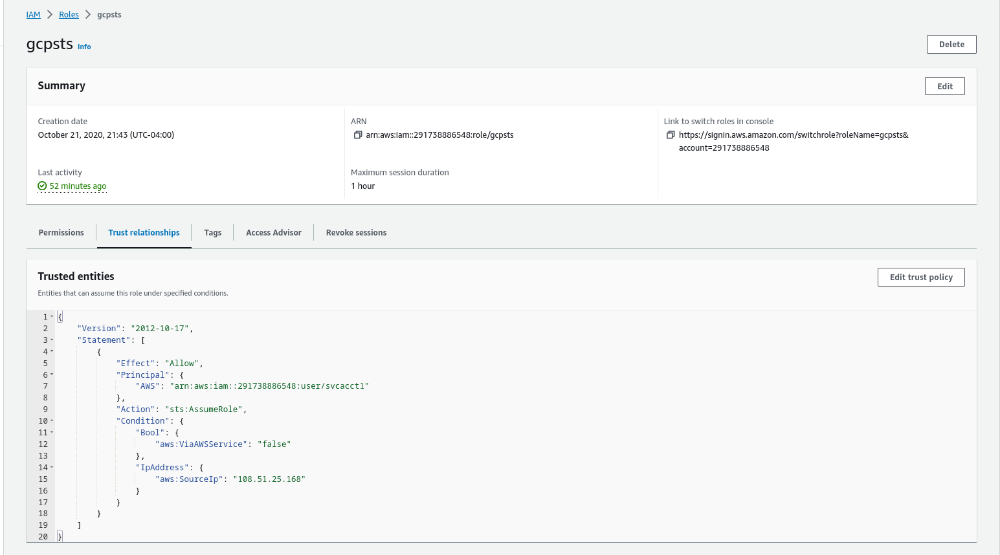

## EKM golang AWS SDK Credential and Process Credential for Confidential Space

Access AWS resources from Confidential Space using a token broker.

AWS does not allow you to easily specify nested claims for federation (it only allows for `aud:`, `sub:` and `iss:`).

This is a problem if you want to _directly_ submit the attestation_jwt to aws for access to resources because you critically need to verify the nested  claims such as image_hash, sev status, etc

A workaround for this is to run a "token broker" somewhere which validates the nested claims and returns the a temp aws session token or assumed role's token back to confidential space instance.

You would have to run this service somewhere outside of the operator's confidential space and on a platform which terminates the TLS session.   

This section outlines how you can deploy such a service and run aws cli and sdk clients to interact with this service

There are two client approaches:

1. create a [process credential](https://docs.aws.amazon.com/cli/latest/userguide/cli-configure-sourcing-external.html) object which aws cli's and sdk's understand
2. create a language specific credential object which performs the same tasks as the process credential.  This repo includes an implementation in go.

The basic flow is like this:

1. you deploy the service on a platform you trust and seed it with the `AWS_ACCESS_KEY_ID` and `AWS_SECRET_ACCESS_KEY`

   needless to say, this system must be very secure as it contains the 'keys to the kingdom'

2. client on Confidential Space

   - creates a TLS connection to this service and reads its Exported Key Material (EKM)
   - creates a custom attestation token where the EKM is a custom_nonce value
   - sends the token to the service

3. server validates attestation jwt

   - verifies the signature
   - verifies the claims (image_hash, etc)
   - verifies the EKM value in the claim matches the TLS session

4. server issues session token

   - server issues a session token using the root keys.
   - server can optionally bind the session token's use to a specific ip address (`aws:SourceIp`) or any other aws claim
   - server returns the session token to the client

5. client uses session token to access AWS resources

   - if the aws Credential object expires (usually in an hour), the wrapper library will automatically redo from step 2 above

---

##### References

* [Exported Key Material (EKM) in golang and openssl](https://github.com/salrashid123/go_ekm_tls)
* For TPM based process credentials, see [AWS Process Credentials for Trusted Platform Module (TPM)](https://github.com/salrashid123/aws-tpm-process-credential)
* For HSM based process credentials, see [AWS Process Credentials for Hardware Security Module (HSM) with PKCS11](https://github.com/salrashid123/aws-pkcs-process-credential)
  

### Setup

This demo uses a specific user (`"arn:aws:iam::291738886548:user/svcacct1"`) who is setup to assume a role `arn:aws:iam::291738886548:role/gcpsts`\

Note, the default credential provided here as well as the process credential uses the "testtoken" provider from `github.com/salrashid123/confidential_space/misc/testtoken`, if you want to deploy this in confidential space, remove the test token provider in `credential/cred.go` or the `process/main.go`
and instead use `getCustomAttestation(tokenRequest customToken)`




### Run Service

To test locally, first run the server and remember to specify your AWS Credentials for the user

at the moment, the server uses the Role, SessionName and Duration values provided by the client.  

```bash
go run main.go --awsRegion=us-east-1 \
   --awsAccessKeyID=$AWS_ACCESS_KEY_ID \
   -awsSecretAccessKey=$AWS_SECRET_ACCESS_KEY
```

If you would rather have the server in full control of it so that you need to edit `server/main.go` and modify an override for `UseAssumeRole` section

Once thats done, you'd specify the values inline:

```bash
cd example/server
go run main.go --awsRegion=us-east-1 \
   --awsRoleArn=arn:aws:iam::291738886548:role/gcpsts \
   --awsSessionName=mysession \
   --awsAccessKeyID=$AWS_ACCESS_KEY_ID \
   -awsSecretAccessKey=$AWS_SECRET_ACCESS_KEY
```

### AWS go SDK

If you want to use the go sdk, edit `example/client/main.go` and specify the `AWSRoleArn` and the sessionName

```golang
import (
   ek "github.com/salrashid123/confidential_space/misc/aws-channel-jwt-credential/credential"
   "github.com/aws/aws-sdk-go/aws/session"
	"github.com/aws/aws-sdk-go/service/s3"
)

	creds, err := ek.NewEKMAWSCredentials(ek.CredConfig{
		STSEndpointHost: "localhost:8081",
		STSEndpoint:     "https://server.domain.com:8081/token",
		STSSNI:          "server.domain.com",
		Audience:        "https://server.domain.com",
		UseMTLS:         true,
		TrustCA:         "certs/tls-ca-chain.pem",
		ClientCert:      "certs/client-svc.crt",
		ClientKey:       "certs/client-svc.key",
		AWSRoleArn:      "arn:aws:iam::291738886548:role/gcpsts",
		AWSSessionName:  "foo",
		UseAssumeRole:   true,
		Duration:        900,
	})

	sess, err := session.NewSession(&aws.Config{
		Region:      aws.String(*region),
		Credentials: &creds,
	},
	)

	svcs := s3.New(sess)

	sresp, err := svcs.ListObjectsV2(&s3.ListObjectsV2Input{Bucket: aws.String(*bucket)})
```

### Process Credential

To use the process credential, first build 

```bash
cd process/
go build -o aws-channel-jwt-process-credential
```

Then edit `~/.aws/config`

```conf
[default]
credential_process = /path/to/aws-channel-jwt-process-credential   --host=localhost:8081 --endpoint=https://server.domain.com:8081/token --audience=https://server.domain.com --audience=https://server.domain.com --sts-sni=server.domain.com --trust-ca=/path/to/example/server/certs/tls-ca-chain.pem --use-mtls=true   --cert=/path/to/example/client/certs/client-svc.crt --key=/path/to/example/client/certs/client-svc.key  


[profile sessiontoken]
credential_process = /path/to/aws-channel-jwt-process-credential    --host=localhost:8081 --endpoint=https://server.domain.com:8081/token --audience=https://server.domain.com --audience=https://server.domain.com --sts-sni=server.domain.com --trust-ca=/path/to/example/server/certs/tls-ca-chain.pem --use-mtls=true   --cert=/path/to/example/client/certs/client-svc.crt --key=/path/to/example/client/certs/client-svc.key  

[profile assumerole]
credential_process = /path/to/aws-channel-jwt-process-credential    --host=localhost:8081 --endpoint=https://server.domain.com:8081/token --audience=https://server.domain.com --sts-sni=server.domain.com --trust-ca=/path/to/example/server/certs/tls-ca-chain.pem --use-mtls=true   --cert=/path/to/example/server/client/client-svc.crt --key=/path/to/example/client/certs/client-svc.key  --aws-arn="arn:aws:iam::291738886548:role/gcpsts"   --use-assume-role=true
```

Use CLI


```bash
$ aws sts get-caller-identity  --profile sessiontoken
{
    "UserId": "AIDAUH3H6EGKDO36JYJH3",
    "Account": "291738886548",
    "Arn": "arn:aws:iam::291738886548:user/svcacct1"
}

$ $ aws sts get-caller-identity  --profile assumerole 
{
    "UserId": "AROAUH3H6EGKHZUSB4BC5:gcp-f9b5c91d-1466-469c-9bf9-0e4b6fc2a7a8",
    "Account": "291738886548",
    "Arn": "arn:aws:sts::291738886548:assumed-role/gcpsts/gcp-f9b5c91d-1466-469c-9bf9-0e4b6fc2a7a8"
}

$ aws s3 ls mineral-minutia --region us-east-2 --profile sessiontoken
2020-08-09 22:52:08        411 README.md
2020-11-02 19:16:00          3 foo.txt

$ aws s3 ls mineral-minutia --region us-east-2 --profile assumerole
2020-08-09 22:52:08        411 README.md
2020-11-02 19:16:00          3 foo.txt
```


You can also invoke the process credential from any AWS SDK.  In go, its though [github.com/aws/aws-sdk-go/aws/credentials/processcreds](https://docs.aws.amazon.com/sdk-for-go/api/aws/credentials/processcreds/)

```golang
import "github.com/aws/aws-sdk-go/aws/credentials/processcreds"

command := "/aws-channel-jwt-process-credential   --host=localhost:8081 --endpoint=https://server.domain.com:8081/token --audience=https://server.domain.com --sts-sni=server.domain.com --trust-ca=/path/to/certs/certs/tls-ca-chain.pem --use-mtls=true   --cert=/path/to/certs/client-svc.crt --key=/path/to/certs/client-svc.key"

creds := processcreds.NewCredentials(command)
```

then uncomment the appropriate lines in the code, specify the paths, then run

```bash
$ cd example/client
$ export AWS_SDK_LOAD_CONFIG=1

$ go run main.go 
```

---

