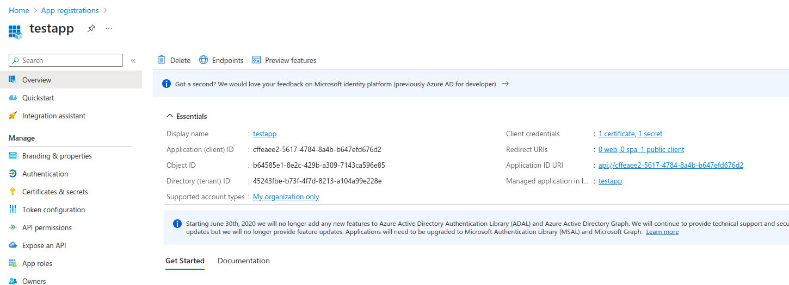
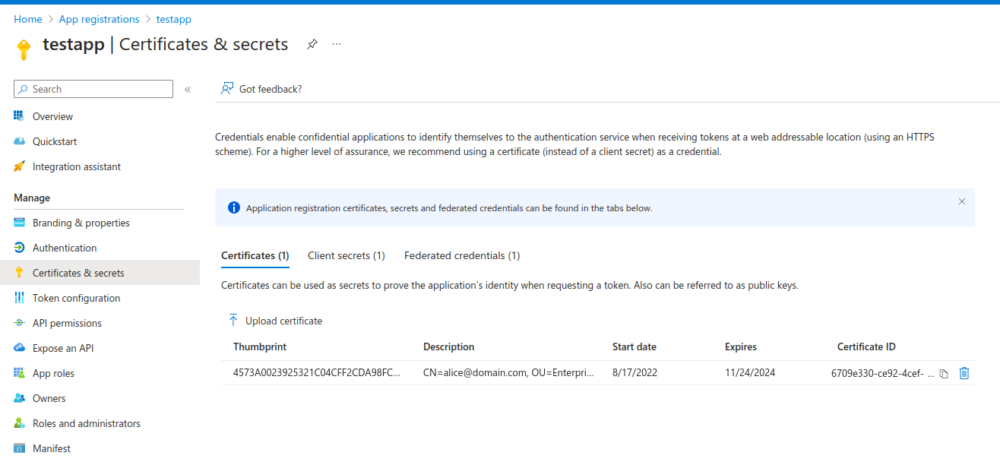
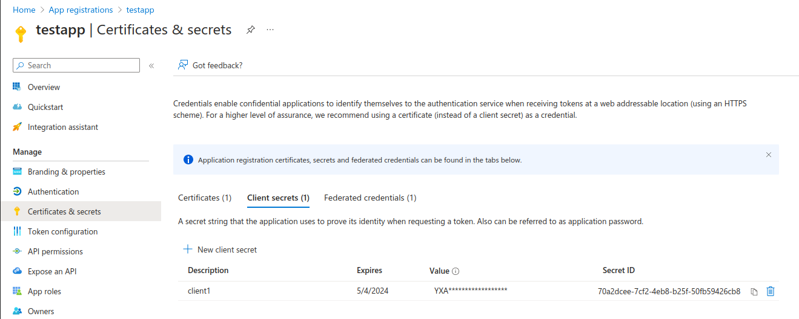
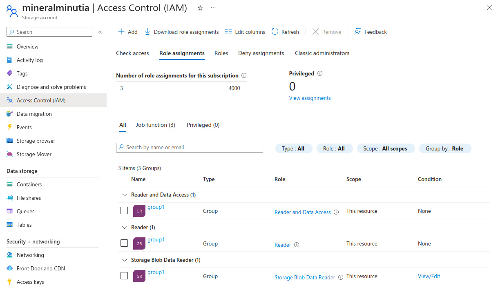

## EKM golang SDK Azure Credential for Confidential Space

Access Azure resources from Confidential Space using a token broker.

Azure does not allow you to easily specify nested claims for federation (it only allows for `aud:`, `sub:` and `iss:`).

This is a problem if you want to _directly_ submit the attestation_jwt to azure for access to resources because you critically need to verify the nested  claims such as image_hash, sev status, etc

A workaround for this is to run a "token broker" somewhere which validates the nested claims and returns the a temp aws session token or assumed role's token back to confidential space instance.

You would have to run this service somewhere outside of the operator's confidential space and on a platform which terminates the TLS session.   

This section outlines how you can deploy such a service and run sdk clients to interact with this service

The basic flow is like this:

1. you deploy the service on a platform

   - Seed it with either `AZURE_CLIENT_ID` and `AZURE_CLIENT_SECRET` or `AZURE_CLIENT_CERTIFICATE_PATH`.
   - Needless to say, this system must be very secure as it contains the 'keys to the kingdom'.

2. client on Confidential Space

   - creates a TLS connection to this service and reads its Exported Key Material (EKM)
   - creates a custom attestation token where the EKM is a custom_nonce value
   - sends the token to the service

3. server validates attestation jwt

   - verifies the signature
   - verifies the claims (`image_hash`, etc)
   - verifies the EKM value in the claim matches the TLS session

4. server contacts azure and issues scoped azure access_token

   - server returns the token to the client

5. client uses session token to access Azure resources

   - if the aws Credential object expires (usually in an hour), the wrapper library will automatically redo from step 2 above

---

### Setup

To use this, you must register an app



associate a `client_secret` or `certificate` tied to that service principal





Assign the app to a group (for IAM based access)


Allow IAM access to resources based on the group:



Note, the default credential provided here as well as the process credential uses the "testtoken" provider from `github.com/salrashid123/confidential_space/misc/testtoken`, if you want to deploy this in confidential space, remove the test token provider in `credential/cred.go` or the `process/main.go`
and instead use `getCustomAttestation(tokenRequest customToken)`

### Run Service

To test locally, first run the server and remember to specify your Azure Credentials for the user

at the moment, the server uses the Role, SessionName and Duration values provided by the client.  

```bash
export TENANTID="45243fbe-b73f-4f7d-redacted"
export APP_ID="cffeaee2-5617-4784-redacted"
export SECRET="YXA8Q~CIO.yOw_69Xr-redacted"

cd example/server
## if using certificates
go run main.go --useCert=true \
    --azurePublic=/path/to/public.crt \
	--azurePrivate=/path/to/private_rsa.key \
	-azureTenant=$TENANTID --azureAppID=$APP_ID

## if using secrets
go run main.go --useCert=false \
  -azureTenant=$TENANTID \
  --azureAppID=$APP_ID \
  --azureSecret=$SECRET
```

### Azure go SDK

If you want to use the go sdk,

```golang
import (
	"github.com/Azure/azure-sdk-for-go/sdk/storage/azblob"
	ek "github.com/salrashid123/confidential_space/misc/azure-channel-jwt-credential/credential"
)

	creds, err := ek.NewEKMAZCredentials(&ek.EKMAZCredentialOptions{
		STSEndpoint:     "https://server.domain.com:8081/token",
		STSEndpointHost: "localhost:8081",
		STSSNI:          "server.domain.com",
		Audience:        "https://server.domain.com",
		UseMTLS:    true,
		TrustCA:    "certs/tls-ca-chain.pem",
		ClientCert: "certs/client-svc.crt",
		ClientKey:  "certs/client-svc.key",
	})

	client, err := azblob.NewClient(url, creds, nil)
```

then uncomment the appropriate lines in the code, specify the paths, then run

```bash
$ cd example/client
$ go run main.go 

```

---

##### References

* [Exported Key Material (EKM) in golang and openssl](https://github.com/salrashid123/go_ekm_tls)
* [Exchange Google and Firebase OIDC tokens for Azure STS](https://github.com/salrashid123/azcompat)
* [KMS, TPM and HSM based Azure Certificate Credentials](https://github.com/salrashid123/azsigner)