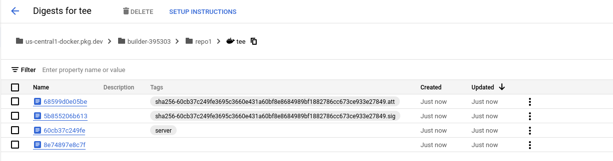

#### Manual Container image signing and verification


If you do not want to use the built in container signature protocol (which currently requires specifying the signature repos and the custom annotations), you can employ other techniques of varying degrees of toil:

There are several alternatives where the signature checks happen during runtime (late binding) or prior to authorizing the image for KMS access (early binding)

- `early binding`

  If a collaborator wants to ensure that the operator or some third party submitted/attested the container+hash, the collaborator can "just verify" that was done prior to authorizing the container for KMS access.

  This would require the workflow pipleine for each collaborator to get notification of a new candidate image for deployment, then check if the requisite signatures were provided and only then authorize KMS access specifically for that image.

  The specific workflows involved for the notification and verification of candidate containers is implementation dependent and is not covered here.

  If `sigstore/cosign` is used the collaborator would need to iterate over the public keys for each attestor he/she is interested in and then once satisfied, proceed to authorize the image.   The section below describes using cosign cli and api to verify containers.

  If [gcp binary authorization](https://cloud.google.com/binary-authorization) is used by the operator as the "signature system", the collaborator can verify N parties provided signatures by invoking the operators binary authorization api, then reading and verifying which parties provided signatures (eg the collaborator would run `gcloud beta container binauthz attestations list --attestor=myattestor --project=$OPERATOR_PROJECT_ID` prior to authorization). A more formal confirmation that signatures were provided could be if the operator enabled GCP Audit Logs for the binary authorization API.  If that step is done, each attestation is encoded in the operators audit log permanently.  [Here](https://gist.github.com/salrashid123/2ca607fee4977244136cb1ae0d37173f) is an example of Binary Authorization Audit Log.  Once in audit log, the collaborators can subscribe to events via GCP [eventarc](https://cloud.google.com/eventarc/docs/event-driven-architectures) which can notify of any new signatures or changes.   


  This allows for multiple, rapid IAM binding at the resource per image without defining a new pool.


- `late binding`

  With late binding, the container on startup checks for the requisite signatures during the applications `init()` stage.  
  
  In other words, the actual container code uses a set of public keys to verify the image hash it is running with has a valid signature against it either with cosign or in gcp's binary authorization system or simply read the signatures passed as startup arguments to the container runtime.  An image could derive its own image_hash by  locally verifying its JWT Attestation token.
  
  This mechanism is described in detail below

##### Container Signatures Late-binding

In the example here,  the builder's generated sigature is added in during the cloudbuild steps using the builders's KMS key.  

To check the cosign signatures and attestations, install cosign and then:

```bash
### verify with cosign
## first login to ADC as the builder
## gcloud config configurations activate builder
## export BUILDER_PROJECT_ID=`gcloud config get-value core/project`
## export BUILDER_PROJECT_NUMBER=`gcloud projects describe $BUILDER_PROJECT_ID --format='value(projectNumber)'`
## gcloud auth application-default login

$ export IMAGE_HASH=us-central1-docker.pkg.dev/$BUILDER_PROJECT_ID/repo1/tee@sha256:60cb37c249fe3695c3660e431a60bf8e8684989bf1882786cc673ce933e27849
$ cosign tree  $IMAGE_HASH     

📦 Supply Chain Security Related artifacts for an image: us-central1-docker.pkg.dev/builder-395303/repo1/tee@sha256:60cb37c249fe3695c3660e431a60bf8e8684989bf1882786cc673ce933e27849
└── 💾 Attestations for an image tag: us-central1-docker.pkg.dev/builder-395303/repo1/tee:sha256-60cb37c249fe3695c3660e431a60bf8e8684989bf1882786cc673ce933e27849.att
   └── 🍒 sha256:2008211259d8021aaa8466cec423de1e64e312c38c4c76cf22ad1bff2ed352c4
└── 🔐 Signatures for an image tag: us-central1-docker.pkg.dev/builder-395303/repo1/tee:sha256-60cb37c249fe3695c3660e431a60bf8e8684989bf1882786cc673ce933e27849.sig
   └── 🍒 sha256:561222396fbe725acde46e728adc5aa8069942c201787a22ce6fc286ecc96f0a
```

which will exist as additional artifacts in the registry



```bash
# get the public key for the cosigned image
gcloud kms keys versions get-public-key 1  \
  --key=key1 --keyring=cosignkr \
  --location=global --output-file=/tmp/kms_pub.pem

## verify 
# you can also reference the kms key via url instead of using a local one
#   for that use --key gcpkms://projects/$BUILDER_PROJECT_ID/locations/global/keyRings/cosignkr/cryptoKeys/key1/cryptoKeyVersions/1 

cosign verify --key /tmp/kms_pub.pem --insecure-ignore-tlog=true  $IMAGE_HASH   | jq '.'

# the output for the verify will look like:

Verification for us-central1-docker.pkg.dev/builder-395303/repo1/tee@sha256:60cb37c249fe3695c3660e431a60bf8e8684989bf1882786cc673ce933e27849 --
The following checks were performed on each of these signatures:
  - The cosign claims were validated
  - The signatures were verified against the specified public key
[
  {
    "critical": {
      "identity": {
        "docker-reference": "us-central1-docker.pkg.dev/builder-395303/repo1/tee"
      },
      "image": {
        "docker-manifest-digest": "sha256:60cb37c249fe3695c3660e431a60bf8e8684989bf1882786cc673ce933e27849"
      },
      "type": "cosign container image signature"
    },
    "optional": {
      "dev.cosignproject.cosign/pub": "LS0tLS1CRUdJTiBQVUJMSUMgS0VZLS0tLS0KTUZrd0V3WUhLb1pJemowQ0FRWUlLb1pJemowREFRY0RRZ0FFbkpreFBrTkJkc1RmdVFuWkpBbUU2dFZFb3NURwpZZW1UYVFsKzYwT0xSc3ltVUQ4R2ZUQ29nR3JnUkhtTlRhSWlWemtQYldZQjNpSzI3TXVZa0FHeU1RPT0KLS0tLS1FTkQgUFVCTElDIEtFWS0tLS0tCg",
      "dev.cosignproject.cosign/sigalg": "ECDSA_P256_SHA256",
      "key1": "value1"
    }
  }
]


## inspect the signature itself

$ skopeo inspect --raw docker://$(cosign triangulate --type=signature $IMAGE_HASH) | jq -r

{
  "schemaVersion": 2,
  "mediaType": "application/vnd.oci.image.manifest.v1+json",
  "config": {
    "mediaType": "application/vnd.oci.image.config.v1+json",
    "size": 233,
    "digest": "sha256:05fbecb08f0d6d921b2808b0104ed825e3c0e67807efd5b95a38083779f6c285"
  },
  "layers": [
    {
      "mediaType": "application/vnd.dev.cosign.simplesigning.v1+json",
      "size": 606,
      "digest": "sha256:561222396fbe725acde46e728adc5aa8069942c201787a22ce6fc286ecc96f0a",
      "annotations": {
        "dev.cosignproject.cosign/signature": "MEUCIFCXprEXIMQBX2+JWFq5PMzpbxiwUekGoRCBvgXmsI1hAiEA+sVy/bnyuQpybmisw0rOtUC5f1xzqVrHDBE9YqpIun8="
      }
    }
  ]
}

## for attestation
# $ skopeo inspect --raw docker://$(cosign triangulate --type=attestation $IMAGE_DIGEST) | jq -r

# now verify the attestation that is cross checked with the rego in `policy.rego` (cosign_verify/policy.rego)
#  (all that this rego validates is if foo=bar is present in the predicate (which we did during the cloud build steps))
cosign verify-attestation --insecure-ignore-tlog=true --key /tmp/kms_pub.pem --policy cosign_verify/policy.rego  $IMAGE_HASH   | jq '.'


Verification for us-central1-docker.pkg.dev/builder-395303/repo1/tee@sha256:60cb37c249fe3695c3660e431a60bf8e8684989bf1882786cc673ce933e27849 --
The following checks were performed on each of these signatures:
  - The cosign claims were validated
  - The signatures were verified against the specified public key
{
  "payloadType": "application/vnd.in-toto+json",
  "payload": "eyJfdHlwZSI6Imh0dHBzOi8vaW4tdG90by5pby9TdGF0ZW1lbnQvdjAuMSIsInByZWRpY2F0ZVR5cGUiOiJodHRwczovL2Nvc2lnbi5zaWdzdG9yZS5kZXYvYXR0ZXN0YXRpb24vdjEiLCJzdWJqZWN0IjpbeyJuYW1lIjoidXMtY2VudHJhbDEtZG9ja2VyLnBrZy5kZXYvYnVpbGRlci0zOTUzMDMvcmVwbzEvdGVlIiwiZGlnZXN0Ijp7InNoYTI1NiI6IjYwY2IzN2MyNDlmZTM2OTVjMzY2MGU0MzFhNjBiZjhlODY4NDk4OWJmMTg4Mjc4NmNjNjczY2U5MzNlMjc4NDkifX1dLCJwcmVkaWNhdGUiOnsiRGF0YSI6InsgXCJwcm9qZWN0aWRcIjogXCJidWlsZGVyLTM5NTMwM1wiLCBcImJ1aWxkaWRcIjogXCI0OTllZmJhMy0xZTM5LTRhNjEtYmY3ZC03MjgyZjZlMjRlOTFcIiwgXCJmb29cIjpcImJhclwiLCBcImNvbW1pdHNoYVwiOiBcIjhlODhhYWM1ODQxMWJiNGZjYTdiNzVlOTRmMjc3MTY3YzhiNGY5NjBcIn0iLCJUaW1lc3RhbXAiOiIyMDIzLTEyLTE5VDIwOjExOjMxWiJ9fQ==",
  "signatures": [
    {
      "keyid": "",
      "sig": "MEUCIEQunEL++iSlxTwq9anjaeRox/J8qgGXs6RAzhdEq12lAiEA5t9U5PbINoFmLQOKjvsBtUqO10VILvlI0EozSiTNCY4="
    }
  ]
}


## if you decode the payload, you'll see the predicate and image attestations (build number, commit hash, timestamp and the prediecate KV pair we sent during build (foo=bar in consign_verify/policy.rego))

{
  "_type": "https://in-toto.io/Statement/v0.1",
  "predicateType": "https://cosign.sigstore.dev/attestation/v1",
  "subject": [
    {
      "name": "us-central1-docker.pkg.dev/builder-395303/repo1/tee",
      "digest": {
        "sha256": "60cb37c249fe3695c3660e431a60bf8e8684989bf1882786cc673ce933e27849"
      }
    }
  ],
  "predicate": {
    "Data": "{ \"projectid\": \"builder-395303\", \"buildid\": \"499efba3-1e39-4a61-bf7d-7282f6e24e91\", \"foo\":\"bar\", \"commitsha\": \"8e88aac58411bb4fca7b75e94f277167c8b4f960\"}",
    "Timestamp": "2023-12-19T20:11:31Z"
  }
}
```

You can also encode in verificaiton of each participants cosign signatures into the code.

This is similar to [binary authorization](https://cloud.google.com/binary-authorization) except that the verification occurs incode using baked in public keys

In this mode, the secure image you're deploying "checks" the hash value for its own image from `/run/container_launcher/attestation_verifier_claims_token` and then use a static (or configured) set of public or KMS keys to verify signatures or attestations predicates are preset.

This is currently not included in this sample but you could modify it using examples [here](https://github.com/salrashid123/cosign_bazel_cloud_build/blob/main/client/main.go)

As mentioned above, each collaborator could also optionally provide the builder a singature for inclusion to the registry.  


For example:

* 1 collaborator-1, -2 and builder creates a image signing key

* 2 collaborator-1, -2 gives the public key for image siginig to the builder

* 3 the deployed code does the following on `func init() {}`:

  ```golang
  const (
    builder_public_key=".."
    collaborator_1_public_key=".."
    collaborator_2_public_key=".."
  )
  var (
      signatures_to_check := []string{ builder_public_key, collaborator_1_public_key, collaborator_2_public_key }
  )
  func init() {
    // verify attestation jwt and extract current image hash by decoding {submods.container.image_reference} from
    // /run/container_launcher/attestation_verifier_claims_token
    imageRef := "..."

    for __, publicKey in range signatures_to_check {
      // verify signatures using each publicKey against imageRef
      // https://github.com/salrashid123/cosign_bazel_cloud_build/blob/main/client/main.go#L127-L190
    }
  }
  ```

* 4 collaborator-1, 2 builder _offline_ sign the image using their private key:
  - [Sign without upload to registry](https://github.com/salrashid123/cosign_bazel_cloud_build/blob/main/README.md#sign-without-upload-to-registry)

* 5 builder _attaches_ all the signatures to the registry
  - [Sign offline and attach](https://github.com/salrashid123/cosign_bazel_cloud_build/blob/main/README.md#sign-offline-and-attach)
  - Alternatively, the builder can provide the signatures as arguments to the TEE containers's startup

* 6 On deployment, the startup init in step 3 will ensure all parties signed image before doing anything

### Software Bill of Materials
  
This repo also demonstrates basic [Software Bill of materials](https://www.cisa.gov/sbom) for:

* application code
* container image

The application code sbom is created as part of the build is _also_ generated using [syft](https://github.com/anchore/syft)  and `goreleaser` and can be found in the `Releases` section of the repo.  The sbom contains all the software used by go application.

The container `sbom` is generated at build time and saved in the container registry.  

>> unfortunately, the `bazel` toolchain does not surface the go libraries used by the application. see

* [syft/1725](https://github.com/anchore/syft/issues/1725)

`kaniko` based builds, however, shows (note the image hash used is only if `kaniko` is used, the rest of the examples in this page uses `bazel`)

```bash
$ syft packages    us-central1-docker.pkg.dev/$BUILDER_PROJECT_ID/repo1/tee@sha256:51af5e192f5c1f6debf16ec90764fe0dcd96e187a4fdd8d1175e3a2f483fb7a0 

 ✔ Pulled image                    
 ✔ Loaded image                                                                                                                                                                                                                                          us-central1-docker.pkg.dev/builder-395303/repo1/tee@sha256:51af5e192f5c1f6debf16ec90764fe0dcd96e187a4fdd8d1175e3a2f483fb7a0
 ✔ Parsed image                                                                                                                                                                                                                                                                                              sha256:60381d69ccc70a0bd0c3ccba30ce299256f03561fa807011cf3aa044c5181025
 ✔ Cataloged packages              [39 packages]  
NAME                                                VERSION                             TYPE      
base-files                                          11.1+deb11u7                        deb        
cloud.google.com/go                                 v0.110.10                           go-module  
cloud.google.com/go/compute/metadata                v0.2.3                              go-module  
cloud.google.com/go/iam                             v1.1.5                              go-module  
cloud.google.com/go/kms                             v1.15.5                             go-module  
cloud.google.com/go/logging                         v1.8.1                              go-module  
cloud.google.com/go/longrunning                     v0.5.4                              go-module  
cloud.google.com/go/pubsub                          v1.33.0                             go-module  
github.com/golang-jwt/jwt/v5                        v5.2.0                              go-module  
github.com/golang/groupcache                        v0.0.0-20210331224755-41bb18bfe9da  go-module  
github.com/golang/protobuf                          v1.5.3                              go-module  
github.com/google/s2a-go                            v0.1.7                              go-module  
github.com/googleapis/enterprise-certificate-proxy  v0.3.2                              go-module  
github.com/googleapis/gax-go/v2                     v2.12.0                             go-module  
github.com/gorilla/mux                              v1.8.1                              go-module  
github.com/lestrrat/go-jwx                          v0.9.1                              go-module  
github.com/lestrrat/go-pdebug                       v0.0.0-20180220043741-569c97477ae8  go-module  
github.com/pkg/errors                               v0.9.1                              go-module  
github.com/salrashid123/confidential_space/app      (devel)                             go-module  
github.com/salrashid123/confidential_space/claims   v0.0.0-20231113123744-44f929093c61  go-module  
go.opencensus.io                                    v0.24.0                             go-module  
golang.org/x/crypto                                 v0.16.0                             go-module  
golang.org/x/net                                    v0.19.0                             go-module  
golang.org/x/oauth2                                 v0.15.0                             go-module  
golang.org/x/sync                                   v0.5.0                              go-module  
golang.org/x/sys                                    v0.15.0                             go-module  
golang.org/x/text                                   v0.14.0                             go-module  
golang.org/x/time                                   v0.5.0                              go-module  
google.golang.org/api                               v0.152.0                            go-module  
google.golang.org/genproto                          v0.0.0-20231120223509-83a465c0220f  go-module  
google.golang.org/genproto/googleapis/api           v0.0.0-20231127180814-3a041ad873d4  go-module  
google.golang.org/genproto/googleapis/rpc           v0.0.0-20231120223509-83a465c0220f  go-module  
google.golang.org/grpc                              v1.59.0                             go-module  
google.golang.org/protobuf                          v1.31.0                             go-module  
libc6                                               2.31-13+deb11u6                     deb        
libssl1.1                                           1.1.1n-0+deb11u4                    deb        
netbase                                             6.3                                 deb        
openssl                                             1.1.1n-0+deb11u4                    deb        
tzdata                                              2021a-1+deb11u10                    deb
```

The sboms also include signatures verfiying its authenticity.  

The container image is signed by the same kms based cosing key

#### Download and Verify image sbom:

```bash
# download the imagebom 
$ cosign download sbom --output-file  latest.spdx.download \
      us-central1-docker.pkg.dev/$BUILDER_PROJECT_ID/repo1/tee@sha256:1447781b9a6fd0a09a6352c10efaffaf6a67d2d12940b56d00cb38c5b56ad646  

$ cosign verify --key /tmp/kms_pub.pem --insecure-ignore-tlog=true --attachment=sbom   \
        us-central1-docker.pkg.dev/$BUILDER_PROJECT_ID/repo1/tee@sha256:1447781b9a6fd0a09a6352c10efaffaf6a67d2d12940b56d00cb38c5b56ad646   | jq '.'

Verification for us-central1-docker.pkg.dev/builder-395303/repo1/tee:sha256-1447781b9a6fd0a09a6352c10efaffaf6a67d2d12940b56d00cb38c5b56ad646 .sbom --
The following checks were performed on each of these signatures:
  - The cosign claims were validated
  - The signatures were verified against the specified public key
[
  {
    "critical": {
      "identity": {
        "docker-reference": "us-central1-docker.pkg.dev/builder-395303/repo1/tee"
      },
      "image": {
        "docker-manifest-digest": "sha256:f6dc9d0985e420916d9c11f29a148175f90ec59bec89effda9a0e2f596cc1b32"
      },
      "type": "cosign container image signature"
    },
    "optional": {
      "commit_sha": "f56cd1cd4278ea4add2dca74b5fcc9768e6b3234"
    }
  }
]
```

#### Download and Verify application sbom:

For the application, note we're asking for the `type=` field below

```bash
cosign verify-attestation --key /tmp/kms_pub.pem --insecure-ignore-tlog=true  --type="https://cyclonedx.org/bom/v1.4" \
      us-central1-docker.pkg.dev/$BUILDER_PROJECT_ID/repo1/tee@sha256:1447781b9a6fd0a09a6352c10efaffaf6a67d2d12940b56d00cb38c5b56ad646   | jq '.'

## note the payload:  thats the full signed software sbom generated as part of cloud build

Verification for us-central1-docker.pkg.dev/builder-395303/repo1/tee@sha256:1447781b9a6fd0a09a6352c10efaffaf6a67d2d12940b56d00cb38c5b56ad646  --
The following checks were performed on each of these signatures:
  - The cosign claims were validated
  - The signatures were verified against the specified public key
{
  "payloadType": "application/vnd.in-toto+json",
  "payload": "eyJfd...redacted",
  "signatures": [
    {
      "keyid": "",
      "sig": "MEUCIQDN3jOW+21ZoJkF3q8e95k0V1HMltWKHQTxF0SQE/yaXgIgOWpKo5LhQoleSzRym1JQ9GKzasC2xTwgwxHsdtxXpEM="
    }
  ]
}
```

