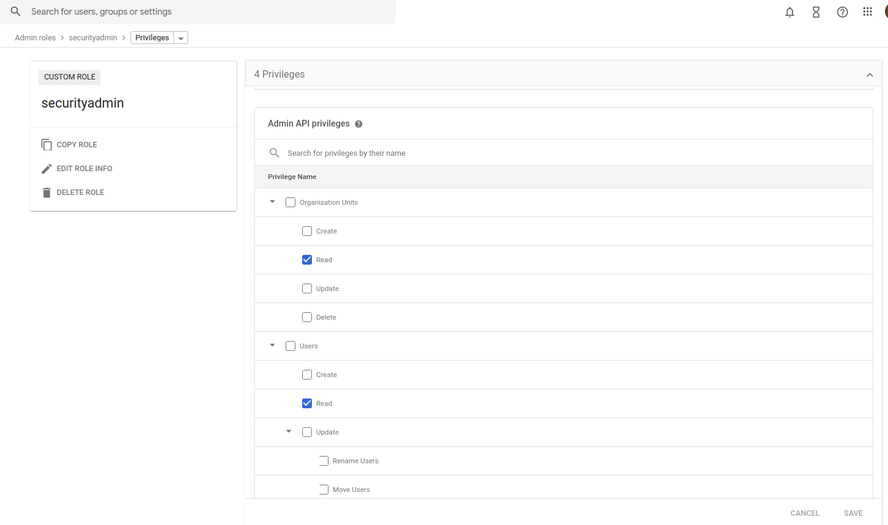
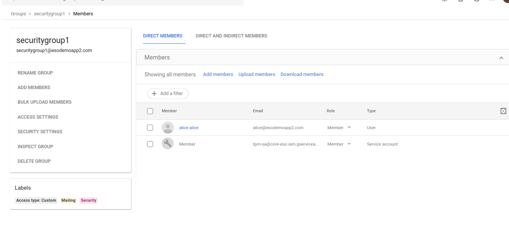
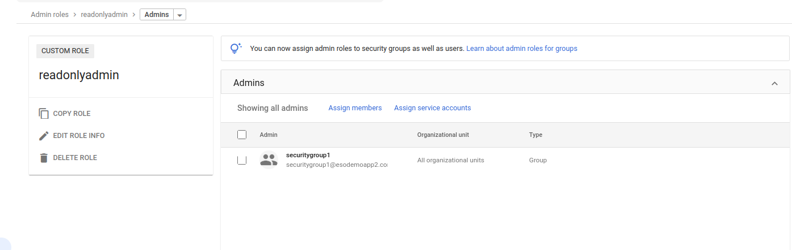
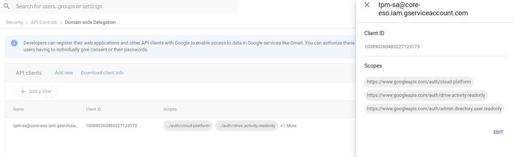

##  Access GCP and workspace APIs using GCP Workload Identity Federation

### Using Service Account

Basic idea is you will use workload federation to act as a service account

This service account is in a google group within the domain which has permissions to:

* access a gcs bucket
* list users in the workspace domain
* view a sheet where the sheet owner granted access to the workspace group

see
* https://workspaceupdates.googleblog.com/2020/08/service-accounts-in-google-groups-beta.html
* https://blog.salrashid.dev/articles/2021/understanding_workload_identity_federation/
* https://pkg.go.dev/google.golang.org/api/impersonate#example-CredentialsTokenSource-AdminUser

* https://gist.github.com/salrashid123/6d621cf7e8ef152b60332fcf7422ccca 


so using fake oidc server here:
  https://gist.github.com/salrashid123/677866e42cf2785fe885ae9d6130fc21
create an oidc token and set

```bash
$ cat sts-creds.json
{
  "type": "external_account",
  "audience": "//iam.googleapis.com/projects/$PROJECT_NUMBER/locations/global/workloadIdentityPools/fake-oidc-pool-1/providers/fake-oidc-provider-1",
  "subject_token_type": "urn:ietf:params:oauth:token-type:jwt",
  "token_url": "https://sts.googleapis.com/v1/token",
  "credential_source": {
    "file": "/tmp/oidccred.txt"
  },
  "service_account_impersonation_url": "https://iamcredentials.googleapis.com/v1/projects/-/serviceAccounts/tpm-sa@$PROJECT_ID.iam.gserviceaccount.com:generateAccessToken"
}
```
we are using impersonation here since you can't bind `principalSet://iam.googleapis.com/projects/$PROJECT_NUMBER/locations/global/workloadIdentityPools/fake-oidc-pool-1/subject/alice@domain.com`  to a group

grant the candidate service account 'self-impersonation' permissions

```bash
$ gcloud iam service-accounts describe tpm-sa@$PROJECT_ID.iam.gserviceaccount.com
        email: tpm-sa@$PROJECT_ID.iam.gserviceaccount.com
        etag: MDEwMjE5MjA=
        name: projects/$PROJECT_ID/serviceAccounts/tpm-sa@$PROJECT_ID.iam.gserviceaccount.com
        oauth2ClientId: '100890260483227123113'
        projectId: $PROJECT_ID
        uniqueId: '100890260483227123113'

gcloud iam service-accounts \
  add-iam-policy-binding tpm-sa@$PROJECT_ID.iam.gserviceaccount.com \
  --member=principal://iam.googleapis.com/projects/$PROJECT_NUMBER/locations/global/workloadIdentityPools/fake-oidc-pool-1/subject/alice@domain.com \
   --role=roles/iam.serviceAccountTokenCreator

finally

```bash
export GOOGLE_APPLICATION_CREDENTIALS=`pwd`/sts-creds.json
go run main.go
```







```golang
func main() {

	ctx := context.Background()

	// c1_adc := fmt.Sprintf(`{
	// 	"type": "external_account",
	// 	"audience": "%s",
	// 	"subject_token_type": "urn:ietf:params:oauth:token-type:jwt",
	// 	"token_url": "https://sts.googleapis.com/v1/token",
	// 	"credential_source": {
	// 	  "file": "%s"
	// 	},
	// 	"service_account_impersonation_url": "https://iamcredentials.googleapis.com/v1/projects/-/serviceAccounts/%s:generateAccessToken"
	// 	}`, "//iam.googleapis.com/projects/995081019036/locations/global/workloadIdentityPools/fake-oidc-pool-1/providers/fake-oidc-provider-1", "/tmp/oidccred.txt", "tpm-sa@core-eso.iam.gserviceaccount.com")

	// storageClient, err := storage.NewClient(ctx, option.WithCredentialsJSON([]byte(c1_adc)))

	storageClient, err := storage.NewClient(ctx)
	if err != nil {
		log.Fatalf("%v", err)
	}

	bucketName := "core-eso-bucket"

	it := storageClient.Bucket(bucketName).Objects(ctx, nil)
	for {

		attrs, err := it.Next()
		if err == iterator.Done {
			break
		}
		if err != nil {
			log.Fatal(err)
		}
		log.Println(attrs.Name)
	}

	// adminservice, err := admin.NewService(ctx, option.WithCredentialsJSON([]byte(c1_adc)))
	adminservice, err := admin.NewService(ctx)
	if err != nil {
		log.Fatal(err)
	}
	srv := admin.NewUsersService(adminservice)

	// gcloud organizations list
	usersReport, err := srv.List().Customer("C023zw3x8").MaxResults(10).OrderBy("email").Do()
	if err != nil {
		log.Fatal(err)
	}

	if len(usersReport.Users) == 0 {
		fmt.Print("No users found.\n")
	} else {
		fmt.Print("Users:\n")
		for _, u := range usersReport.Users {
			fmt.Printf("%s (%s)\n", u.PrimaryEmail, u.Name.FullName)
		}
	}

	// dsrv, err := sheets.NewService(ctx, option.WithCredentialsJSON([]byte(c1_adc)))
	dsrv, err := sheets.NewService(ctx)
	if err != nil {
		log.Fatalf("Unable to retrieve driveactivity Client %v", err)
	}

	spreadsheetId := "1swpYS6NaQjE_4f-FJ872Bf-D4tKb0omKSMjkYBZuWk8"
	readRange := "Class Data!A2:E"
	resp, err := dsrv.Spreadsheets.Values.Get(spreadsheetId, readRange).Do()
	if err != nil {
		log.Fatalf("Unable to retrieve data from sheet: %v", err)
	}

	if len(resp.Values) == 0 {
		fmt.Println("No data found.")
	} else {
		fmt.Println("Name, Major:")
		for _, row := range resp.Values {
			// Print columns A and E, which correspond to indices 0 and 4.
			fmt.Printf("%s, %s\n", row[0], row[4])
		}
	}

}
```


#### Using User Impersonation

see
* https://blog.salrashid.dev/articles/2021/impersonation_and_domain_delegation/
* https://blog.salrashid.dev/articles/2021/understanding_workload_identity_federation/
* https://pkg.go.dev/google.golang.org/api/impersonate#example-CredentialsTokenSource-AdminUser


using [fake oidc server](https://gist.github.com/salrashid123/677866e42cf2785fe885ae9d6130fc21)
  

create an oidc token and set

```bash
$ cat sts-creds.json
{
  "type": "external_account",
  "audience": "//iam.googleapis.com/projects/$PROJECT_NUMBER/locations/global/workloadIdentityPools/fake-oidc-pool-1/providers/fake-oidc-provider-1",
  "subject_token_type": "urn:ietf:params:oauth:token-type:jwt",
  "token_url": "https://sts.googleapis.com/v1/token",
  "credential_source": {
    "file": "/tmp/oidccred.txt"
  }
}
```


grant the candidate service account 'self-impersonation' permissions

```bash
$ gcloud iam service-accounts describe tpm-sa@$PROJECT_ID.iam.gserviceaccount.com
        email: tpm-sa@$PROJECT_ID.iam.gserviceaccount.com
        etag: MDEwMjE5MjA=
        name: projects/$PROJECT_ID/serviceAccounts/tpm-sa@$PROJECT_ID.iam.gserviceaccount.com
        oauth2ClientId: '100890260483227123113'
        projectId: $PROJECT_ID
        uniqueId: '100890260483227123113'


gcloud iam service-accounts \
  add-iam-policy-binding tpm-sa@$PROJECT_ID.iam.gserviceaccount.com \
  --member=principal://iam.googleapis.com/projects/$PROJECT_NUMBER/locations/global/workloadIdentityPools/fake-oidc-pool-1/subject/alice@domain.com \
   --role=roles/iam.serviceAccountTokenCreator
```

grant service account domain delegation rights to scopes

  ```
  admin.AdminDirectoryUserReadonlyScope, driveactivity.DriveActivityReadonlyScope, "https://www.googleapis.com/auth/cloud-platform"
  ```
  as described in:  https://blog.salrashid.dev/articles/2021/impersonation_and_domain_delegation/



finally

```bash
export GOOGLE_APPLICATION_CREDENTIALS=`pwd`/sts-creds.json
go run main.go
```

---

```golang
package main

import (
	"fmt"
	"log"

	"context"

	"cloud.google.com/go/storage"

	admin "google.golang.org/api/admin/directory/v1"
	driveactivity "google.golang.org/api/driveactivity/v2"
	"google.golang.org/api/impersonate"
	"google.golang.org/api/iterator"
	"google.golang.org/api/option"
)


func main() {

	ctx := context.Background()

    // get a token that impersonates a domain user who has rights to the bucket and to list the users, drive activity (eg, an admin user)

	// c1_adc := fmt.Sprintf(`{
	// 	"type": "external_account",
	// 	"audience": "%s",
	// 	"subject_token_type": "urn:ietf:params:oauth:token-type:jwt",
	// 	"token_url": "https://sts.googleapis.com/v1/token",
	// 	"credential_source": {
	// 	  "file": "%s"
	// 	}
	// 	}`, "//iam.googleapis.com/projects/$PROJECT_NUMBER/locations/global/workloadIdentityPools/fake-oidc-pool-1/providers/fake-oidc-provider-1", "/tmp/oidccred.txt")

	// ts, err := impersonate.CredentialsTokenSource(ctx, impersonate.CredentialsConfig{
	// 	TargetPrincipal: "tpm-sa@$PROJECT_ID.gserviceaccount.com",
	// 	Scopes:          []string{admin.AdminDirectoryUserReadonlyScope, driveactivity.DriveActivityReadonlyScope, "https://www.googleapis.com/auth/cloud-platform"},
	// 	Subject:         "admin@yourdomain.com",
	// }, option.WithCredentialsJSON([]byte(c1_adc)))


	ts, err := impersonate.CredentialsTokenSource(ctx, impersonate.CredentialsConfig{
		TargetPrincipal: "tpm-sa@$PROJECT_ID.iam.gserviceaccount.com",
		Scopes:          []string{admin.AdminDirectoryUserReadonlyScope, driveactivity.DriveActivityReadonlyScope, "https://www.googleapis.com/auth/cloud-platform"},
		Subject:         "admin@yourdomain.com",
	})
	if err != nil {
		log.Fatal(err)
	}

	storageClient, err := storage.NewClient(ctx, option.WithTokenSource(ts))
	if err != nil {
		log.Fatalf("%v", err)
	}

	bucketName := "some-bucket"

	it := storageClient.Bucket(bucketName).Objects(ctx, nil)
	for {

		attrs, err := it.Next()
		if err == iterator.Done {
			break
		}
		if err != nil {
			log.Fatal(err)
		}
		log.Println(attrs.Name)
	}

	adminservice, err := admin.NewService(ctx, option.WithTokenSource(ts))
	if err != nil {
		log.Fatal(err)
	}
	srv := admin.NewUsersService(adminservice)

	// gcloud organizations list
	usersReport, err := srv.List().Customer("your_customer_id").MaxResults(10).OrderBy("email").Do()
	if err != nil {
		log.Fatal(err)
	}

	if len(usersReport.Users) == 0 {
		fmt.Print("No users found.\n")
	} else {
		fmt.Print("Users:\n")
		for _, u := range usersReport.Users {
			fmt.Printf("%s (%s)\n", u.PrimaryEmail, u.Name.FullName)
		}
	}

	dsrv, err := driveactivity.NewService(ctx, option.WithTokenSource(ts))
	if err != nil {
		log.Fatalf("Unable to retrieve driveactivity Client %v", err)
	}

	q := driveactivity.QueryDriveActivityRequest{PageSize: 10}
	r, err := dsrv.Activity.Query(&q).Do()
	if err != nil {
		log.Fatalf("Unable to retrieve list of activities. %v", err)
	}

	fmt.Println("Recent Activity:")
	if len(r.Activities) > 0 {
		for _, a := range r.Activities {
			for _, i := range a.Actors {
				log.Printf("%s, \n", i.User.KnownUser.PersonName)

			}
		}
	} else {
		fmt.Print("No activity.")
	}

}
