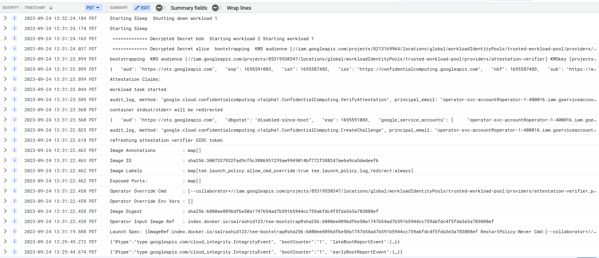

## Minimal key injection for GCP Confidential Space

Generalized credential injection container which on startup will decrypt secrets and launch background applications.

Key/credential injection with confidential space involves exchanging a JWT which has specific claims present only within confidential space container for access to invoke API calls (eg KMS-decrypt)

The difficulty most off the shelf applications (postgres, envoy, spark, redis, etc) incur with this model is they 'don't know' how to do this exchange transparently.  Short of that, a helper or bootstrap application would be able to get these credentials or keys and provide them to the background system.

What this sample here does is creates a container image where there is

- operator:  runs the infrastructure and deploys this container
- collaborator-1, collaborator-2:  encrypts some secret data with their KMS key


When the operator launches the container in CS, they will provide the KMS key references and the encrypted data as arguments on launch.

The container will first read the command line values, use the KMS references contained within them and then decrypt each key.

Once the keys are decrypted, two background 'tasks' are launched within go.  THese tasks can be anything and they keys can be anything (symmetric keys, a key that is used to unwrap envelope-encrypted data, etc)


---

- why not use `systemd`? 

  sure, the `bootstrap` binary could be the first on boot init, acquire credentials and then provide them to other applications

- why `distroless` images?

  I like the minimal containers and `distroless`` doesn't even have a shell (see why i didn't use systemd)

- can you make it easier by creating a base container image that mounts volumes?

  I suspect you can but now we're talking about a custom image


---

The setup uses two collaborators and and an operator.   In my case, i had the following setup

#### Setup

```bash
$ gcloud projects list
PROJECT_ID             NAME            PROJECT_NUMBER
collaborator-1-400016  collaborator-1  85319530347
collaborator-2-400016  collaborator-2  8213169964
operator-1-400016      operator-1      1027627358806
```


### Operator

First as the operator, do some background work to setup the CS infra:

```bash
## ofcourse your project will be different
gcloud config set project operator-1-400016 

export OPERATOR_PROJECT_ID=`gcloud config get-value core/project`
export OPERATOR_PROJECT_NUMBER=`gcloud projects describe $OPERATOR_PROJECT_ID --format='value(projectNumber)'`

gcloud services enable  compute.googleapis.com confidentialcomputing.googleapis.

gcloud iam service-accounts create operator-svc-account

## allows logging and the ability to use conf-space itself
gcloud projects add-iam-policy-binding $OPERATOR_PROJECT_ID \
    --member=serviceAccount:operator-svc-account@$OPERATOR_PROJECT_ID.iam.gserviceaccount.com    --role=roles/logging.logWriter

gcloud projects add-iam-policy-binding $OPERATOR_PROJECT_ID \
    --member=serviceAccount:operator-svc-account@$OPERATOR_PROJECT_ID.iam.gserviceaccount.com    --role=roles/confidentialcomputing.workloadUser


## i used kaniko to build which will give the image hash below
docker run \
    -v `pwd`:/workspace -v $HOME/.docker/config_docker.json:/kaniko/.docker/config.json:ro  \
      -v /var/run/docker.sock:/var/run/docker.sock   \
        gcr.io/kaniko-project/executor@sha256:034f15e6fe235490e64a4173d02d0a41f61382450c314fffed9b8ca96dff66b2   \
         	 --dockerfile=Dockerfile 	 --reproducible \
              --destination "docker.io/salrashid123/tee-bootstrap"       --context dir:///workspace/

export IMAGE="index.docker.io/salrashid123/tee-bootstrap@sha256:6080ee8896df6e50a1747b54ad7b591b5944cc759abfdc4f5fda3e3a783088ef"
```


### Collaborator-1

As the first collaborator, create the workload pool, create the KMS key, encrypt some secret and finally allow that image to access that key.

```bash
## ofcourse your value will be different
gcloud config set project collaborator-1-400016 

export COLLABORATOR_1_PROJECT_ID=`gcloud config get-value core/project`
export COLLABORATOR_1_PROJECT_NUMBER=`gcloud projects describe $COLLABORATOR_1_PROJECT_ID --format='value(projectNumber)'`

gcloud services enable cloudkms.googleapis.com  iam.googleapis.com --project $COLLABORATOR_1_PROJECT_ID

gcloud iam workload-identity-pools create trusted-workload-pool --location="global"  --project $COLLABORATOR_1_PROJECT_ID

gcloud iam workload-identity-pools providers create-oidc attestation-verifier  --project $COLLABORATOR_1_PROJECT_ID \
    --location="global"     --workload-identity-pool="trusted-workload-pool"   \
      --issuer-uri="https://confidentialcomputing.googleapis.com/"     --allowed-audiences="https://sts.googleapis.com" \
          --attribute-mapping="google.subject=assertion.sub,attribute.image_reference=assertion.submods.container.image_reference"  \
             --attribute-condition="assertion.swname=='CONFIDENTIAL_SPACE' && \"STABLE\" in assertion.submods.confidential_space.support_attributes && assertion.submods.gce.project_id=='$OPERATOR_PROJECT_ID' && 'operator-svc-account@$OPERATOR_PROJECT_ID.iam.gserviceaccount.com' in assertion.google_service_accounts"

export PROVIDER_1_REF="//iam.googleapis.com/"`gcloud iam workload-identity-pools providers describe  attestation-verifier  \
     --location="global"   --project $COLLABORATOR_1_PROJECT_ID   --workload-identity-pool="trusted-workload-pool" --format="value(name)"`

echo $PROVIDER_1_REF


gcloud kms keyrings create kr1 --location=global --project $COLLABORATOR_1_PROJECT_ID
gcloud kms keys create --keyring=kr1 --location=global --purpose=encryption --project $COLLABORATOR_1_PROJECT_ID  key1

export KEY_1_REF=`gcloud kms keys describe key1 --keyring=kr1 --location=global  --project $COLLABORATOR_1_PROJECT_ID  --format="value(name)"`
echo $KEY_1_REF

echo -n "alice" > /tmp/secret1.txt

gcloud kms encrypt  \
    --key key1 \
    --keyring kr1 \
    --location global --project $COLLABORATOR_1_PROJECT_ID \
    --plaintext-file /tmp/secret1.txt \
    --ciphertext-file /tmp/secret1.enc

export CIPHER_1=`cat /tmp/secret1.enc | base64 -w 0`
echo $CIPHER_1

gcloud kms keys add-iam-policy-binding key1 \
   --keyring=kr1 --location=global --project $COLLABORATOR_1_PROJECT_ID    \
     --member="principalSet://iam.googleapis.com/projects/$COLLABORATOR_1_PROJECT_NUMBER/locations/global/workloadIdentityPools/trusted-workload-pool/attribute.image_reference/$IMAGE"  \
     --role=roles/cloudkms.cryptoKeyDecrypter
```

#### Collaborator-2

As the other collaborator, create the workload pool, create the KMS key, encrypt some secret and finally allow that image to access that key.


```bash
gcloud config set project collaborator-2-400016

export COLLABORATOR_2_PROJECT_ID=`gcloud config get-value core/project`
export COLLABORATOR_2_PROJECT_NUMBER=`gcloud projects describe $COLLABORATOR_2_PROJECT_ID --format='value(projectNumber)'`

gcloud services enable cloudkms.googleapis.com  iam.googleapis.com --project $COLLABORATOR_2_PROJECT_ID
gcloud iam workload-identity-pools create trusted-workload-pool --location="global" --project $COLLABORATOR_2_PROJECT_ID 

gcloud iam workload-identity-pools providers create-oidc attestation-verifier --project $COLLABORATOR_2_PROJECT_ID  \
    --location="global"     --workload-identity-pool="trusted-workload-pool"   \
      --issuer-uri="https://confidentialcomputing.googleapis.com/"     --allowed-audiences="https://sts.googleapis.com" \
          --attribute-mapping="google.subject=assertion.sub,attribute.image_reference=assertion.submods.container.image_reference"  \
             --attribute-condition="assertion.swname=='CONFIDENTIAL_SPACE' && \"STABLE\" in assertion.submods.confidential_space.support_attributes && assertion.submods.gce.project_id=='$OPERATOR_PROJECT_ID' && 'operator-svc-account@$OPERATOR_PROJECT_ID.iam.gserviceaccount.com' in assertion.google_service_accounts"

export PROVIDER_2_REF="//iam.googleapis.com/"`gcloud iam workload-identity-pools providers describe  attestation-verifier   --location="global"     --workload-identity-pool="trusted-workload-pool" --project $COLLABORATOR_2_PROJECT_ID --format="value(name)"`

echo $PROVIDER_2_REF


gcloud kms keyrings create kr2 --location=global --project $COLLABORATOR_2_PROJECT_ID
gcloud kms keys create --keyring=kr2 --location=global --purpose=encryption --project $COLLABORATOR_2_PROJECT_ID key2 

export KEY_2_REF=`gcloud kms keys describe key2 --keyring=kr2 --location=global  --project $COLLABORATOR_2_PROJECT_ID  --format="value(name)"`
echo $KEY_2_REF

echo -n "bob" > /tmp/secret2.txt
gcloud kms encrypt  \
    --key key2 \
    --keyring kr2 \
    --location global --project $COLLABORATOR_2_PROJECT_ID \
    --plaintext-file /tmp/secret2.txt \
    --ciphertext-file /tmp/secret2.enc

export CIPHER_2=`cat /tmp/secret2.enc | base64 -w 0`
echo $CIPHER_2

gcloud kms keys add-iam-policy-binding key2        --keyring=kr2 --location=global --project $COLLABORATOR_2_PROJECT_ID    \
     --member="principalSet://iam.googleapis.com/projects/$COLLABORATOR_2_PROJECT_NUMBER/locations/global/workloadIdentityPools/trusted-workload-pool/attribute.image_reference/$IMAGE"  \
     --role=roles/cloudkms.cryptoKeyDecrypter
```


### Operator

Now as the operator, launch a CS instance and provide arguments to the cs instance that specifies the workload poos, kms keys references and encrypted secret:


```bash
gcloud compute instances create cs-1  --confidential-compute --project  $OPERATOR_PROJECT_ID   \
      --shielded-secure-boot --tags=tee-vm  --private-network-ip=10.128.0.41       \
                --maintenance-policy=TERMINATE --service-account="operator-svc-account@$OPERATOR_PROJECT_ID.iam.gserviceaccount.com"    \
                 --scopes=cloud-platform  --zone=us-central1-a   \
                 --image-project=confidential-space-images --image-family=confidential-space \
                 --metadata ^~^tee-image-reference=$IMAGE~tee-restart-policy=Never~tee-container-log-redirect=true~tee-cmd=[\"--collaborator=$PROVIDER_1_REF,$KEY_1_REF,$CIPHER_1\",\"--collaborator=$PROVIDER_2_REF,$KEY_2_REF,$CIPHER_2\"]
```

basically a repeated value of

```golang
 --collaborator=//iam.googleapis.com/projects/[PROJECT_NUMBER]/locations/global/workloadIdentityPools/[POOL_NAME]/providers/[PROVIDER],projects/[PROJECT_NUMBER]/locations/[LOCATION]/keyRings/[KEYRING]/cryptoKeys/[KEY],[ciphertext]")
```

```bash
./boostrap  --collaborator="//iam.googleapis.com/projects/85319530347/locations/global/workloadIdentityPools/trusted-workload-pool/providers/attestation-verifier,projects/collaborator-1-400016/locations/global/keyRings/kr1/cryptoKeys/key1,CiQAOeZ8lwourhrJThQOzFjoWCIpGUNsBQ2U88deCD6KZaIwoV4SLgAhpVUxkKT276SDE0L9kzgpmzLYAVFE8cfPwx0c9v1nst3uhr888zThnSKQO2M=" --collaborator="//iam.googleapis.com/projects/8213169964/locations/global/workloadIdentityPools/trusted-workload-pool/providers/attestation-verifier,projects/collaborator-2-400016/locations/global/keyRings/kr2/cryptoKeys/key2,CiQA5+QAzdpS6bETXecdok3QDRIAti/blZOfs9SZalBpSKzhmIESLABnqnjVgNYTMdomQfY/JPceiKIb71Nc9k5pTkfhFgjcnOOtq+xqxuvqwrfx"
```

On startup, the logs will show both secrets were decrypted and the background tasks were launched.  In real life, the secrets would be used to initialize each node



---

#### Sample JSON attestation with init parameters

```json
{
  "aud": "https://sts.googleapis.com",
  "exp": 1695591083,
  "iat": 1695587483,
  "iss": "https://confidentialcomputing.googleapis.com",
  "nbf": 1695587483,
  "sub": "https://www.googleapis.com/compute/v1/projects/operator-1-400016/zones/us-central1-a/instances/cs-1",
  "tee": {
    "version": {
      "major": 0,
      "minor": 0
    },
    "platform": {},
    "container": {
      "image_reference": "",
      "image_digest": "",
      "restart_policy": "",
      "image_id": "",
      "env_override": null,
      "cmd_override": null,
      "env": null,
      "args": null
    },
    "gce": {}
  },
  "secboot": true,
  "oemid": 11129,
  "hwmodel": "GCP_AMD_SEV",
  "swname": "CONFIDENTIAL_SPACE",
  "swversion": [
    "230600"
  ],
  "dbgstat": "disabled-since-boot",
  "google_service_accounts": [
    "operator-svc-account@operator-1-400016.iam.gserviceaccount.com"
  ],
  "submods": {
    "container": {
      "image_reference": "index.docker.io/salrashid123/tee-bootstrap@sha256:6080ee8896df6e50a1747b54ad7b591b5944cc759abfdc4f5fda3e3a783088ef",
      "image_digest": "sha256:6080ee8896df6e50a1747b54ad7b591b5944cc759abfdc4f5fda3e3a783088ef",
      "restart_policy": "Never",
      "image_id": "sha256:3007337932fad9cf5c3886951239ae9949014bf772f388247ae6a9ca5dedeefb",
      "env_override": null,
      "cmd_override": [
        "--collaborator=//iam.googleapis.com/projects/85319530347/locations/global/workloadIdentityPools/trusted-workload-pool/providers/attestation-verifier,projects/collaborator-1-400016/locations/global/keyRings/kr1/cryptoKeys/key1,CiQAOeZ8lwourhrJThQOzFjoWCIpGUNsBQ2U88deCD6KZaIwoV4SLgAhpVUxkKT276SDE0L9kzgpmzLYAVFE8cfPwx0c9v1nst3uhr888zThnSKQO2M=",
        "--collaborator=//iam.googleapis.com/projects/8213169964/locations/global/workloadIdentityPools/trusted-workload-pool/providers/attestation-verifier,projects/collaborator-2-400016/locations/global/keyRings/kr2/cryptoKeys/key2,CiQA5+QAzdpS6bETXecdok3QDRIAti/blZOfs9SZalBpSKzhmIESLABnqnjVgNYTMdomQfY/JPceiKIb71Nc9k5pTkfhFgjcnOOtq+xqxuvqwrfx"
      ],
      "env": {
        "HOSTNAME": "cs-1",
        "PATH": "/usr/local/sbin:/usr/local/bin:/usr/sbin:/usr/bin:/sbin:/bin",
        "SSL_CERT_FILE": "/etc/ssl/certs/ca-certificates.crt"
      },
      "args": [
        "/bootstrap",
        "--collaborator=//iam.googleapis.com/projects/85319530347/locations/global/workloadIdentityPools/trusted-workload-pool/providers/attestation-verifier,projects/collaborator-1-400016/locations/global/keyRings/kr1/cryptoKeys/key1,CiQAOeZ8lwourhrJThQOzFjoWCIpGUNsBQ2U88deCD6KZaIwoV4SLgAhpVUxkKT276SDE0L9kzgpmzLYAVFE8cfPwx0c9v1nst3uhr888zThnSKQO2M=",
        "--collaborator=//iam.googleapis.com/projects/8213169964/locations/global/workloadIdentityPools/trusted-workload-pool/providers/attestation-verifier,projects/collaborator-2-400016/locations/global/keyRings/kr2/cryptoKeys/key2,CiQA5+QAzdpS6bETXecdok3QDRIAti/blZOfs9SZalBpSKzhmIESLABnqnjVgNYTMdomQfY/JPceiKIb71Nc9k5pTkfhFgjcnOOtq+xqxuvqwrfx"
      ]
    },
    "gce": {
      "zone": "us-central1-a",
      "project_id": "operator-1-400016",
      "project_number": "1027627358806",
      "instance_name": "cs-1",
      "instance_id": "1483152313261302464"
    },
    "confidential_space": {
      "support_attributes": [
        "LATEST",
        "STABLE",
        "USABLE"
      ]
    }
  }
}

```
